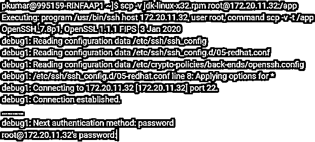

# Linux 中的 SCP 命令

> 原文：<https://www.educba.com/scp-command-in-linux/>


## Linux 中的 SCP 命令介绍

SCP 被称为“安全拷贝”,它允许我们在本地主机和远程主机之间或两个远程主机之间安全地传输文件。它使用安全外壳(SSH)协议进行安全和身份验证，以及它所基于的安全目的。SCP 因其安全、简化和预安装的设施可用性而被采用。在这个主题中，我们将学习 Linux 中的 SCP 命令。

这个命令允许我们在不同的主机/计算机之间拷贝文件。这是一个命令行实用程序，允许您在两个位置之间安全地复制文件和目录。

<small>网页开发、编程语言、软件测试&其他</small>

**目的**

我们可以将 SCP 命令用于以下用途:

*   从本地系统到远程系统或主机。
*   从远程系统或服务器或主机到我们的本地系统。
*   在本地系统的两个或多个远程系统之间。

**安全**

因为安全性是任何基于 Linux 的命令的一个方面，安全拷贝(SCP)也是其中之一，其中文件和密码都被加密，以防止恶意软件甚至任何人试图获取流量的敏感信息。

### SCP 语法

Scp 命令语法采用以下形式:

```
scp [OPTIONS] [username@][Source_HOST:]file_name1 [username@]Destination_HOST:]file_name2
```

在哪里

**1。选项:**我们有不同的选项，如 ssh 配置、密码、限制、ssh 端口、递归复制等等。

**2。[用户名@]源主机:]文件名 1:** 源文件，用户名为&主机。

**3。[用户名@]目标主机:]文件名 2:** 目标文件，用户名为&主机。

**Note:** Absolute or relative path can also be mentioned in case of local files while remote file names need to include a username and host with “@” annotation.

#### 选择

SCP 命令提供了多种选项。让我们讨论最常用的:

*   **scp–P port:**指定可以连接远程主机的端口。
*   **scp–p:**该选项用于检查原始文件的访问次数、修改次数和不同模式。
*   **scp–q:**此选项用于禁止文件在复制时的进度。
*   **scp–r:**该选项用于递归复制整个目录中的文件。
*   **scp–S 程序:**该选项用于与程序名的加密连接，为此程序必须理解 ssh(1)选项。
*   **scp–v:**此选项将在详细模式下启用命令。因此，当我们运行带有这些选项的命令时，进度会显示不同的消息。这有助于认证、调试连接&配置问题。
*   **scp -C:** 此选项将在复制时启用文件压缩，从而提高文件传输的性能。
*   **scp -i:** 该选项用于文件，无论是私钥还是文件。

### Linux 中的 SCP 命令示例

现在让我们用不同的例子来讨论每个选项，这样我们可以对 SCP 命令概念有一个正确的理解。

#### 1.将文件从本地系统复制到远程系统

让我们考虑一下，我们想要通过 scp 命令将 jdk 文件从本地 Linux 系统复制到远程系统(172.20.11.32 ),那么我们将使用以下命令:

**命令:**

```
scp jdk-linux-x32.rpm root@172.20.11.32:/app
```

**输出:**


从上面的输出中，该命令将文件从本地系统复制到远程系统的/app 文件夹下。

#### 2.将文件从远程系统复制到本地系统

如果需要将文件从远程系统复制到本地系统的/app 文件夹下，我们需要执行以下命令:

**命令:**

```
scp root@172.20.11.32:/root/Technical_file.txt /app
```

**输出:**


#### 3.启用详细模式复制文件

如果我们想知道文件传输背后发生了什么，那么我们可以使用带有“-v”选项的详细模式。

**命令:**

```
scp -v jdk-linux-x32.rpm root@172.20.11.32:/app
```

**输出:**




从上面的输出中，我们可以看到详细级别的信息是如何在详细模式下显示的。

#### 4.将多个文件传输到远程系统

可能会有这样的要求，我们需要一次传输多个文件。所以在这其中 scp 起着至关重要的作用。通过运行下面的命令，我们可以做到这一点。

**命令:**

```
scp File_test.txt Demo_file.html jdk-linux-x32.rpm root@172.20.11.32:/app
```

**输出:**


#### 5.在两台远程主机之间传输文件

为了在两个远程主机之间复制文件和目录，从一个本地 Linux 系统到两个不同的远程 Linux 系统，下面将帮助我们实现这一点。

**命令:**

```
scp pkumar@172.20.11.33:~/backup-file.zip root@172.20.11.32:/app
ssh root@172.20.11.32 "ls -l /app/backup-file.zip" .
```

**输出:**


#### 6.递归复制文件和目录(-r)

选项-r 可以用来在下面命令的帮助下递归地复制目录中的文件。

**命令:**

```
scp -r Document root@172.20.11.32:/app/
```

通过下面的命令，我们可以验证文档文件夹是否被复制到远程系统。

**输出:**


#### 7.使用压缩选项(-C)提高文件传输速度

要快速传输文件，可以使用选项-C。该文件在目的主机上进行压缩和解压缩。

**命令:**

```
scp -r -C Document root@172.20.11.32:/app
```

在上面的例子中，我们在启用压缩选项的情况下传输文档目录。

#### 8.复制文件时限制带宽(-l)

通过“-l”选项，我们可以在文件传输期间限制带宽。带宽以 Kbit/s 为单位，如下例所示:

**命令:**

```
scp -l 500 jdk-linux-x32.rpm  root@172.20.11.32:/app
```

#### 9.在 scp 命令中指定不同的 ssh 端口(-P)

在某些情况下，目标主机上的 ssh 端口可能会发生变化，因此我们可以使用'-P '选项指定端口号。

**命令:**

```
scp -P 2030 jdk-linux-x32.rpm  root@172.20.11.32:/app
```

在上面的中，远程/目标主机的 ssh 端口是“2030”

#### 10.在安静/无声模式下传输文件(-q)

我们可以使用'-q '选项来隐藏信息和不同消息的细节。下面的命令很容易做到这一点。

**命令:**

```
scp -q -r Document root@172.20.11.32:/app/
```

### 结论

通过这种方式，我们了解了 SCP 命令、不同的选项以及在 Linux 环境中安全复制数据的应用。

### 推荐文章

这是 Linux 中 SCP 命令的指南。在这里，我们讨论基本概念、不同的示例以及输出，以理解 SCP 命令概念。您也可以看看以下文章，了解更多信息–

1.  [Linux 中的 Zip 命令](https://www.educba.com/zip-command-in-linux/)
2.  [Linux 中的 CAT 命令](https://www.educba.com/cat-command-in-linux/)
3.  [Linux 中的 Tar 命令](https://www.educba.com/tar-command-in-linux/)
4.  [Linux 中的 NFS](https://www.educba.com/nfs-in-linux/)


