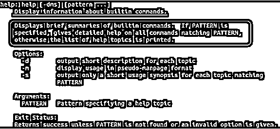
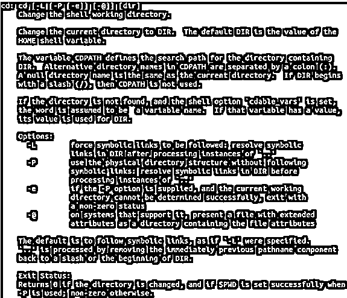
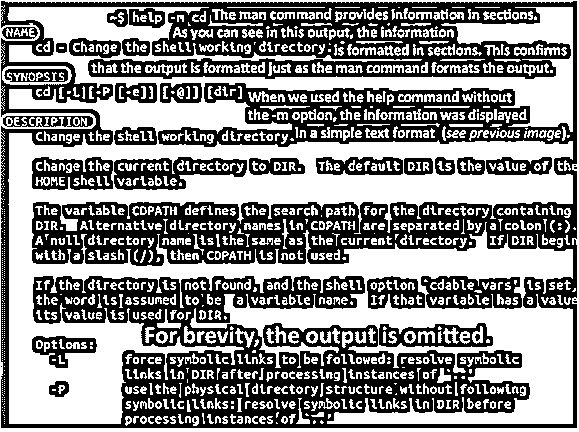
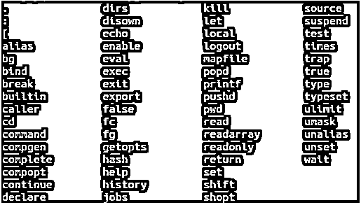

# Linux 中的帮助命令

> 原文：<https://www.educba.com/help-command-in-linux/>

## Linux Help 命令简介

我们使用的任何计算机操作系统或应用程序或软件都有一个帮助选项卡，其中包含一个关于特定应用程序的内置指南，对用户很有帮助。同样，基于命令行实用程序的 Linux 也提供了一些有用的选项。如果有人第一次使用 Linux 或者在他们的会话中有一些困惑，可以使用 help 选项来解决他们的疑问。

### 什么是帮助命令？

在使用帮助命令之前，我们应该知道什么是帮助命令。准确地说，help command 显示了 Linux shell 中的内置命令的信息。

<small>网页开发、编程语言、软件测试&其他</small>

**语法:**

`$ help [-dms] [pattern...]`

这里模式指定了我们需要帮助的命令。如果我们提供的输入与任何内置的 shell 命令匹配，那么 help 命令将显示相关的详细信息，如果输入不匹配，那么它将显示帮助主题的概要，用户可以从中进行选择。这里 d、m 和 s 是与 help 命令一起使用的选项。

要清楚地了解 help 命令，请使用以下命令。

`$ help help`

该命令显示包含帮助命令本身信息的页面。

**输出:**

### 帮助命令中使用的选项

d、m 和 s 是 help 命令使用的选项。

#### 1.-d 选项

当我们只需要获得 shell 中构建的任何命令的概述时，使用该选项，这意味着该选项只给出命令的简要描述，如它做什么，而不提供选项的任何细节。

**语法:**

`$ help -d`

#### 2.-m 选项

该选项以伪联机帮助页格式显示输出。

**语法:**

`$ help -m`

#### 3.-s 选项

该选项仅显示特定命令的语法。

**语法:**

`$ help –s`

**举例:**

$帮助 echo

该命令将打印 echo 命令的简短描述。

### 使用带选项的帮助命令

让我们考虑一下命令 cd。要显示 cd 命令的完整信息，请将字符串 cd 作为参数传递给 help 命令。

**语法:**

`$ help cd`

**输出:**

要显示关于 cd 命令的所有可用信息，请使用-m 选项。这类似于 man 命令。

`$ help –m cd`

**输出:**

当您将上面的输出与前面的输出进行比较时，您可以注意到两个命令输出之间的差异。当不使用-m 选项时，输出以普通文本格式显示。当-m 选项与 help 命令一起使用时，输出会分段显示。man 命令将信息分段对齐。

假设您不想要 cd 命令的完整描述，但是您只想知道命令 cd 做什么，那么使用选项-d。

**语法:**

`$ help -d cd`

系统中会产生以下输出。

**输出:**

可以看到，当-d 选项与 help 命令一起使用时，显示的输出包含特定命令的简短描述。

如果您想了解如何使用 cd 命令或该命令的语法，可以使用–s 选项。

**语法:**

`$ help –s cd`

### 获取关于内部和外部命令的帮助

Linux shell 中有两种类型的命令:外部命令和内部命令。内部命令是外壳中内置的命令。它们将在安装外壳时自动安装。所以大多数内部命令不会安装任何独特的文档。

help 命令只能用于获取有关内部命令的帮助。它不能用于外部命令。如果您提供一个外部命令作为 help 命令的参数，那么输出将显示如下所示的错误消息。

**输出:**

例如，如果我们提供 password command 作为 help 命令的参数，那么您将会看到如下所示的错误消息。

**输出:**

为了确定给定的命令是内部的还是外部的，我们必须使用哪个命令。该命令显示有关指定命令位置的信息。我们知道内部命令是 Linux 外壳的一部分，它们将直接从外壳中执行。因此，如果输入命令是内部的，那么 which 命令不会产生任何输出。如果指定的命令是外部命令，则指定命令的安装路径将由 which 命令显示。

要查看，所有内部命令都使用以下命令行。

**语法:**

`$ compgen -b | column`

**输出:**

外部命令随软件包一起提供。它们将与各自的软件包一起安装。通常，当一个 Linux 包安装一个外部命令时，它也会安装关于该命令的文档。

#### 获得 Linux Shell 帮助的其他方法

**使用制表符补全:**如果我们不确定某个命令的准确名称，那么我们可以使用制表符补全。使用 Ctrl + Alt + T 或单击任务栏中的终端图标来启动终端。现在输入您想知道的命令，然后按两次 tab，输出如下所示。

**输出:**

**使用未知命令:**如果您想使用一个特定的命令，但是您不确定该命令是否安装在 Linux shell 中，或者即使它存在，您也不知道哪个包包含它，您仍然可以使用该命令。使用 Ctrl + Alt + T 或单击任务栏中的终端图标来启动终端。现在输入您想要检查的命令，然后按 enter 键。将显示输出，它将告诉您该命令是否安装在 shell 中。如果显示了该命令，那么输出将告诉包该命令所在的包。

**输出:**

**信息命令:**该命令用于获取不包含手册或包含不完整手册的命令的帮助。

例子:信息狂欢

**Whatis 命令:**该命令提供指定命令的单行描述，不提供整本手册。

**语法:**

`$ whatis [command name]`

### 推荐文章

这是一个 Linux 中帮助命令的指南。在这里，我们讨论 Linux 中的简介和什么是 help 命令，以及 Help 命令中使用的选项。您也可以看看以下文章，了解更多信息–

1.  [Linux 中的 du 命令](https://www.educba.com/du-command-in-linux/)
2.  [Linux 中的 SCP 命令](https://www.educba.com/scp-command-in-linux/)
3.  [Linux 过滤命令](https://www.educba.com/linux-filter-commands/)
4.  [Linux 中的 Tail 命令](https://www.educba.com/tail-command-in-linux/)

