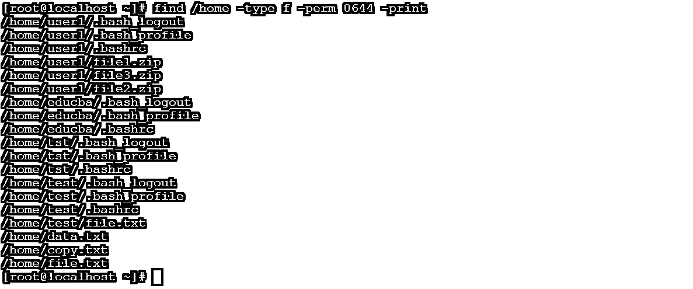

# Linux 查找命令

> 原文：<https://www.educba.com/linux-find-command/>

## Linux Find 命令简介

在 Linux 操作系统中，find 命令是一个非常常见且高度可用的命令。find 命令用于在 Linux 环境中定位或搜索文件或目录。文件和目录的搜索基于特定的标准，或者换句话说，它将取决于兼容的选项。使用 find 命令时，我们可以使用不同的条件进行搜索，如用户、日期、组、权限、大小、文件类型等。此外，我们可以将 find 命令与多个命令或操作符一起使用。换句话说，我们也可以说 find 命令用于递归过滤 Linux 文件系统中的对象。过滤基于输入选项或条件。

**文本编辑器的语法**

<small>网页开发、编程语言、软件测试&其他</small>

`find [-H] [-L] [-P] [-D debugopts] [-Olevel] [path...] [expression]`

*   **find:** 我们可以在语法或命令中使用“find”关键字。它将采用不同的参数，如选项、表达式、文件或目录的路径等。所提供的参数将在 Linux 操作系统上找到所需的文件或目录。
*   像-H、-L 和-P 这样的 find 命令选项将控制符号链接的处理。命令行参数将帮助获取要检查的文件或目录的名称，直到以“-”开头的第一个参数。
*   **PATH:** 我们可以为 find 命令提供不同的文件或目录路径。
*   **表达式:**根据需要，我们可以在 find 命令中使用自定义表达式或系统表达式。

### Linux 的 Find 命令是如何工作的？

在 Linux 环境中，我们有多种工具来搜索和定位文件或目录。但是 find 命令行实用程序方便快捷。我们可以使用自定义表达式的多种组合来搜索文件或目录。find 命令将接受不同的参数，如选项、表达式、文件或目录路径等。根据输入参数，find 命令将在 Linux 操作系统中搜索或定位文件或目录。

下面是我们可以在 find 命令中使用的选项列表。

| **服务请求编号** | **选项** | **描述** |
| One | -gid n | 文件的数字组 ID 是 n。 |
| Two | –组名 | 该文件属于输入组 gname。但是数字组 ID 允许。 |
| Three | -ilname 模式 | 它将接受 Like -lname，但匹配不区分大小写。 |
| Four | -同名模式 | 选项类似于-name，但匹配不区分大小写。 |
| Five | -inum n | 该文件的索引节点号为 n。因此，使用-samefile 测试更容易。 |
| Six | -ipath 模式 | 类似文件的路径，但匹配不区分大小写。 |
| Seven | -iregex 模式 | 它是一个正则表达式，但是匹配不区分大小写。 |
| Eight | -iwholename 模式 | 它会看到-ipath。另一种选择比-ipath 的可移植性差。 |
| Nine | -链接 n | 这些文件有“n”个链接。 |
| Ten | -名称模式 | 这些文件是符号链接，其内容与 shell 模式相匹配。 |
| Eleven | -敏敏 | 这将有助于识别“n”分钟前最后修改的数据。 |
| Twelve | 时间 | 这将有助于识别“n*24 小时”分钟前的最后修改数据。 |

### 实现 Linux Find 命令的例子

下面给出了 Linux Find 命令的例子:

#### 示例# 1–在“/”目录中查找文件

find 命令非常简单易用。我们正在“/”位置中搜索所需的文件。

**命令:**

`find / -name elearning`

**说明:**

我们在“/”位置找到了“电子教学”文件。

**输出:**

#### 示例 2–在工作目录中查找文件

在 Linux 中，我们能够在当前或工作目录中找到文件。

**命令:**

`find /home/user1 -name elearning`

**说明:**

按照上面的命令，我们在“/home/user1”位置找到了“elearning”文件。

**输出:**

#### 示例 3–忽略案例

默认情况下，find 命令区分大小写。为了克服这种情况，我们需要使用“-i”选项。

**命令:**

`find / -iname eleaRnInG`

**说明:**

我们在“/”位置找到了不区分大小写的文件(“电子学习”)。

**输出:**

#### 示例 4–查找目录

在 Linux 中，我们能够搜索文件。同样，我们也能够搜索目录。因此，我们需要在 find 命令中使用“-d”选项。

**命令:**

`find / -type d -name dir_elearning`

**说明:**

按照上面的命令，我们在“/”位置找到了“dir_elearning”目录。

**输出:**

#### 示例# 5–带有文件扩展名

在 find 命令中，我们可以找到具有特定文件扩展名的文件。

**命令:**

`find / -type f -name "*.zip"`

**说明:**

我们正在“/”位置查找所有的“zip”文件。

**输出:**

#### 示例# 6–查找有权限的文件

在 Linux find 命令中，我们能够根据文件权限找到文件。

**命令:**

`find /home -type f -perm 0644 -print`

**说明:**

按照上面的命令，我们在“/home”位置找到了具有 rw，r，r 权限的文件。

**输出:**

#### 示例# 7–查找可执行文件

在 find 命令中，我们能够找到拥有可执行权限的文件。

**命令:**

`find /home -perm /a=x`

**说明:**

按照上面的命令，我们只能在“/home”位置找到可执行文件。

**输出:**

#### 示例 8–查找空文件

在 Linux 的 find 命令中，我们能够找到空文件。

**命令:**

`find /home -type f -empty`

**说明:**

按照上面的 find 命令，我们在“/home”位置找到了“空”文件。

**输出:**

#### 示例 9–查找隐藏文件

在 find 命令中，我们能够找到隐藏的文件

**命令:**

`find /home/user1 -type f -name ".*"`

**说明:**

按照上面的命令，我们在“/home/user1”位置找到隐藏文件。

**输出:**

### 结论

我们已经看到了“Linux Find Command”的完整概念，以及正确的示例、解释和具有不同输出的命令。然后，根据需求，我们能够找到具有多个条件的文件或目录。

### 推荐文章

这是一个 Linux Find 命令指南。在这里，我们将讨论 Linux Find 命令是如何工作的，并给出实现 Find 命令的例子。您也可以看看以下文章，了解更多信息–

1.  [Linux 列表组](https://www.educba.com/linux-list-groups/)
2.  [Linux 用户](https://www.educba.com/linux-users/)
3.  [Linux mdadm](https://www.educba.com/linux-mdadm/)
4.  [Linux 挂载命令](https://www.educba.com/linux-mount-command/)

