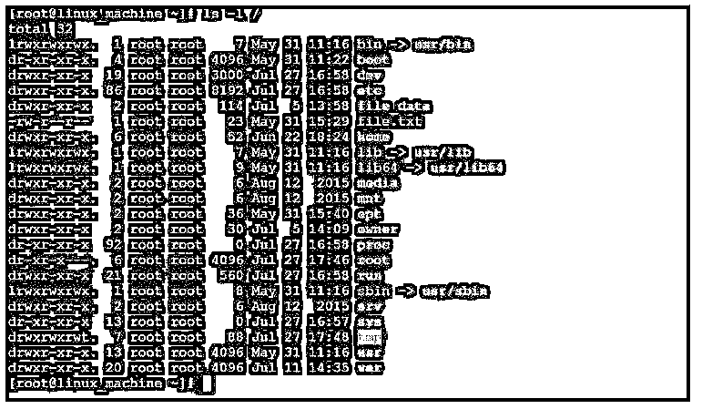
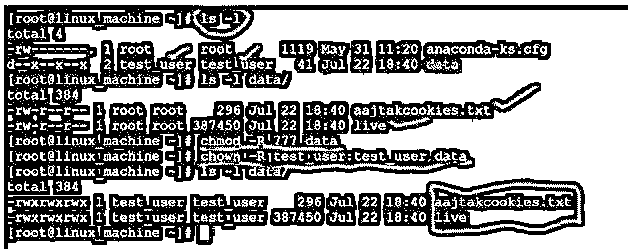

# Linux 目录权限

> 原文：<https://www.educba.com/linux-directory-permissions/>

## Linux 目录权限介绍

在 Linux 操作系统中，目录权限用于授予访问特定目录的权限。目录的权限级别有点类似于文件。在目录权限中，我们需要处理读权限、写权限和执行权限。在 Linux 生态系统中，我们得到了多用户环境，即多个用户可以访问 Linux 环境以及目录结构。以避免任何数据丢失或任何不受信任的用户访问。必须在各自的目录中保留适当的权限目录。

**Note:** When the directory owner will create any directory thenhe or she will get full access to the newly created directory and group, other users will get the read and execute access only.

### **目录权限语法**

下面给出了目录权限的语法:

<small>网页开发、编程语言、软件测试&其他</small>

`ll [ Directory Name ] chmod [ OPTION ] [ Access Type ] [ Directory Name/Path ] chown [ OPTION ] [ Owner/Group ] [ Directory Name/Path ]`

*   **ll:**“ll”命令用于打印特定目录的目录权限信息。
*   我们可以在语法或命令中使用 chmod 关键字。它将两个参数作为访问权限和目录名或路径。根据提供的参数，它将更改指定目录的目录权限。
*   **chown:**“chown”关键字类似于“chmod”。但是在这里，我们使用 chown 来更改目录所有者和组。
*   **选项:**我们可以提供不同的标志作为与“chmod”和“chown”命令兼容的选项。
*   **访问类型:**我们可以提供与“chmod”命令兼容的不同访问权限标志。
*   **目录名称/路径:**根据需要，我们可以提供目录的名称或路径来更改权限。

### Linux 目录权限是如何工作的？

目录权限基于以下两点:

*   许可/访问类型
*   访问组或用户

根据以上两点，我们可以对目录设置或定义目录权限。

**1。权限/访问类型:**在 Linux 环境下，权限类型会是读、写、执行。

**2。访问组或用户:**我们可以定义或授予特定组或用户的访问权限。相应地，目录许可特定的组或用户可以访问目录。

以下是可用的目录权限选项列表:

| **Sr 号** | **选项** | **描述** |
| One | -4，-读 | 我们可以使用整数值“4”来授予对目录的读取权限。 |
| Two | -2，–写 | 我们可以使用整数值“2”来授予对目录的写访问权。 |
| Three | -1，–执行 | 我们可以使用整数值“1”来授予对目录的执行访问权。 |

### Linux 目录权限的示例

下面是提到的例子:

#### 示例#1

目录权限

在 Linux 环境中，这是检查目录权限的一种非常简单和常见的方法。它将在 Linux 终端上打印当前的目录权限信息。

**代码:**

`ls -l /`

**说明:**

*   根据下面的截图，我们能够获得不同的目录访问类型信息。整个目录拥有“根”所有者和“根”组访问权限。

**输出:**

#### 实施例 2

目录权限–更改为“读取”权限

默认情况下，当任何目录将创建，然后目录所有者有完全的权限。该组和其他人将拥有读取和执行权限。但是我们可以将目录权限更改为只读。

**代号** **:**

`chmod 444 data`

**说明:**

*   我们正在将“数据”目录的访问类型从 755 (-rwx rx rx)更改为 444 (- r r r)。在“数据”目录上，所有者、组和其他人只有读取权限。

**输出:**

#### 实施例 2

目录权限–更改为“写入”权限

在目录权限概念中，我们能够将权限从当前状态更改为写权限。我们需要在 chmod 命令中使用“2”(写)整数值。

**代码:**

`chmod 222 data`

**说明:**

*   我们将“数据”目录的访问类型从 444 (-r r r)更改为 222 (- w w w)。在“数据”目录上，所有者、组和其他人只有写访问权。

**输出:**

#### 实施例 3

目录权限–更改为“执行”权限

在 Linux 环境中，我们能够将权限从当前状态更改为执行权限。我们需要在 chmod 命令中使用“1”(执行)整数值。

**代码:**

`chmod 111 data`

**说明:**

*   我们正在将“数据”目录的访问类型从 222 (-w w w)更改为 111(-e e e e)。在“数据”目录上，所有者、组和其他人只有执行访问权。

**输出:**

#### 实施例 4

目录权限–更改目录“所有者”

在 Linux 生态系统中，我们拥有将目录所有者从当前所有者更改为被请求用户的功能。

**Note:** While doing this change, it is mandatory that the login user is the owner of the directory or have sufficient privileges on the same working directory.

**代码:**

`chown test_user:root data`

**说明:**

*   按照上面的命令，我们能够将“data”目录的所有者从“root”用户更改为“test_user”用户。

**输出:**

#### 实施例 5

目录权限–更改目录“组”

根据目录所有者的变化，我们也可以改变访问目录组。

**代码:**

`chown test_user: test_user data`

**说明:**

*   根据上面的命令，我们可以将“data”目录组从“root”组更改为“test_user”组。

**输出:**

#### 实施例 6

目录权限–带选项“-R”

在 Linux 环境中，我们有大量的文件和子目录。不可能逐个更改目录权限。为了解决这个问题，我们使用了“-R”选项。借助这个选项，我们可以递归地设置目录权限。

**代码:**

`chmod -R 777 data/
chown -R test_user: test_user data/`

**说明:**

*   根据上面的两个命令，我们能够将“数据”目录访问类型从 755 (-rw r r)重新更改为 777 (-rwerwerwe)，将所有者和组从“root”更改为“test_user”。

**输出:**

### 结论

我们已经看到了“Linux 目录许可”的完整概念，以及正确的示例、解释和带有不同输出的命令。从安全角度来看，目录权限非常重要。我们能够更改目录的访问类型以及目录所有者和组。

### 推荐文章

这是一个 Linux 目录权限的指南。这里我们讨论 Linux 目录权限的介绍，目录权限如何工作的例子。您也可以看看以下文章，了解更多信息–

1.  [Linux 用户](https://www.educba.com/linux-users/)
2.  [Linux comm](https://www.educba.com/linux-comm/)
3.  [Linux 正则表达式](https://www.educba.com/linux-regular-expression/)
4.  [Linux 别名命令](https://www.educba.com/linux-alias-command/)

