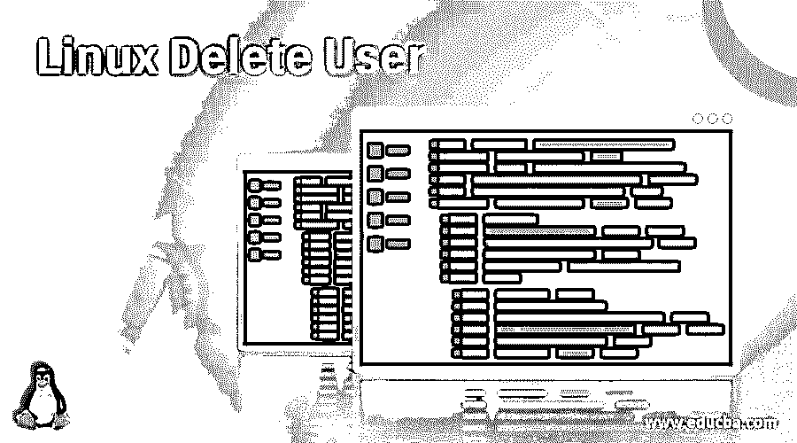

# Linux 删除用户

> 原文：<https://www.educba.com/linux-delete-user/>

## Linux 删除用户简介

Linux 删除用户选项用于从服务器上删除用户。通过从 Linux 中删除用户，我们还可以删除 SSH 访问，并删除用户的文件和用户所有权目录。只有拥有 root 权限，我们才能在 Linux 中删除用户。

**基本语法:**

<small>网页开发、编程语言、软件测试&其他</small>

`userdel user_name`

Linux 服务器是一个多用户可以同时登录的服务器。这意味着将会有许多用户同时被创建和交互。为了管理他们的账户，管理部门应该承担起管理用户账户的责任。在某些情况下，我们可能需要从服务器中删除某个用户，因为该用户不再与组织相关联，或者该用户不再在服务器中运行。在本文中，我们将讨论如何从服务器中删除用户。

**语法**

以下是从服务器中删除用户的方法。语法如下:

`userdel user_name
userdel [options] user_name
userdel -r user_name`

在这里，以下选项与 Linux 中的 userdel 命令一起使用:

*   **-f :** 强制删除用户账号，同时强制删除文件。
*   **-r :** 删除用户帐户以及邮件假脱机和用户的主目录
*   **-z :** 从 Linux 中删除用户时，如果 SELinux 用户被映射到用户，则删除 SELinux 用户。

### 如何从 Linux 中删除用户？

下面是我们可以用来对服务器中的用户执行删除操作的选项。

| **选项** | **描述** |
| -f | 强制删除一个用户帐户，并强制删除文件。 |
| -r | 删除用户帐户以及邮件假脱机和用户的主目录 |
| -z | 从 Linux 中删除用户时，如果 SELinux 用户被映射，则删除 SELinux 用户。 |

**按照下面的步骤在 Linux 中删除用户:**

**第一步:**在 Linux 服务器中删除用户的第一步是锁定用户的账号。我们可以通过以下过程做到这一点。

`$ passwd -l user_name`

**第二步:**然后，我们需要将用户主目录中的文件备份到备份文件夹中。我们可以使用 tar 选项来压缩文件的大小。

`$ tar -zcvf /backup_folder.tar.gz /home/user_name/`

**第三步:**删除用户设置的 cron 作业。

`$ crontab -r -u username`

**步骤 4:** 然后删除系统中可用的打印作业。

`$ lprm user_name`

**第五步:**显示用户拥有的所有文件。

**第六步:**最后，我们将删除服务器中的用户帐户。Userdel 命令用于删除服务器中的用户。我们可以如下图所示。

`$ userdel -r user_name`

### 从 Linux 服务器中删除用户的示例

以下是在服务器中使用 userdel 命令删除用户表单服务器的示例。为了更好地理解，通过示例对选项进行了简要描述。

#### 示例# 1–无选项

当 Linux 中的 userdel 命令没有传递任何选项时，它将从服务器中删除用户。

**语法:**

`userdel user_name`

示例:如果我们想要删除一个名为“nikhil”的用户，那么我们可以通过下面的示例从 Linux 中删除他的帐户。

`userdel nikhil`

#### 示例 2–选项-r

要删除用户的主目录和邮件假脱机，我们可以在 userdel 命令中使用选项-r 来删除它们。

**语法:**

`userdel -r user_name`

示例:要删除名为“nikhil”的用户的主目录及其邮件假脱机，我们可以在 Linux 中通过下面的示例来完成。

`userdel -r nikhil`

#### 示例 3–选项 f

当被删除的用户在其他位置有任何其他文件时，我们可以使用选项-f 强制删除它们，即使它不属于该用户。

**语法:**

`userdel -r -f user_name`

示例:如下所示，可以从其他位置完全删除文件。

`userdel -r -f nikhil`

#### 示例# 4–选项-z

要删除任何 SELinux 用户映射到的用户，我们可以使用-z 选项。

**语法:**

`userdel -z -r -f user_name`

示例:我们可以通过使用-z 选项删除映射到名为' nikhil '的用户的任何 SELinux 用户，如下所示。

`userdel -z -r -f nikhil`

### 结论

在本文中，您已经学习了如何使用 userdel 命令从 Linux 服务器中删除用户。我们可以删除 Ubuntu、RHEL、CentOS 中的用户，方法与在 Linux 中类似。Userdel 命令是一个非常重要的命令，主要由管理人员使用，用于监控服务器中未使用的用户帐户是否被删除。删除用户选项用于从服务器中删除用户。通过从 Linux 中删除用户，我们还可以删除 SSH 访问，并删除用户的文件和用户所有权目录。只有当我们拥有 root 权限时，我们才能删除用户。

### 推荐文章

这是一个 Linux 删除用户指南。这里我们讨论如何从 Linux 服务器上删除一个用户，以及不同的例子。您也可以看看以下文章，了解更多信息–

1.  [Linux 重命名命令](https://www.educba.com/linux-rename-command/)
2.  [Linux rm 命令](https://www.educba.com/linux-rm-command/)
3.  [Linux More 命令](https://www.educba.com/linux-more-command/)
4.  [Linux 目录结构](https://www.educba.com/linux-directory-structure/)

