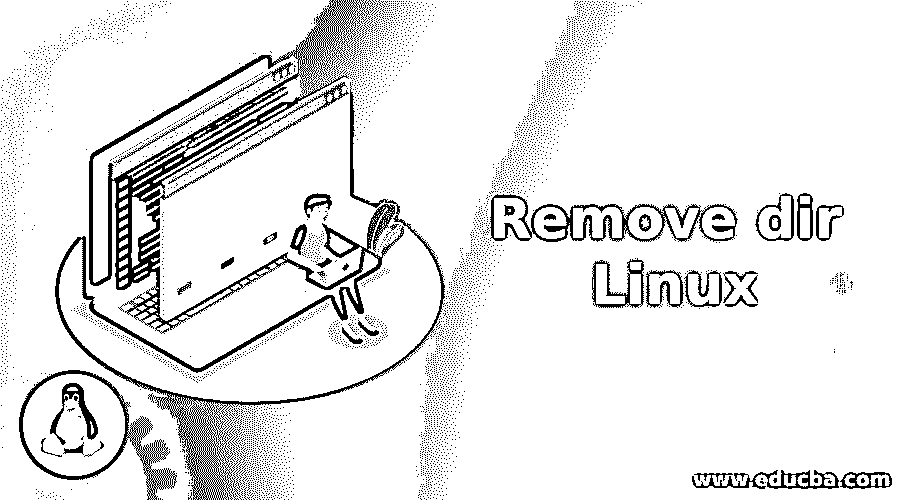

# 删除目录 Linux

> 原文：<https://www.educba.com/remove-dir-linux/>

## 移除目录 Linux 简介

我们知道 Linux 系统是由文件和目录组成的。我们的系统中可能有大量不再需要的目录。所以我们需要定期清理它们来释放空间。在 Linux 中，有像 Remove dir Linux、rm 和 find 命令这样的命令，用于从我们的 Linux 文件系统中删除目录。在这篇文章中，我们将讨论如何使用各种命令行选项删除 Linux 中的目录。

### 用于删除 Dir Linux 的命令

命令 rmdir、rm 和 find 用于从我们的 Linux 系统中移除或删除目录。让我们逐一讨论。

<small>网页开发、编程语言、软件测试&其他</small>

#### Rmdir 命令

rmdir 命令用于从我们的 Linux 操作系统中删除空目录。每个需要删除的目录都不应该包含任何文件或子目录。否则，rmdir 命令无法从我们的文件系统中删除该目录。目录按照在命令行中指定的顺序删除，即从左到右。要同时删除父目录和父目录的子目录，应该首先提到子目录，这样父目录就为空，rmdir 可以删除它。

### 句法

rmdir 命令的语法如下所示。

`rmdir [-p] [-v, --verbose] [--ignore-fail-on-non-empty] [ directory names....]`

**解释:**这里 p、v 和 ignore-fail-on-non-empty 是 rmdir 命令中使用的选项。

### 实现 Remove dir Linux 的示例

下面是提到的例子:

#### 示例#1

**代码:**

`rmdir sampledir1`

**解释:**如果目录 sampledir1 为空，上述命令将删除该目录。如果它不为空，则会产生错误消息。在这种情况下，您必须先移除目录内容，然后再删除它。

#### 实施例 2

要一次删除多个目录，请使用以下命令。

**代码:**

`rmdir sample1 sample2 sample3`

**输出:**

**解释:**如果目录 sample1、sample2 和 sample 3 为空，上述命令将删除它们。如果任何目录不为空，则将显示该特定目录的错误消息，其他目录将从文件系统中删除。

### 如何忽略非空目录？

默认情况下，如果您试图删除一个非空目录， **rmdir** 命令将产生一个错误消息。要忽略删除非空目录时出现的错误消息，请使用–ignore-fail-on-non-empty 选项。

**代码:**

`$ rmdir--ignore-fail-on-non-empty test-dir`

**输出:**

### 如何使用 Remove dir Linux 删除父目录？

rmdir 命令还可以对父目录执行操作。它能够一次性删除目录及其父目录。您可以在 **-p** 选项的帮助下使用该功能。

**代码:**

`$ rmdir -p test/testdir/`

**解释:**上面的命令将删除 test 和 testdir 目录。为此，除了要删除的空目录之外，所有父目录都应该为空。

### 如何获得删除目录 Linux 的帮助？

要获得关于 rmdir 命令的帮助，请使用以下命令。

**代码:**

`$ rmdir --help`

#### RM 命令

rm 是一个实用程序命令，用于删除文件和目录。rm 命令可用于删除空目录和非空目录。

默认情况下，如果使用不带任何选项的 rm 命令，它不会删除目录。使用-d 选项删除空目录。

如果您希望删除一个非空目录，那么您可以使用带有递归选项(-r 或–R)的 rm 命令。

**代码:**

`$ rm [options] [directory name]`

### 使用 RM 命令删除目录

要删除名为 sampledir 的目录及其所有内容，请使用以下命令。

**代码:**

`$ rm - r sampledir`

如果文件或目录是写保护的，那么您将被提示确认。要删除目录而不显示提示消息，请使用-f 选项，如下所示。

**代码:**

`$ rm –rf sampledir`

**输出:**

**解释:**要一次删除多个目录，请键入目录的名称，并用空格分隔每个目录。

`$ rm -r one two three`

如果使用-i 选项，在删除每个文件或目录之前，系统会提示您进行确认。如果目录包含很多文件和子目录，这可能会令人恼火。在这种情况下，我们可以使用-I 选项，在删除之前只提示用户一次。

`$ rm –rI sampledir`

将会提示您一次。要删除目录，键入 **y** 并按回车键。我们也可以使用正则表达式来删除目录。例如，如果您想删除当前目录中以 _ing 结尾的所有目录，可以使用下面的命令。

`$ rm -r *_ing`

#### 查找命令

find 命令在当前工作目录中搜索与给定搜索条件匹配的文件，并在匹配的文件或目录上执行给定的操作。您可以通过名称、扩展名、组、修改日期、权限等来搜索文件。

find 命令还用于删除与给定模式匹配的目录。例如，要删除当前目录中所有以 _tmp 结尾的目录，请使用以下命令。

**代码:**

`$ find . -type d -name '*_tmp' -exec rm -r {} +`

**说明:**

*   **(。)–**它在当前工作目录中递归搜索。
*   **-键入**-仅搜索目录。
*   **-name ' *-tmp '**-仅搜索以 _tmp 结尾的目录
*   **-exec**–使用选项-r 执行外部命令 rm。
*   **{ }+**–将搜索到的目录追加到命令 rm 的末尾。

### 如何清除所有空目录？

要删除所有空目录，请运行以下命令。

**代码:**

`$ find /dir -type d -empty -delete`

**说明:**

*   **/dir**–从/dir 目录和/dir 目录下的所有子目录开始搜索。
*   **-键入**-仅搜索目录。
*   **-empty**-仅搜索空目录。
*   **-删除**-删除所有找到的空目录。

-使用 delete 选项时应格外小心。如果首先指定了-delete 选项，那么该命令将删除我们指定的起点以下的所有目录。

### 结论

在本文中，我们讨论了如何使用各种命令行选项从 Linux 系统中删除目录。删除目录时要格外小心，因为一旦删除，几乎不可能在 Linux 系统中恢复文件。

### 推荐文章

这是一个删除 dir Linux 的指南。这里我们讨论一个关于如何删除目录的介绍，如何删除父目录，如何删除所有的空目录。您也可以浏览我们的其他相关文章，了解更多信息——

1.  [Linux 中的复制命令](https://www.educba.com/copy-command-in-linux/)
2.  [Linux 中的 CAT 命令](https://www.educba.com/cat-command-in-linux/)
3.  [Linux 中的 mv 命令](https://www.educba.com/mv-command-in-linux/)
4.  [Linux 中的顶级命令](https://www.educba.com/top-commands-in-linux/)

