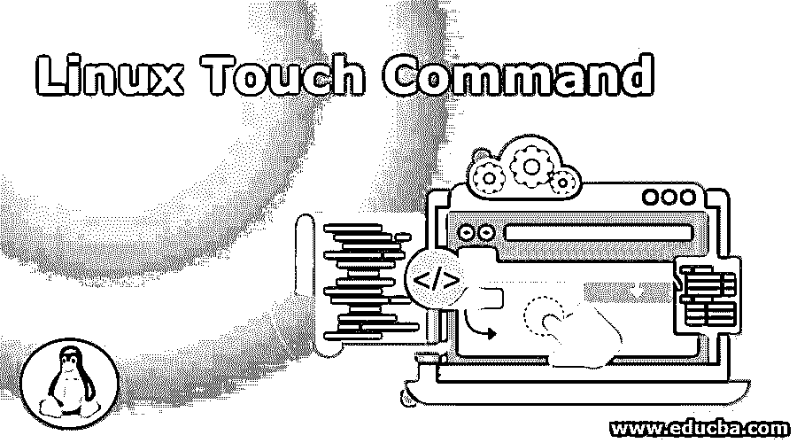
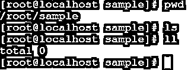
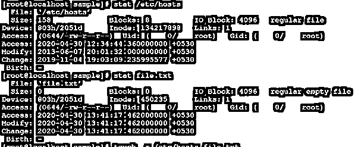
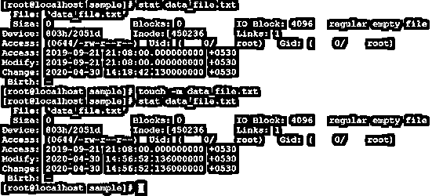
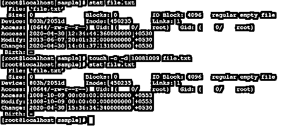

# Linux 触摸命令

> 原文：<https://www.educba.com/linux-touch-command/>

## Linux 触摸命令简介

在 UNIX 或 Linux 操作系统中，touch 命令用于创建空文件和/或更新文件或目录的访问、修改、更改时间戳。触摸命令避免了打开、更新、保存和关闭文件。它将直接更新与文件或目录相关的日期或时间戳。Linux Touch 命令行实用程序由保罗·鲁宾、阿诺德·罗宾斯、吉姆·金登、大卫·麦肯齐和兰迪·史密斯编写。

**tee 命令的语法:**

<small>网页开发、编程语言、软件测试&其他</small>

`touch [ OPTION ] FILE NAME`

*   **touch:** 在命令|语法中使用 touch 关键字。它将两组参数作为选项和文件名，并在时间戳中进行必要的更改或创建空文件。
*   **选项:**我们可以提供不同的标志作为触摸命令的选项。
*   **文件:**输入文件名。

### Linux 触摸命令是如何工作的？

Linux touch 命令只是创建一个空文件，这对于更改文件和目录的时间戳值很有用。基本上，下面是在 Linux 操作系统中创建文件的两种不同的变体。

触摸命令:它只是创建没有内容的文件。当用户没有数据存储在文件中时，将创建触摸文件。

Cat 命令:它将创建包含内容数据的文件。

### Linux 触摸命令的实现实例

下面是 Linux Touch 命令的例子:

#### 示例 1–触摸命令

借助触摸命令，我们能够创建一个没有任何内容的空文件。

**命令:**

`pwd
ls
ll
touch file.txt
ll`

**说明:**

我们有一个样本目录。在同一个目录中，我们没有任何文件在里面(参考截图 1 (a))。在 touch 命令的帮助下，我们正在创建一个空的“file.txt”文件。在“ls”或“ll”命令的帮助下，我们能够列出所有文件并检查关于文件的更多信息(参见截图 1 (b))。

**输出:**

截图 1 (a)

截图 1 (b)

#### 示例 2–带“-a”选项的触摸命令

在 Touch 命令中，我们能够更改文件的上次访问时间戳。要更改上次访问时间戳，我们可以使用 touch 命令中的“-a”选项。

**命令:**

`touch -a file.txt
stat file.txt`

**说明:**

在示例目录中，我们有“file.txt”文件。文件的访问时间是 13:24:20(下午 01:24)(参考截图 2 (a))。现在我们需要更改文件的访问时间戳。我们将“-a”选项用于触摸命令，并更改访问时间戳。现在更新后的访问时间戳是(31:31:08)(下午 01:31)(参考截图 2 (b))。

**输出:**

截图 2 (a)

截图 2 (b)

#### 示例 3–带“-c”选项的触摸命令

在触摸命令中，我们有避免重复的功能。如果工作目录中存在相同的文件名，则触摸命令处理重复文件创建。我们需要在 touch 命令中使用“-c”选项。

**命令:**

`touch -c file1.txt
ls`

**说明:**

在上面的命令中，我们能够避免创建重复的文件。在示例目录中，我们已经有了“file.txt”文件。但是当创建一个具有相同文件名的新文件时，“-c”选项将避免在相同的工作目录中创建副本。

**输出:**

#### 示例 4–带“-r”选项的触摸命令

在触摸命令中，我们有更新其他文件的时间戳的功能。我们需要在 touch 命令中使用“-r”选项。

**命令:**

`touch -r /etc/hosts file.txt`

**说明:**

按照上面的命令，我们将时间戳(/etc/hosts)文件的相同时间戳修改为“file.txt”文件。“/etc/hosts”文件的时间戳为(2013-06-07 20:01:32)(参考截图 3 (a))。借助“-r”选项，我们能够将以前的文件时间戳更新为新的文件时间戳(参见屏幕截图 3 (b))。

**输出:**

截图 3 (a)

截图 3 (a)

#### 示例 5–带“-t”选项的触摸命令

在 Linux touch 命令中，我们也能够创建较旧的日期时间戳文件。我们需要在 touch 命令中使用“-t”选项。

**Note:** We need to follow the “YYMMDDHHMM” time format.

**命令:**

`touch -t 1909212108 data_file.txt`

**说明:**

按照上面的触摸命令，我们能够将日期文件与系统时间进行比较。借助“-t”选项和时间格式“YYMMDDHHMM”，我们能够创建较旧的文件。

**输出:**

#### 示例 6–带“-m”选项的触摸命令

在 Linux touch 命令中，我们只能更改文件修改时间戳。我们需要在 touch 命令中使用“-m”选项。

**命令:**

`touch -m data_file.txt`

**说明:**

根据上述触摸命令，我们只能修改文件修改时间。根据输出，“data_file.txt”文件的旧时间戳是(2019-09-21)。现在，借助“-m”选项，我们能够更改“data_file.txt”文件的修改时间戳。

**Note:** The current system time is consideredfor file modification timestamp.

**输出:**

#### 示例# 7–触摸命令创建多个文件

在 Linux 或 UNIX 操作系统中，我们可以用一个触摸命令创建多个文件。只是我们需要提供多个文件或多个文件的格式。

**命令:**

`touch f1 f2 f3 f4 f5
touch f{1..5}
ls`

**说明:**

根据要求，我们能够创建多个文件。创建多个文件有不同的方法。根据上面的触摸命令，我们选择了两种不同的方式来创建多个文件。

**输出:**

#### 示例 8–带“-c -d”选项的触摸命令

在 touch command 中，我们能够更改访问时间戳和文件修改时间戳。我们需要在 touch 命令中同时使用“-c”和“-d”选项。

**命令:**

`touch -c -d 10081009 file.txt
stat file.txt`

**说明:**

我们能够更改文件的访问和修改时间戳。

**输出:**

**

** 

### 结论

我们已经看到了“Linux 触摸命令”的完整概念，以及正确的示例、解释和具有不同输出的命令。默认的触摸命令用于创建空的或不包含文件。在运行时，我们能够创建触摸文件并写入文件。

### 推荐文章

这是一个 Linux 触摸命令的指南。在这里，我们将讨论 Linux Touch 命令及其不同命令的概述、解释以及示例和代码实现。您也可以浏览我们推荐的其他文章，了解更多信息——

1.  [Linux 的优势](https://www.educba.com/advantage-of-linux/)
2.  [Linux 系统命令](https://www.educba.com/linux-system-commands/)
3.  [Linux 发行版](https://www.educba.com/linux-distributions/)
4.  [Linux 操作员](https://www.educba.com/linux-operators/)

