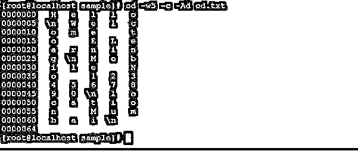

# Linux OD

> 原文：<https://www.educba.com/linux-od/>

## Linux OD 简介

Linux od 命令用于将输入数据或文件的内容转换成不同的格式，如十六进制、十进制、有符号十进制、无符号十进制、八进制。od 命令的默认转换是八进制。Linux od 命令对于修复或识别 bash/shell 脚本或程序中不需要的更改或字符特别有用。如果我们向 od 命令提供一个或多个输入文件。od 命令将按照输入的列表顺序连接它们。根据要求，输出将以不同的格式显示。Linux od 命令由 Jim Meyering 编写。

**语法**

<small>网页开发、编程语言、软件测试&其他</small>

`od [ OPTION ][ FILE ]`

*   选项:根据需要，我们可以在 od 命令中提供不同的选项
*   文件:它是输入数据或文件

### Linux OD 命令是如何工作的？

Linux OD 命令通常用于将现有的输出转换成不同的格式。od 工具从输入文件获取输入，并根据 od 命令中的 give 选项转换输入文件的实际数据。od 命令的输出可能因同一命令中使用的选项而异。

### 实现 Linux OD 命令的例子

以下是提到的一些例子:

#### 示例#1

八进制格式的 od 命令:这是 OD 命令最基本最简单的用法。我们可以得到八进制格式的输出数据。“-b”选项将在 od 命令中使用。

**代码:**

`od –b od.txt`

**输出:**

解释:我们有一个样本目录。在同一个目录中，我们有一个“od.txt”文件，其中包含一些示例数据(参考截图 1 (a))。在 od 命令中，我们使用“-b”选项来获得八进制格式的输出结果。它只是将输入数据文件转换成默认的八进制格式。您将获得转换格式的输出数据(参见截图 1 (b))。

#### 示例#2

字符格式的 od 命令:在 OD 命令中，我们有以字符格式获取输入数据的功能。我们需要在 od 命令中使用“-c”选项。

**代码:**

`od –c od.txt`

**输出:**

**说明:**在“od.txt”文件中，我们有文本数据在里面(参考截图 2 (a))。按照上面的命令，我们使用“-c”选项将输入数据转换成字符格式(参见截图 2 (b))。

#### 示例#3

带有偏移细节的 od 命令:在 OD 命令中，我们有从输出数据中移除偏移值或偏移信息的功能。要删除偏移信息，我们可以在 od 命令中使用“-An”选项。

**代码:**

`od -An -b od.txt`

**输出:**

**说明:**当我们将正常的输入数据或文件从一种格式转换为另一种格式时。按照默认标准，偏移值附加到输出中。但是，如果我们有一个大文件，那么重要的是要删除偏移值，以获得输出数据的短格式。在上面的 od 命令中，我们有输入文件“od.txt”。它正在联系正常的文本数据。转换成八进制格式后，输出数据带有偏移值(参见截图 3 (a))。现在，我们在 od 命令中使用“-An”选项从输出中移除偏移值(参见截图 3 (b))。

#### 实施例 4

带有连接的 od 命令:在 OD 命令中，我们可以用不同的值以连接格式显示输出。借助“-A”选项，我们可以添加或连接不同的值。

**代码:**

`od -Ao -c od.txt
od -Ax -c od.txt
od -Ad -c od.txt`

**输出:**

**说明:**根据上面的命令，我们可以用不同的连接格式显示输出。我们将得到十六进制格式的输出，将“o”与–A 连接在一起(参见屏幕截图 4 (a))。类似地，我们将得到十六进制格式的输出，其中将“x”与–A 连接起来(参见屏幕截图 4 (b))，同样将“d”与–A 连接起来(参见屏幕截图 4 (c))。

#### 实施例 5

带有用户输入的 od 命令:在 od 命令中，我们有将实时用户输入带到 OD 命令的功能，该命令将在按 ctrl+d 之前显示输出数据。

**代码:**

`od -b -`

**输出:**

**解释:**有时候我们需要一个活的解释器来解释用户数据，并在同一个动作中进行转换。od 命令提供了同样的功能。在上面的命令中，我们提供的输入数据是“Hello EDUCBA”。od 命令将获取输入数据并将其转换为八进制格式。

#### 实施例 6

有限字节的 od 命令:在 OD 命令中，我们可以在输出中显示有限的字节。我们可以使用“-N”来显示有限的字节。

**代码:**

`od -N5 -c od.txt`

**输出:**

**说明:**在截图 5 (a)中，我们得到的是字符格式的输出。但是现在我们不显示完整的输出。我们需要一个有限格式的输出。因此，我们使用“-N”选项来显示字符数(参见截图 5 (b))。

#### 实施例 7

带宽度选项的 OD 命令:根据需要，我们可以定制输出数据的宽度。

**代码:**

`od -w5 -c -Ad od.txt`

**输出:**

**说明:**在截图 6 (a)中，我们会得到输出显示的默认宽度尺寸。如果我们需要改变输出显示的宽度尺寸。我们可以在 od 命令中使用"-w "选项来实现。使用“-w”选项，我们需要指定宽度大小(参见截图 6 (b))。

### 结论

我们已经看到了“Linux OD 命令”的完整概念，以及正确的示例、解释和具有不同输出的命令。od 命令对于将输入数据转换成不同的格式很有用。它主要用于可视化非人类可读格式的输出数据。它会喜欢程序或可执行代码。

### 推荐文章

这是一个 Linux OD 指南。这里我们讨论 Linux OD 的介绍，语法，它是如何工作的，代码示例，输出和解释。您也可以浏览我们的其他相关文章，了解更多信息——

1.  [Linux 中的复制命令](https://www.educba.com/copy-command-in-linux/)
2.  [Linux 中的 PS 命令](https://www.educba.com/ps-command-in-linux/)
3.  [Linux tac](https://www.educba.com/linux-tac/)
4.  [Linux rm 命令](https://www.educba.com/linux-rm-command/)

