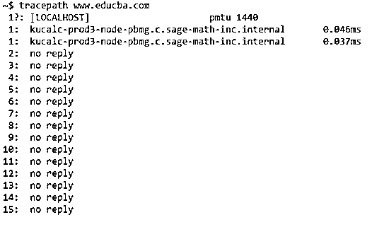
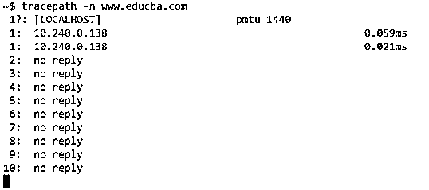
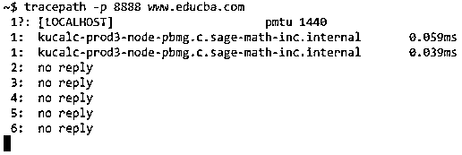

# Linux tracepath

> 原文：<https://www.educba.com/linux-tracepath/>

## Linux tracepath 命令简介

Linux 中的 tracepath 命令允许使用 UDP 端口或任何其他不需要任何超级用户权限的端口来跟踪到目的地路径的路径，确定沿着该路径的 MTU。Tracepath、tracepath6 是承载检测 MTU 及其路径的网络的路径轨迹。Tracepath6 是在 Linux 错误队列中运行的应用程序的最好例子。tracepath 中有许多选项可以帮助获取数据及其主机名和 IP 地址。

Tracepath 和 traceroute 作为 Linux 实用程序服务彼此相似。它们之间的主要区别是:

<small>网页开发、编程语言、软件测试&其他</small>

*   tracepath 中不需要 root 或超级用户权限。这是在 Linux 中使用 tracepath 而不是 traceroute 的主要原因。
*   Tracepath 仅使用 UDP 探测以及任何其他高端口。但是 traceroute 使用 UDP 以及 33434-33534 范围内的目的端口。

**语法:**

Linux tracepath 的一般语法是:

`tracepath [destination]`

当选项与 tracepath 命令一起给出时，语法如下:

`tracepath [-n] [-b] [-l pktlen] [-m max] [-port] destination`

### tracepath 命令在 Linux 中是如何工作的？

让我们举个例子，简单描述一下其中的每个参数。

tracepath6 4gge:2467:2:374::3

根据上面的截图，第一列给出了 TTL(生存时间)的信息，后面是冒号(:)。一般来说，TTL 值是从网络中获取的，而当 TTL 值没有被获取时，则由？.

第二列给出了网络跳数的信息。通常，它是路由器的地址。在某些情况下，当探测未发送到网络时，会显示单词(LOCALHOST)。

输出中显示的其余数据是关于网络跳或路径的各种信息。最后一行简要介绍了到达目的地的路径、MTU 路径、从目的地开始的网络跳数、探测中的网络跳数。

**Linux 中 tracepath 可用的选项**

在 Linux 中，tracepath 有几个选项可用于跟踪目的地的路径，使用 UDP 端口或任何其他端口沿此路径确定 MTU。

| **选项** | **描述** |
| **无选项** | 当 tracepath 命令的参数中没有选项时，它将只显示 tracepath 的语法。 |
| **带目的地的选项** | 我们可以使用 tracepath 追踪到目的地的路径 |
| **选项-n** | 当 tracepath 由选项 n 给出时，它在输出中打印 IP 地址。 |
| **选项-b** | 选项 b 将在输出中打印主机名和 IP 地址。 |
| **选项-l** | tracepath 的这个选项允许将数据包长度初始设置为 pktlen。 |
| **选项-m** | 选项 m 将允许将最大跳数或 TTL 数设置为最大值，而不是 30。 |
| **选项-p:** | 带有 tracepath 命令的选项 p 将允许设置要使用的目的端口。 |

### 实现 Linux tracepath 命令的示例

下面是几个在 Linux 中使用 tracepath 命令及其选项的例子。为了更好地理解，下面给出了语法和截图示例。

#### 1.别无选择

如果输入时不带任何选项，tracepath 将显示 tracepath 命令的语法，并带有与 tracepath 相关联的不同选项。每个选项都有简要说明。

**命令:**

`tracepath`

**输出:**

#### 

#### 2.带有目的地的跟踪路径

我们可以在 Linux 中使用 tracepath 命令，按照下面给出的语法跟踪到目的地的路径:

**语法:**

`tracepath destination`

**命令:**

`tracepath`[www.educba.com](https://www.educba.com/)

**输出:**

#### 3.选项-n

当 tracepath 由选项 n 给出时，它在输出中打印 IP 地址。有时我们需要目的地 IP 地址的详细信息，这时就更需要这个选项了。选项 n 的语法如下所示。

**语法:** `tracepath -n destination`

**命令:**

`tracepath -n`[www.educba.com](https://www.educba.com/)

**输出:**

#### 4.选项 b

选项 b 将在输出中打印主机名和 IP 地址。下面的屏幕截图中显示的输出为您提供了关于主机名和 IP 地址的完整信息。语法如下所示:

**语法:** `tracepath -n destination`

**命令:**

`tracepath -b`[www.educba.com](https://www.educba.com/)

**输出:**

#### 5.选项-l

tracepath 的这个选项允许将数据包长度初始设置为 pktlen。语法如下所示:

**语法:** `tracepath -l <num> destination`

**命令:**

`tracepath -l 42`[www.educba.com](https://www.educba.com/)

**输出:**

**

** 

#### 6.选项-m

选项 m 将允许将最大跳数或 TTL 数设置为最大值，而不是 30。语法如下所示:

**语法:** `tracepath -m <num> destination`

**命令:**

`tracepath -m 12`[www.educba.com](https://www.educba.com/)

**输出:**

#### 7.选项-p

带有 tracepath 命令的选项 p 将允许设置要使用的目的端口。每当我们需要在目的地探测器上设置一个固定端口时，我们都可以使用这个选项。它通常会限制端口选项的使用。该选项的语法如下所示:

**语法:** `tracepath -p 8888 destination`

**命令:**

`tracepath -p 8888`[www.educba.com](https://www.educba.com/)

**输出:**

### 结论

Linux 中的 tracepath 命令允许使用 UDP 端口或不需要任何超级用户权限的任何其他端口来跟踪到目的地路径的路径，确定沿着该路径的 MTU。Tracepath、tracepath6 是承载检测 MTU 及其路径的网络的路径轨迹。Tracepath6 是在 Linux 错误队列中运行的应用程序的最好例子。tracepath 中有许多选项可以帮助获取数据及其主机名和 IP 地址。

本文提供了关于如何以及何时在 Linux 中使用 tracepath 命令的完整信息。为了更好地理解，还通过截图对示例进行了简要描述。希望这篇文章能让你对 Linux 中的 tracepath 命令有一个清晰的认识。

### 推荐文章

这是一个 Linux tracepath 指南。在这里，我们讨论 Linux tracepath 命令及其不同命令的概述，以及示例和代码实现。您也可以浏览我们推荐的其他文章，了解更多信息——

1.  [Linux 的 18 大优势](https://www.educba.com/advantage-of-linux/)
2.  [Linux 系统命令介绍](https://www.educba.com/linux-system-commands/)
3.  [Linux 发行版](https://www.educba.com/linux-distributions/)
4.  [Linux 操作人员综合指南](https://www.educba.com/linux-operators/)

