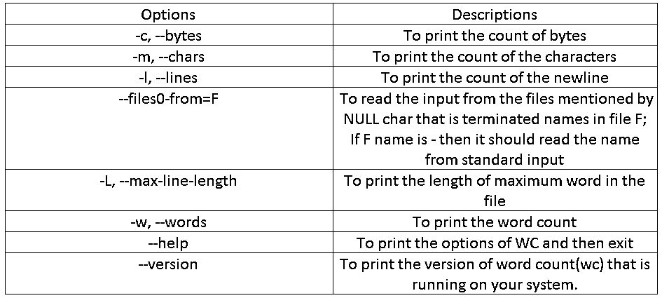

# Linux WC

> 原文：<https://www.educba.com/linux-wc/>

## Linux WC 的定义

Linux 操作系统中的命令 WC (word count)允许找出文件参数所提到的文件中的字数、换行符数以及字节或字符数。word count 命令返回的输出将给出文件中的行数或文件中的字数或字符数。

**语法:**

<small>网页开发、编程语言、软件测试&其他</small>

WC 命令的语法如下所示:

`wc [options].. [file]..`

这里的选项包括:

*   **wc -l:** 打印文件中的行数。
*   **wc -c:** 打印文件中的字节数。
*   **wc -w:** 打印一个文件的字数。
*   **wc -m:** 打印文件中的字符数。
*   **wc -L:** 打印文件中最长一行的长度。

### Wc 命令的优势

Linux 中的 WC 命令有助于找出以下几点:

*   允许找出文件参数中提到的字数、换行符数以及文件中的字节或字符数。
*   默认情况下，生成的输出是四列的。
*   四列输出参数是:第一列给出文件中的行，第二列给出文件中的字数，第三列给出文件中的字符数，最后一列是参数中的文件名。

### WC 命令在 Linux 中是如何工作的？

我们可以在 Linux 中使用–help 命令来了解 WC 命令在 Linux 中的工作方式。

**语法:**

`wc --help`

**用法:**

WC[OPTION]…[FILE]…
WC[OPTION]…–files 0-from = F

我们可以打印 word、newline，并计算系统中每个文件的字节数，如果参数中提到了多个文件，我们还可以计算总行数。文件中的一个单词是非零长度的字符，可以用空格分隔。当没有文件时，或者如果文件是-，那么我们应该读取标准输入。

下面提到的选项可用于选择打印的计数和始终按以下顺序打印的计数——换行符、单词、字符、字节、行的最大长度。

让我们以一个示例文件为例，对其执行 wc 命令。在这里，我们可以使用 cat 命令列出 fruits.txt 文件中的数据。

`cat fruits.txt
wc fruits.txt`

**输出:**

当我们对上面的文件执行 WC 命令时，我们可以看到显示的输出是一个四列的方式。这里第一列给出的是文件中的第 5 行，第二列给出的是文件中的字数，第三列给出的是文件中的字符数，是 38，最后一列是参数中的文件名，是 fruits.txt。

### Linux 中 WC 命令的例子

下面是可以在 WC 命令中使用的选项示例及其语法和示例，以便更好地理解。

#### 1.选项-l

要只打印文件中的行数，我们可以使用选项' l '。生成的输出将分为两栏，第一栏是行数，第二栏是文件名。

**语法:**

`wc -l filename`

**举例:**

`wc -l fruits.txt`

**输出:**

#### 2.选项-w

要仅打印文件中的字数，我们可以使用选项“w”。生成的输出将分为两栏，第一栏是字数统计，第二栏是文件名。

**语法:**

`wc -w filename`

**举例:**

`wc -w fruits.txt`

**输出:**

#### 3.选项-c

要仅打印文件中存在的字节数，我们可以使用选项“c”。生成的输出分为两栏，第一栏是字节数，第二栏是文件名。

**语法:**

`wc -c filename`

**举例:**

`wc -c fruits.txt`

**输出:**

#### 4.选项-m

要仅打印文件中存在的字符数，我们可以使用选项' m '。生成的输出将分为两栏，第一栏是字符数，第二栏是文件名。

**语法:**

`wc -c filename`

**举例:**

`wc -m fruits.txt`

**输出:**

#### 5.选项-L

选项“L”将有助于找出文件中最长的一行(就长字符而言)。文件中的字符将被视为包含空格、换行符或制表符。

**语法:**

wc -L filename

**举例:**

`wc -L fruits.txt`

**输出:**

#### 6.选项–版本

“版本”选项将帮助您打印系统上运行的字数(wc)版本。

**语法:**

`wc --version`

**举例:**

`wc --version`

**输出:**

### 推荐文章

这是一个 Linux WC 的指南。这里我们也讨论了 wc 命令的定义以及它在 linux 中是如何工作的？以及不同的示例及其代码实现。您也可以看看以下文章，了解更多信息–

1.  [Linux 用户](https://www.educba.com/linux-users/)
2.  [Linux 挂载命令](https://www.educba.com/linux-mount-command/)
3.  [Linux 粉碎](https://www.educba.com/linux-shred/)
4.  [Linux Inode](https://www.educba.com/linux-inode/)

