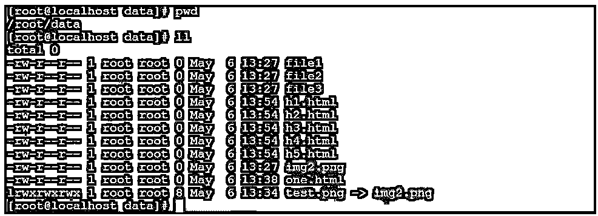
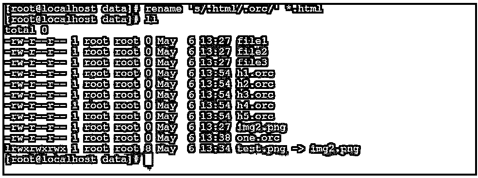
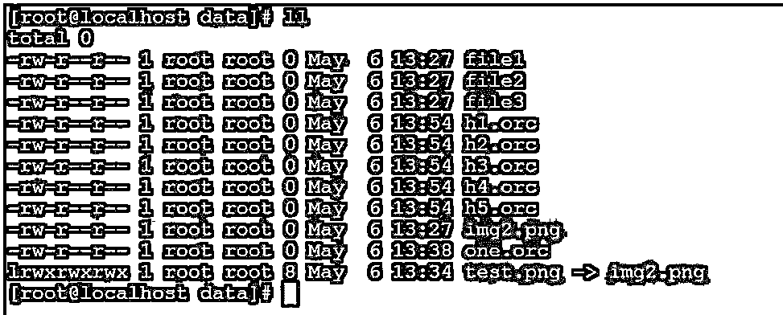
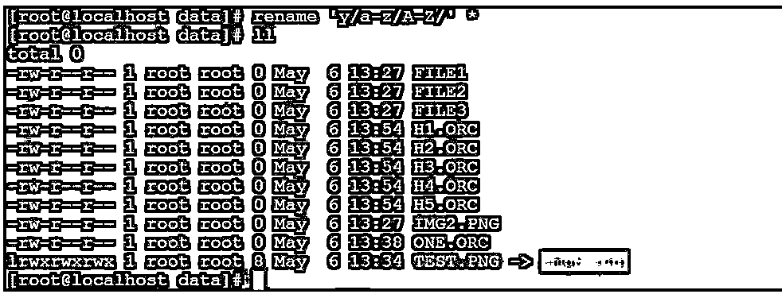
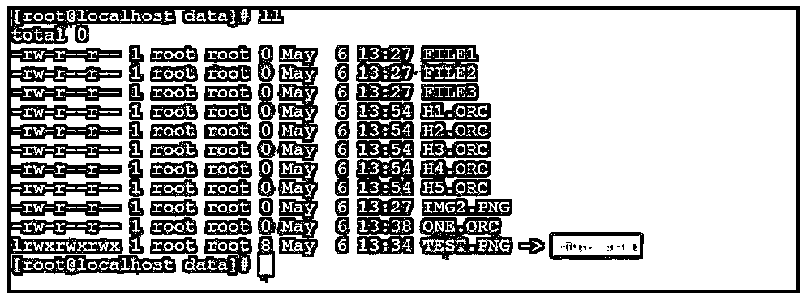
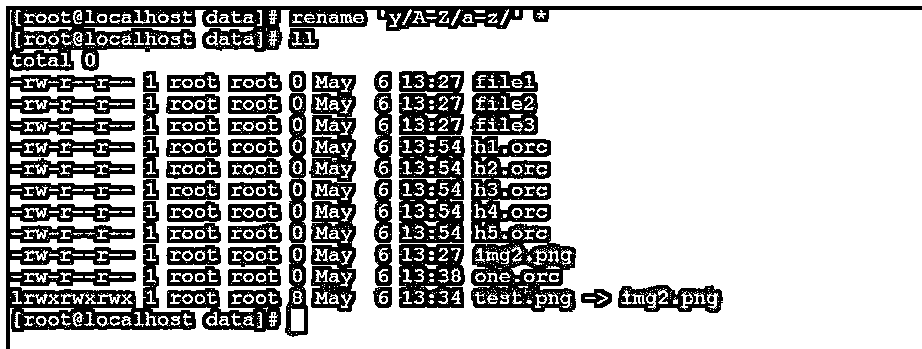
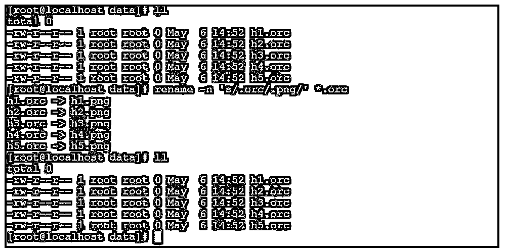
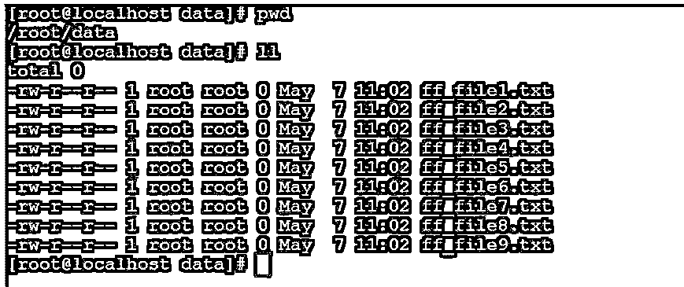
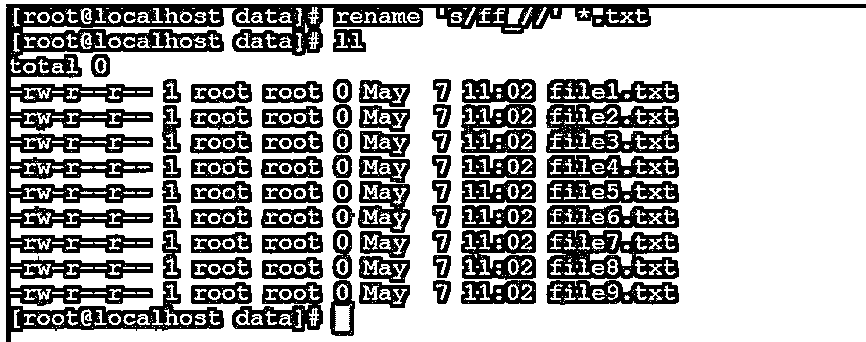

# Linux 重命名命令

> 原文：<https://www.educba.com/linux-rename-command/>

## Linux 重命名命令简介

在 Linux 操作系统中，rename 命令将通过替换第一次出现的 expression 来重命名多个文件。使用重命名命令时，如果用户没有向重命名命令提供文件名，那么它将考虑标准输入文件名。

**Note:** In Linux, move command is also used to rename the inputs files but the rename command is more advanced as compared to move (mv) command.

**语法:**

<small>网页开发、编程语言、软件测试&其他</small>

`rename [options] expression file...`

*   **重命名:**在命令|语法中使用 rename 关键字。它将把参数集作为选项、表达式、文件名和重命名文件。
*   **选项:**我们可以提供不同的标志作为重命名命令的选项。
*   **表达式:**我们需要在重命名命令中提供正则表达式。
*   **文件:**输入文件名。

### Linux 重命名命令是如何工作的？

顾名思义，rename 命令对于重命名多个文件非常有用。在内容中，我们正在寻找 pearl 版本的重命名命令。如果您的计算机中没有 rename 命令，请下载必要的软件包，以便在您的 Linux 环境中运行 rename 命令。重命名命令基本上是在给定选项值和表达式格式上工作。借助于选项和表达式值，rename 命令将重命名多个文件。

**Note:** Most of the time, we are using the mv (move) command to rename the file names. But in move command, we are just renaming the single files. Rename command is having more functionality as compared to mv command.

### Linux 重命名命令的示例

下面是一些例子:

#### 示例# 1–更改文件扩展名。

在 rename 命令的帮助下，我们能够把所有的文件扩展名改成其他的文件扩展名格式。

**代码:**

`rename 's/.html/.orc/' *.html`

**说明:**

我们有一个数据目录。在同一个目录中，我们有多个不同文件扩展名的文件。借助 rename 命令，我们能够将所有文件扩展名重命名为不同的文件扩展名。按照上面的重命名命令，我们正在重命名”。html“扩展到”。orc”扩展。

**输出:**

#### 示例 2–用大写字母重命名文件名。

借助重命名命令，我们可以将所有文件名从小写字母重命名为大写字母。

**代码:**

`rename 'y/a-z/A-Z/' *`

**说明:**

我们在同一个目录中创建了一个数据目录。我们有多个文件在里面。文件名是小写字母。借助重命名命令，我们可以将文件名从小写改为大写。在同一个目录中，我们可以对其中的所有文件进行同样的操作。不需要选择不可分割的文件。

**输出:**

#### 例 3–用小写字母重命名文件名。

在重命名命令中，我们可以将文件名从大写字母重命名为小写字母。

**代码:**

`rename 'y/A-Z/a-z/' *`

**说明:**

在数据目录中，我们有大写字母名称的文件数。在上面的重命名命令中，我们能够将工作目录中的所有文件从大写字母重命名为小写字母。

**输出:**

#### 

#### 示例 4–最终变更。

在重命名命令中，我们可以看到所有多个文件的最终更改，而无需更改实际文件名。我们可以在 rename 命令中使用“-n”选项来检查文件名的最终变化。

**代码:**

`rename -n 's/.orc/.png/' *.orc`

**说明:**

在数据目录中，我们有多个文件，文件扩展名为“”。兽人”。在对文件级别进行任何更改之前，我们需要检查文件在更改为任何其他文件扩展名后的样子。按照上面的命令，我们正在将多文件扩展名从"。兽人“到”。png”。在进行任何文件扩展名更改之前，rename 命令会显示文件扩展名输出。

**输出:**

#### 例 5–删除文件名的一部分。

在 linux rename 命令中，可以删除文件名中不需要的部分。根据要求，我们可以从多个文件中删除文件名的特定部分。

**代码:**

`rename 's/ff_//' *.txt`

**说明:**

在数据目录中，我们有许多文件。文件名以某种特殊格式“如 ff_”开头。我们不需要特殊格式的文件。我们需要从多个文件中删除所有的特殊字符名称。在上面的重命名命令中，我们可以用想要的文件名重命名所有的文件。

**输出:**

#### 

#### 例 6–删除文件名中的空格。

在重命名命令中，我们能够删除文件名中的所有“空格”。在同一命令的帮助下，我们根据需要用任何字符或特殊字符或数字替换文件名中的空格。

**代码:**

`rename 'y/ /_/' *`

**说明:**

在数据目录中，三个不同的文件在文件名中包含空格。在处理此类文件时，linux 应用程序或 shell 作业无法正确识别这些文件。我们需要用一个有效的名字来重命名文件。我们用下划线替换文件名中的空格。

**输出:**

### 结论

我们已经看到了“Linux 重命名命令”的完整概念，以及正确的示例、解释和带有不同输出的命令。重命名命令用于重命名多个文件。当我们需要处理大量文件，但文件命名不兼容时，这真的很有帮助。

### 推荐文章

这是一个 Linux 重命名命令的指南。在这里，我们讨论 Linux 重命名命令的介绍，该命令是如何工作的，并给出了相应的例子。您也可以看看以下文章，了解更多信息–

1.  [Linux 过滤命令](https://www.educba.com/linux-filter-commands/)
2.  [Linux 创建文件](https://www.educba.com/linux-create-file/)
3.  [Linux 中的帮助命令](https://www.educba.com/help-command-in-linux/)
4.  [Linux 中的 Head 命令](https://www.educba.com/head-command-in-linux/)

