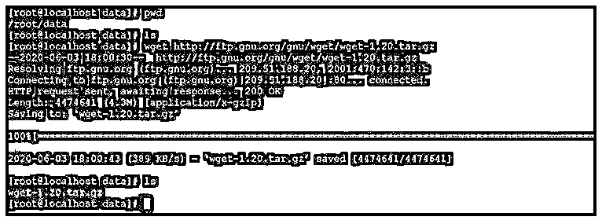
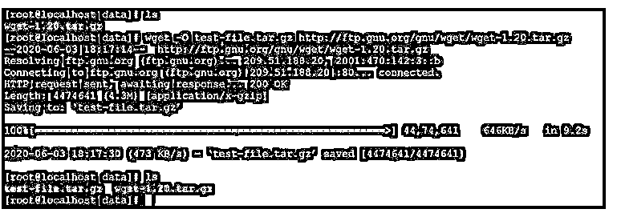
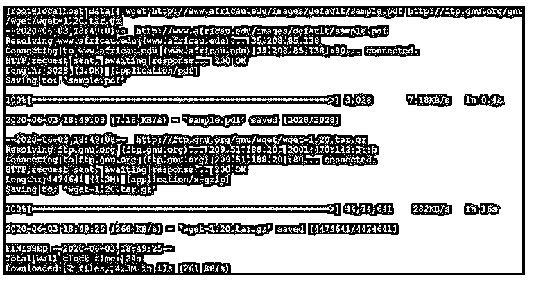
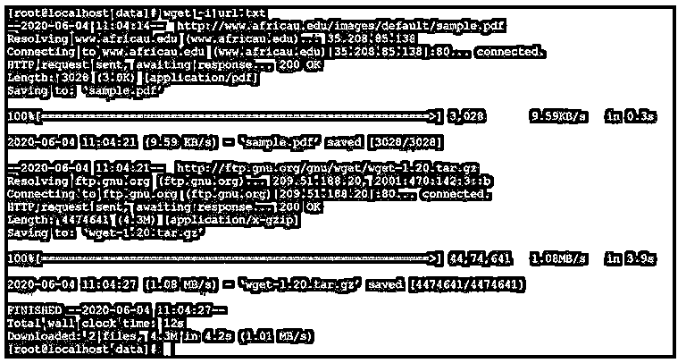
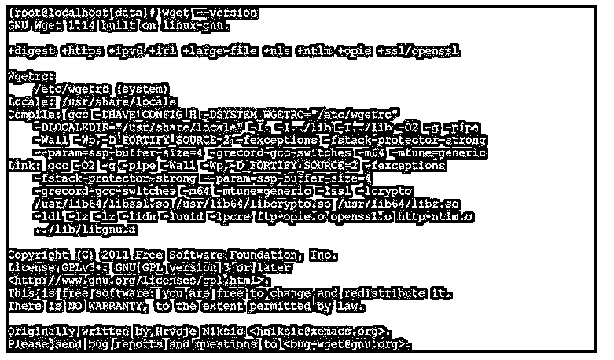

# Linux wget

> 原文：<https://www.educba.com/linux-wget/>

## Linux wget 简介

在 Linux 生态系统中，wget 是一个从互联网或任何数据提供商那里获取或下载文件的实用程序。它兼容不同的协议，如 HTTP，HTTPS，FTP 等。它也被称为非交互式网络下载器。这个实用程序是由 Hrvoje Niksic 编写的。

**wget 命令的语法:**

<small>网页开发、编程语言、软件测试&其他</small>

`wget [option]... [URL ]...`

*   **wget:** 我们可以在语法或者命令中使用 wget 关键字。它将两个参数作为选项和 URL。提供下载文件的最终结果。
*   **选项:**我们可以提供不同的标志作为与 wget 命令兼容的选项。
*   **URL:** 根据需要，我们可以将完全合格的 URL 传递给 wget 命令。

### Linux wget 命令是如何工作的？

*   wget 是非交互式实用程序。
*   基本上，从不同的平台获取文件会更加健壮和安全。
*   wget 实用程序被设计成可以在不稳定或慢速网络中工作。
*   当任何文件试图下载，但由于网络连接的文件没有完全下载。
*   然后 wget 命令将使用最后一个下载点下载相同的文件。
*   它不会从开始就完全下载相同的文件。
*   它还会递归下载文件。
*   wget 命令作用于 wget 选项和 wget 下载 URL。
*   按照参数集，wget 命令将下载文件。

**Note:** When we are passing the URL in wget command, we need to provide the compete download URL. So the command will directly hit the URL and get the file.

### Linux wget 的例子

下面是一些例子:

#### 示例#1

wget 命令

它是 wget 的基本命令。它将从提供的 URL 下载单个文件。同时，它还会提供文件下载时间戳和下载状态栏。

**注意:**默认情况下，wget 包不存在于 Linux 操作系统中。

我们需要按照下面的命令下载它。

`“yum install wget”`

**代码:**

`wget http://ftp.gnu.org/gnu/wget/wget-1.20.tar.gz`

**说明:**

*   根据下面的输出截图，我们在数据目录中。其中没有数据/文件。
*   使用 wget 命令，我们能够从互联网上下载 wget 文件。它会将下载文件存储在当前或工作目录中。

**输出:**

#### 实施例 2

wget 命令–用自己的文件名下载文件

在 wget 中，我们为任何下载文件提供自己的文件名。我们需要在 wget 命令中使用“-O”选项。

**代码:**

`wget -O test-file.tar.gz http://ftp.gnu.org/gnu/wget/wget-1.20.tar.gz`

**说明:**

*   按照上面的命令，我们在 wget 命令中使用“-O”选项。
*   将下载文件名改为我们自己的文件名是很有用的。这里，我们使用“test-file.tar.gz”作为自己的文件名。

**输出:**

#### 实施例 3

wget 命令–下载多个文件

在 wget 中，我们可以在同一个命令中下载多个文件。我们需要为 wget 命令提供多个下载 URL。

**代码:**

`wget http://www.africau.eimg/default/sample.pdf http://ftp.gnu.org/gnu/wget/wget-1.20.tar.gz`

**说明:**

*   按照上面的命令，我们能够同时下载多个文件。我们只需要在命令中传递多个 URL。
*   我们已经传递了示例 pdf URL 和 tar 文件 URL。最终结果是，我们将在同一个工作目录中获得这两个文件。

**输出:**

#### 实施例 4

wget 命令–从文件 URL 下载

在 wget 中，我们可以在 URL 文件的帮助下从互联网上下载大量的文件。URL 文件只是一个简单的文件，我们将整个下载 URL 复制到其中。

**代码:**

`wget -i url.txt`

**说明:**

*   我们将整个下载 URL 保存在“url.txt”文件中，并将该文件传递给 wget 命令。

**输出:**

#### 实施例 5

wget 命令–恢复下载

在 wget 命令中，我们有恢复旧下载的功能。它不会重新下载文件。它将从最后一个下载实例继续下载。

**代码:**

`wget -c http://centos.mirror.snu.edu.in/centos/8.1.1911/isos/x86_64/CentOS-8.1.1911-x86_64-dvd1.iso`

**说明:**

*   按照上面的命令，我们能够恢复旧的下载文件。
*   下载文件被手动停止。但是在"-c "选项的帮助下，我们可以恢复下载文件。

**输出:**

#### 实施例 6

wget 命令–限制带宽

ethtool 工具用于获取 Wget 接口的详细信息。

**代码:**

`wget -c --limit-rate=50k http://centos.mirror.snu.edu.in/centos/8.1.1911/isos/x86_64/CentOS-8.1.1911-x86_64-dvd1.iso`

**说明:**

*   为了避免网络带宽问题，我们可以在下载文件时限制带宽使用。
*   根据网络速度，我们可以定义下载的带宽利用率。这里我们要定义 50KB 为下载速度。

**输出:**

#### 实施例 7

wget 命令–使用用户 ID 和密码下载

根据安全下载，我们可以在 wget 命令中提供登录凭证的详细信息。

**代码:**

`wget --http-user=educba --http-password=educba123 http://centos.mirror.snu.edu.in/centos/8.1.1911/isos/x86_64/CentOS-8.1.1911-x86_64-dvd1.iso`

**说明:**

*   从安全的角度来看，我们能够在从 HTTP 和 FTP 协议下载任何特定的或安全的文件时提供登录 id 和密码。

**输出:**

#### 实施例 8

wget 命令-在后台下载

在 wget 命令的帮助下，我们能够在后台下载文件。

**代码:**

`wget -b http://centos.mirror.snu.edu.in/centos/8.1.1911/isos/x86_64/CentOS-8.1.1911-x86_64-dvd1.iso`

**说明:**

*   根据下面的截图，我们正在后台下载文件。

**输出:**

#### 实施例 9

wget 命令-帮助和版本

我们能够获得 wget 版本和命令帮助。这将有助于理解 wget 命令的工作原理。

**代码:**

`wget –help`

`wget --version`

**说明:**

*   当我们需要更多地了解 wget 命令时，我们可以使用“–help”选项。
*   它将提供所有的基本信息，如不同的选项，命令等。
*   版本信息，我们将提供 wget 版本的详细信息。当前 Linux 服务器中使用的。

**输出:**

**帮助**

**版本**

### 结论

我们已经看到了“Linux wget command”的完整概念，以及正确的示例、解释和带有不同输出的命令。wget 命令用于从互联网或内部网下载文件。这是下载文件的安全方式。

### 推荐文章

这是一个 Linux wget 的指南。这里我们讨论 Linux wget 的介绍，wget 命令是如何工作的，以及编程示例。您也可以看看以下文章，了解更多信息–

1.  [Linux 排序命令](https://www.educba.com/linux-sort-command/)
2.  [Linux 列表目录](https://www.educba.com/linux-list-directories/)
3.  [Linux tee 命令](https://www.educba.com/linux-tee-command/)
4.  [Linux 过滤命令](https://www.educba.com/linux-filter-commands/)

