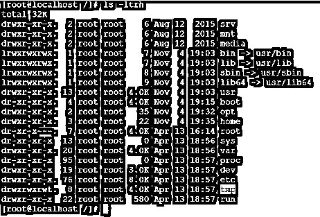
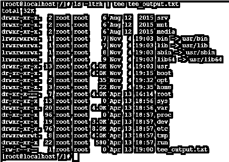
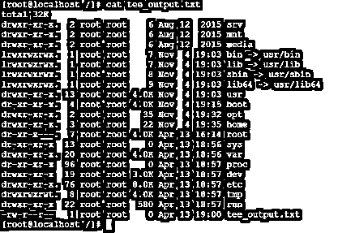

# Linux tee 命令

> 原文：<https://www.educba.com/linux-tee-command/>

## Linux tee 命令简介

Linux Tee 命令使用标准流，它将读取标准输入，并将其写入标准输出和一个或多个文件，从而有效地复制其输入。基本上，tee 命令对于显示 give 命令或程序的标准输出以及在输出文件中写入相同的输出非常有用。

《开球命令》或《实用程序》由迈克·帕克、理查德·M·斯托曼和大卫·麦肯齐编写。

<small>网页开发、编程语言、软件测试&其他</small>

**语法:**

`tee [ -a ] [ -i ] [ File Name ... ]`

*   **-a:**–追加(不要覆盖文件。而是附加到给定的文件)
*   **-I:**-忽略-中断-忽略中断信号。
*   **文件名:**一个文件或文件列表。每个都将获得输出文件。

### Linux tee 命令是如何工作的？

Linux tee 命令通常用于分割输入数据或程序的输出。它既可以显示又可以将输出数据保存在文件中。tee 命令可用于在数据被另一个命令或程序更改之前收集中间输出。

#### tee 命令将返回以下退出值:

*   **0:** 执行 Linux tee 命令后，命令的退出值为“0”。则该命令是正确的。
*   **大于 0:** 执行 Linux tee 命令后，命令的退出值大于“0”。则该命令不是正确预期的。

tee 命令读取标准输入，然后将其内容写入标准输出。它会同时将数据复制到指定的文件或变量中。tee 命令语法可能因要求而异。

### 实现 Linux tee 命令的例子

这是 tee 命令最基本的用法，用来显示命令的输出，并并行地写入输出文件。

#### 示例# 1–编写多个文件的命令

**命令:**

`ls -ltrh
ls -ltrh | tee tee_output.txt
cat tee_output.txt`

**说明:**

在上面的 tee 命令中，我们在“ls–ltrh”命令的帮助下获得了“/”目录的详细信息(参见截图 1 (a))。相同的输出将作为输入提供给 tee 命令(借助管道)。然后，tee 命令将执行显示命令输出的操作，并将输出写入输出文件“tee_output.txt”(参见屏幕截图 1 (b)和(c))。

**输出:**

**截图 1 (a)**

**截图 1 (b)**

**截图 1 (c)**

#### 示例 2–三通附加命令

在 tee 命令中，我们可以同时编写多个输出文件。只是我们需要传递由空格分隔的不同文件。

**命令:**

`date
date | tee file1.out file2.out file3.out
cat f1.out
cat f2.out
cat f3.out`

**说明:**

按照上面的命令，我们使用 date 命令来获取当前的系统时间戳(参见截图 2 (a))。现在我们需要显示或打印该命令的输出，以及相同的输出将写入不同的多个文件中。将命令输出写入多个文件对多模式文本处理应用程序很有帮助。我们可以在 tee 命令的帮助下执行相同的操作(参考截图 2 (b))。

**输出:**

**截图 2 (a)**

**截图二(b)**

#### 示例 3–隐藏输出的 tee 命令

在 tee 命令中，我们可以覆盖特定的输出文件。我们可以将命令输出附加到特定的文件或输出文件中。我们可以使用“-a”选项将命令输出附加到特定的输出文件中。

**命令:**

`echo "Hello EDUCBA"
cat f1.out
echo "Hello EDUCBA" | tee -a f1.out
cat f1.out`

**说明:**

在上面的 tee 命令中，我们使用 echo 命令来显示所写的文本(参考截图 3 (a))。文件“f1.out”中有一些数据。现在，在 tee 命令的帮助下，我们将把 echo 命令输出写入“f1.out”文件，并在命令输出数据后添加现有的文件数据(参见屏幕截图 3 (b))。

**输出:**

**截图 3 (a)**

**截图 3 (b)**

#### 示例 4–SUDO 的发球命令

在 tee 命令中，我们可以通过将命令输出重定向到“null”来隐藏命令的输出。

**命令:**

`lsblk | tee f3.out > /dev/null
cat f3.out`

**说明:**

在上面的 tee 命令中，我们使用“lsblk”命令将存储驱动器的信息获取到我们的机器中。但是一般来说，如果我们使用 tee 命令，我们将显示该命令的输出。但是在某些情况下，我们不想显示输出，只需要重定向它。在上面的 tee 命令中，我们使用了“lsblk”命令，但是它没有显示它的输出(参考输出截图。)

**输出:**

**T2】**

 **#### 实施例 5

在 tee 中，我们可以在使用 tee 命令时评估 sudo 权限。当使用重定向操作符时，它将识别或理解命令中可用的 sudo 权限。

**命令:**

`echo "Hello EduCBA" > sudo_file.txt
echo "Hello EduCBA" | sudo tee -a sudo_file.txt
cat sudo_file.txt`

**说明:**

在 tee 目录中，我们有 4 个不同的文件(参见截图 4 (a))。让我们考虑“sudo_file.txt”。该许可或访问权仅保留给根用户。“educba”用户拥有 sudo 访问权限，但在写“sudo_file.txt”文件。出现拒绝许可错误(参见截图 4 (b))。因为 sudo 不支持输出命令的重定向。

为了克服这种情况，我们可以使用 sudo in tee 命令。tee 命令能够理解或评估 sudo 权限并写入输出文件(参见屏幕截图 4 (c))。

**输出:**

**截图 4 (a)**

**截图 4 (b)**

**截图 4 (c)**

### 结论

我们已经看到了“Linux Tee 命令”的完整概念，以及正确的示例、解释和具有不同输出的命令。tee 命令是一个命令行解释器。它使用标准流的概念来并行读取标准输入并将标准输出写入单个或多个文件。对于评估命令和命令输出结果的数量，tee 命令非常有用。

### 推荐文章

这是一个 Linux tee 命令指南。这里我们讨论 Linux tee 命令的介绍，以及它是如何工作的，还有它的例子和代码实现。您也可以浏览我们推荐的其他文章，了解更多信息——

1.  [Linux 系统命令](https://www.educba.com/linux-system-commands/)
2.  [Linux 过滤命令](https://www.educba.com/linux-filter-commands/)
3.  [Kali Linux 命令](https://www.educba.com/kali-linux-commands/)
4.  [Linux 中的顶级命令](https://www.educba.com/top-commands-in-linux/)

**