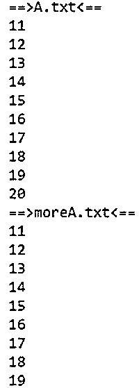

# Linux 中的 Tail 命令

> 原文：<https://www.educba.com/tail-command-in-linux/>

## Linux 中的 Tail 命令简介

下面的文章提供了 Linux 中 Tail 命令的概要。tail 命令通常用于列出文件中的最后十个。这与总指挥部的工作正好相反。如果在命令或语法中指定了一个以上的文件，那么它会给出 10 个结果，每个结果前面都分别提到了文件名。现在，我们准备了 3 个文件，通过示例进行演示。

**语法:**

<small>网页开发、编程语言、软件测试&其他</small>

`TAIL [option] file(s)`

**Note:** Where file(s) means that it can have more than one file.

### 选项描述

以下是选项描述:

| **SNO** | **短码** | **动作** |
| One | 同-EN | 输出的行数。 |
| Two | -丙 | 要显示的字符字节数。 |
| Three | -f | follows-主要在使用日志时使用。 |
| Four | -v | 详细启用或禁用。 |
| Five | 问 | 安静。 |

### Linux 中的 Tail 命令示例

下面是提到的例子:

#### 示例#1

**代码:**

`tail A.txt`

**输出:**

 

**说明:**

我们这里有三个文件。首先，我们要处理的是 A.txt。如果我们将它去掉，您可以看到数字 1 到 20 各占一行。如果我们键入 tail 命令，然后给它一个 A.txt 文件，我们就会显示该文件的最后十个 A。

#### 实施例 2

**代码:**

`tail -n 3 A.txt`

**输出:**

 

**说明:**

我们还可以选择想要显示的 A 的编号。因此，如果我们在尾部键入-n 选项来表示 A 的数量，您可以看到 head 命令中使用的相同选项，然后我们键入 3，然后是文件名，我们会得到该文件中的最后三个 A。

#### 实施例 3

**代码:**

`tail -c 4 A.txt`

**输出:**

**说明:**

我们也可以使用带-C 选项的 tail 来列出一些字节。假设我们想要这个文件的最后四个字节，给它一个点 txt 的文件名，我们得到了这个文件的最后四个字节。

#### 实施例 4

**代码:**

`tail A.txt moreA.txt`

**输出:**

**说明:**

您可以对多个文件执行此操作，因此，如果我们只键入 tail，然后是 A.txt，然后是更多的 A.txt，您可以看到，我们会在每个文件中获得最后 10 个 A，并且我们在这里有标题来指示文件名。

#### 实施例 5

**代码:**

`Java -jar test.jar >>B.txt &
Tail - f --pid 4306 B.txt`

**输出:**

**说明:**

现在，另一个很酷的选项是 follow 选项，我们首先要做的是运行这个 Java 文件，tech jar test，这个程序实际上做的是在之前的数字上加 1000，然后打印到屏幕上，它会继续这样做，直到达到 40，000。让我停下来，清空屏幕，我们将运行它，但这次我们只是将其输出发送到一个文件中，我们将其命名为 B.txt，并在后台运行它。

因此，一旦我们运行这个程序，它将使用 tail 来检查当前正在运行的程序的进度。因此，让我们将 tail 与 follow 选项一起使用，我们将使用另一个选项–PID，并输入该进程 ID。我们需要输入帐户文件的名称，并按 enter 键，这样您就可以看到 tail 开始时向我们显示该文件中的最后十个 A，它继续向我们显示 A，因为它们出现在该文件中，所以它跟随文件的结尾，现在刚刚发生的是 tail 已经计算出正在运行的程序已经结束，它已经自行终止。

实际上，这是当前正在运行的程序的进程 ID，因此通过向 tail 提供该进程 ID，它能够跟踪该程序的状态，并且它检测到该程序已经结束运行，因此 tail 没有理由保持打开状态，它自行终止，这就是— PID 选项的作用，它所代表的只是进程 ID of。

#### 实施例 6

**代码:**

`Java -jar test.jar >>B.txt &
Tail - f B.txt`

**输出:**

**说明:**

在这里，我们将再次运行 java，并运行该 java 程序，它是什么 test jar，我们将再次重定向它的输出，并将其附加到一个名为 B.txt 的文件中，现在在后台运行它，如果我们再次键入 tail 并使用 follow 选项，并为它提供 count，我们可以做的是检查进度，如果我们只是中断它，所发生的是我们停止了 tail 的运行，但是 如果我们看看作业，程序仍然在后台运行，我的终端现在又可以自由地用它做其他事情了。

### 结论

现在我们已经看到了 tail 命令的作用。在这里，我们看到了如何使用-n 只显示输出中 A 数目，使用-c 只显示那些字节数，这样做可以安静地显示结果，而当我们希望得到各种有限和清晰的结果，且只显示那些与用户相关的结果时，verbose 是很有帮助的。

### 推荐文章

这是 Linux 中的 Tail 命令指南。为了更好地理解，我们在这里讨论 Linux 中 Tail 命令的介绍，以及选项描述和相应的示例。您也可以看看以下文章，了解更多信息–

1.  [Linux 中的 PS 命令](https://www.educba.com/ps-command-in-linux/)
2.  [Linux 创建文件](https://www.educba.com/linux-create-file/)
3.  [Linux 中的 Head 命令](https://www.educba.com/head-command-in-linux/)
4.  [Linux 中的 Zip 命令](https://www.educba.com/zip-command-in-linux/)

