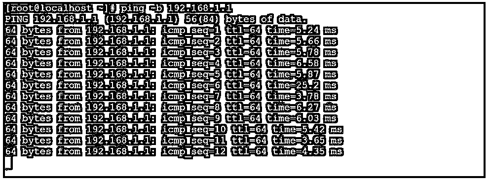

# Linux Ping

> 原文：<https://www.educba.com/linux-ping/>

## Linux Ping 简介

在 Linux 生态系统中，ping 用于检查主机是否可以通过互联网协议到达。它正在研究 ICMP 协议，即互联网控制消息协议。Ping 命令实用程序是跨平台的。主要是工作包级别。广泛地说，ping 命令也被称为数据包互联网探测器。

**Ping 命令的语法:**

<small>网页开发、编程语言、软件测试&其他</small>

`ping [option] hostname or IP address`

*   **ping:** 我们可以在语法或者命令中使用 ping 关键字。它将接受两个参数作为选项，并接受主机名或 IP 地址。根据输入参数，ping 命令将提供 IP 或主机名是否可达的最终结果。
*   **选项:**我们可以提供不同的标志作为与 ping 命令兼容的选项。
*   **主机名或 IP 地址:**根据需要，我们可以传递不同的主机名或 IP 地址。

### Linux Ping 命令是如何工作的？

ping 广泛用于检查主机或 IP 地址的可用性或可达性。

当源机器使用 ping 命令时，ping 命令将遵循以下步骤:

*   它正在尝试连接目的主机或 IP 地址。
*   它计算从目的主机到发送方主机或源主机的时间。
*   它还计算源主机和目的主机之间的平均数据包丢失。

ping 命令适用于 ICMP 协议。它也被称为互联网控制消息协议。在同一协议的帮助下，ping 命令将一系列 ECHO 请求消息或数据包发送到目的地址，并等待目的数据包的回复。目的地数据包也以 ICPM 协议进行回复。如果源机器将接收来自目的机器的包或消息响应。那么只有我们可以说在源或目标服务器之间建立了连接或连通性。

### Linux Ping 的例子

下面是提到的例子:

#### 示例#1

Ping 命令

在 Linux 环境中使用 ping 命令是一种非常简单和常见的方法。它将以默认的 ping 格式工作。

**代码:**

`ping google.com`

**说明:**

ping 命令在跨平台中被广泛使用。按照上面的 ping 命令，我们正在尝试 ping“Google . com ”,并确保连接是否已建立。如果我们从目的主机或 IP 地址收到回复，则可以确定连接已经建立。

**输出:**

#### 实施例 2

Ping 命令–带“-c”选项

默认情况下，ping 命令会不断地在屏幕上显示 echo-response，除非我们不中断它的显示。为了避免这种情况，我们可以在 ping 命令中使用“-c”选项。发送有限的回应请求包是有用的。

**Co** **de:**

`ping -c 3 google.com`

**说明:**

默认情况下，我们得到 ping 响应。但是我们需要来自目标服务器的有限响应或回复，那么我们需要使用带有响应值的“-c”选项。

**输出:**

#### 实施例 3

Ping 命令–带“I”选项

在 ping 命令中，我们可以在特定的时间间隔内发送数据包。

Note: The default interval time is 1 second.

**代码:**

`ping -i 2 -c 2google.com`

**说明:**

按照上面的 ping 命令，我们能够在特定的时间间隔(即两秒钟)内将数据包或响应发送到目的服务器或主机。

**输出:**

#### 实施例 4

Ping 命令–带“-f”选项

有时我们需要测试网络负载或高负载下的网络响应。在 ping 命令中，我们可以在网络级别检查高性能。

**代码:**

`ping -f google.com`

**说明:**

在 ping 命令中，我们通过“-f”选项发送网络中的大量负载。我们还可以测试网络的承载能力。

**输出:**

#### 实施例 5

Ping 命令–带“-b”选项

在 ping 命令中，我们有启用广播的功能。

**代码:**

`ping -b 192.168.1.1`

**说明:**

按照上面的命令，我们能够在 ping 命令的帮助下在 Linux 环境中广播。

**输出:**

#### 实施例 6

Ping 命令–带“-s”选项

在 Linux 环境中，我们可以测试不同数据包大小的 ping 响应。我们可以借助 ping 命令中的“-s”选项来定义数据包的大小。

**代码:**

`ping -s 1024 google.com`

**说明:**

一般来说，ping 命令使用 64 个字节进行源和目的通信。有时由于高流量或延迟，数据包可能会丢失，必要的数据包无法到达源机器。为了避免这种情况，我们需要使用“-s”选项来增加 ping 命令中的字节大小。

**输出:**

#### 实施例 7

Ping 命令–带“-l”选项

在 Ping 命令中，我们可以同时发送数据包，而无需等待目的主机或 IP 地址的回复。

**代码:**

`ping -l 5 google.com`

**说明:**

按照上面的命令，我们同时发送 5 个请求。在这里，我们不等待来自目的地的响应。

**输出:**

#### 实施例 8

Ping 命令–带“-v”选项

在 ping 命令中，我们拥有获取详细输出的功能。

**代码:**

`ping -v google.com`

**说明:**

按照上面的 ping 命令，我们能够在详细模式下获得 ping 命令输出。

**输出:**

#### 实施例 9

Ping 命令–带“-W”选项

在 ping 命令中，我们可以定义等待响应值的时间。ping 命令将在幕帘时间段内等待目的地响应。

**代码:**

`ping -W 10 google.com`

**说明:**

根据下面的截图，我们正在等待 google.com 的回应。我们已经定义等待时间为 10 秒。

**输出:**

### 结论

我们已经看到了“Linux Ping 命令”的完整概念，以及正确的示例、解释和带有不同输出的命令。ping 命令实用程序广泛用于多种平台。这是检查源计算机和目标计算机之间的连通性的最佳方式。

### 推荐文章

这是一个 Linux Ping 的指南。为了更好地理解，我们在这里讨论 linux ping 命令是如何工作的，并给出了编程示例。您也可以看看以下文章，了解更多信息–

1.  [Linux 正则表达式](https://www.educba.com/linux-regular-expression/)
2.  [Linux Inode](https://www.educba.com/linux-inode/)
3.  [Linux 网络命令](https://www.educba.com/linux-network-command/)
4.  [Linux 别名命令](https://www.educba.com/linux-alias-command/)

