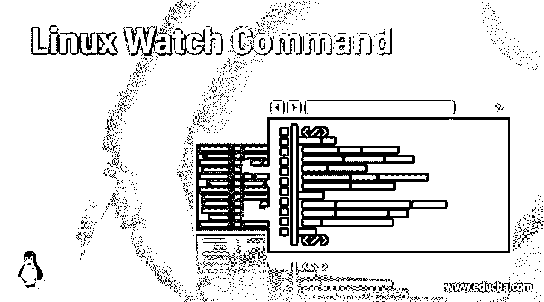

# Linux 观察命令

> 原文：<https://www.educba.com/linux-watch-command/>

## Linux Watch 命令简介

在 Linux 操作系统中，watch 命令用于运行环境中的任何命令，并在工作的 bash 终端或 CLI 上打印命令的输出。watch 命令的主要用途是打印命令之间的输出差异，即如果我们多次打印相同的命令，并且需要检查相同命令的输出差异，那么我们需要使用 watch 命令。

在 1991 年，创新的手表命令是由托尼·雷姆斯(电子邮件地址:rembo@unisoft.com)写的，之后它将由弗朗索瓦·皮纳德修改和更正。在这个时间间隔之后，效用发生了很大的变化。

<small>网页开发、编程语言、软件测试&其他</small>

**语法:**

`watch [ options ] command`

*   **watch:** 我们可以在语法或者命令中使用“watch”关键字。它需要不同的参数，比如选项和 Linux 命令。根据提供的参数或选项，它将在屏幕上打印命令输出。
*   **选项:**我们可以提供不同的标志作为与“监视”命令兼容的选项。
*   **命令:**我们可以使用不同的 Linux 命令。

### Linux Watch 命令是如何工作的？

在 Linux 环境中，我们有多种方法在特定的时间间隔内打印命令。但是在 watch 命令中，我们快速打印命令输出，并观察命令输出的差异(如果有的话)。

在下面的监视命令中有不同的退出代码。

*   0:一旦作业或命令成功执行，它将打印“0”退出代码。
*   1:一旦作业或命令失败，它将打印“1”退出代码。
*   2:当作业或命令分叉进程以监视失败时，它将打印“2”退出代码。
*   3:当它用写端管道失败替换 stdout 的子进程时，它将打印“3”退出代码。
*   4:当命令执行失败时，它将打印“4”退出代码。
*   5:当我们关闭子进程写管道失败时，它将输出“5”退出代码。
*   6:当 IPC 管道创建失败时，它将打印“7”退出代码。
*   其他:它将监视命令或作业，并将命令退出状态作为子退出状态传播。

以下是与 watch 命令兼容的选项列表。

| **服务请求编号** | **选项** | **描述** |
| One | -d，–差异[永久] | 这将有助于突出作业或命令级别的连续更新之间的差异。如果有任何可能改变命令或作业的成功执行，它将打印信息或更新。自第一次迭代以来，什么至少改变了一次？ |
| Two | -n，–间隔秒 | It will help to Specify the update interval.注意:但是该命令不允许小于 0.1 秒的时间间隔来转换较小的值。 |
| Three | 精确的 | 它将确保观察器每隔秒钟尝试运行一次命令。我们需要与系统 ntptime 同步，并注意小数秒如何保持(几乎)不变。 |
| Four | -t, –no-title | 这将有助于关闭显示器顶部显示当前时间命令间隔的标题。 |
| Five | -b-哔 | 哔哔声表示命令有一个非零退出。 |
| Six | -e，–errexit | 它将冻结命令错误的更新，并在输入或按键后退出。 |
| Seven | -g，–chg exit | 当命令的输出改变时，它将退出。 |
| Eight | -c，–颜色 | 它将解释 ANSI 颜色和样式序列。 |
| Nine | -x, –exec | –exec 选项，它将命令传递给 exec (2)。 |
| Ten | 救命啊 | 它将显示帮助信息并退出 |
| Eleven | -v，-版本 | 它将打印版本信息并退出 |

### 实现 Linux Watch 命令的示例

在 Linux 环境中，使用 Watch 命令是一种非常容易和简单的方法。

#### 示例# 1–Linux Watch 命令

**命令:**

`watch date`

**说明:**

按照上面的命令，我们用 watch 关键字触发 date 命令。命令输出窗口将按原样出现，除非我们不取消它(通过 Ctrl+c 选项)。

**输出:**

**

** 

#### 示例 2–更改时间间隔

在观察命令中，我们可以观察命令的执行时间。我们需要对它使用“-n”选项。

**命令:**

`watch -n 5 date`

**说明:**

根据上面的命令，我们正在以秒为单位改变命令的执行时间。date 命令将每 5 秒运行一次。

**输出:**

## 

#### 示例 3–命令差异

在 watch 命令中，我们可以获得命令输出之间的差异。

**命令:**

`watch -d date`

**说明:**

在 watch 命令中，我们能够在 CLI 窗口中找到命令差异。命令差异将通过观察命令突出显示。

**输出:**

#### 示例 4–省略标题信息

在 watch 命令中，我们能够从命令输出中删除标题信息。

**命令:**

`watch -t date`

**说明:**

按照上面的命令，我们正在删除 watch 命令的头信息。

**输出:**

**

** 

#### 示例 5–如果命令输出改变，自动退出

在 watch 命令中，当命令输出改变时，我们可以退出输出窗口。

**命令:**

`watch -g date`

**说明:**

在截图 1 (a)中，我们看到了 watch 命令的输出。但是，当观察到命令差异时，屏幕会自动退出(参见屏幕截图 1 (b))。

**输出:**

截图 1 (a)

截图 1 (b)

### 结论

我们已经看到了“Linux Watch Command”的完整概念，以及正确的示例、解释和带有不同输出的命令。根据需要，我们可以在 watch 命令中更改命令执行时间。观察命令差异非常有用。

### 推荐文章

这是一个 Linux 手表命令指南。在这里，我们讨论 Linux Watch 命令及其不同命令的概述，以及示例和代码实现。您也可以浏览我们推荐的其他文章，了解更多信息——

1.  [Linux 自动挂载](https://www.educba.com/linux-automount/)
2.  [Linux bg 命令](https://www.educba.com/linux-bg-command/)
3.  [Linux tracepath](https://www.educba.com/linux-tracepath/)
4.  [Linux 挂载命令](https://www.educba.com/linux-mount-command/)

