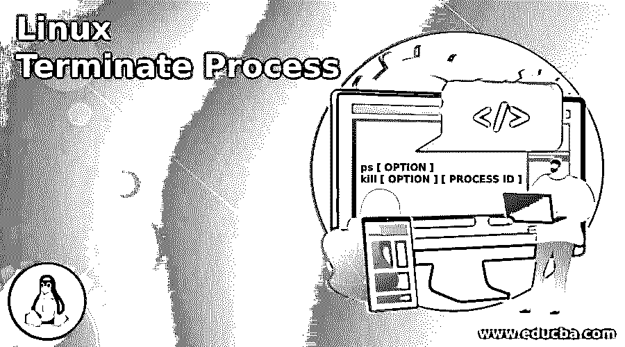
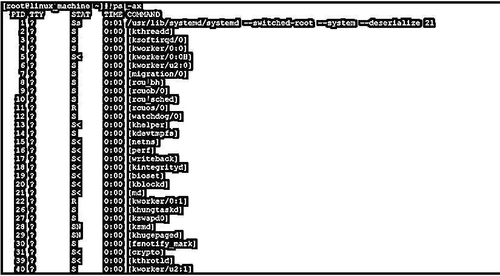
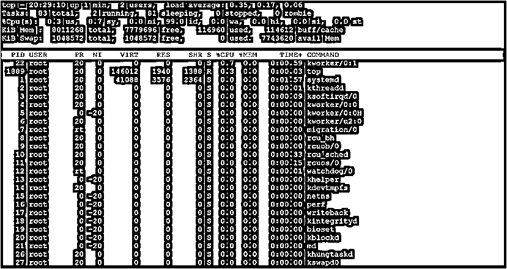
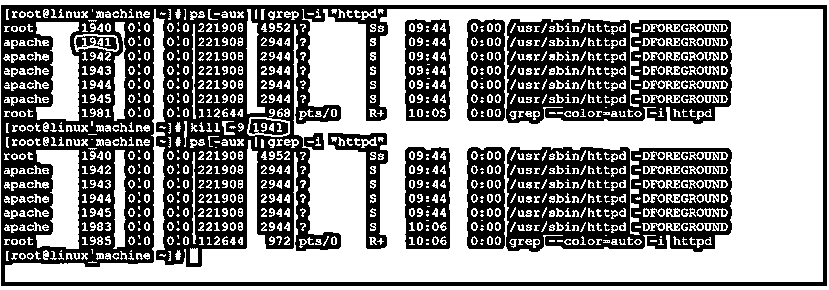
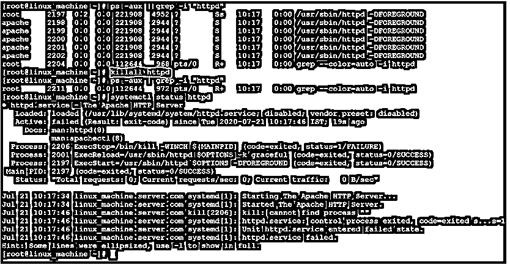

# Linux 终止进程

> 原文：<https://www.educba.com/linux-terminate-process/>

## Linux 终止进程介绍

在 Linux 生态系统中，当我们运行任何应用程序或任何作业时。每个应用程序或作业都将使用特定的进程 ID 或守护程序或服务运行。进程 ID 只是一个数字。有时，由于死锁、进程停滞等问题，作业或任何服务可能无法运行。因此剩余的工作将影响来自相同服务的工作。如果这种情况可能发生，我们需要杀死或终止卡住的作业或进程。

**终止进程的语法**

<small>网页开发、编程语言、软件测试&其他</small>

`ps [ OPTION ] kill [ OPTION ] [ PROCESS ID ]`

*   **ps:** 我们可以在语法中使用“ps”关键字。它将接受参数作为选项。根据提供的输入参数，“ps”命令将显示环境中所有正在运行的进程的信息。
*   **kill:** 我们可以在语法或命令中使用“kill”关键字来终止进程。它将接受两个参数，如选项和进程 ID。根据提供的输入参数,“kill”命令将终止进程。
*   **选项:**我们可以提供不同的标志作为与“ps”和“kill”命令兼容的选项。
*   **进程 ID:** 我们需要提供相关的进程 ID 来终止进程。

### Linux 终止进程是如何工作的？

正如我们前面所讨论的，每个作业或应用程序都使用特定的进程 ID 运行。在后台，我们能够获得 Linux 环境中所有正在运行的进程的列表。由于一些技术问题，如死锁、进程或服务停滞，作业或应用程序将无法运行。因此，我们需要终止停滞的进程。因此，下一个即将到来的任务将被完美地执行。

在 Linux 环境下，如果我们需要杀死进程。首先，我们需要识别进程并获得相关的进程 id。从 Linux 环境中获取进程 id 有不同的方法，比如“ps”和“top”。

`“ps” command.
ps -ax`

`“top” command.`

要终止进程，我们需要在 kill 命令中使用以下不同的 kill 信号。

**1。SIGHUP**

*   要使用 SIGHUP 信号，我们需要使用数字“1”
*   这就是所谓的挂机信号

**2。SIGINT**

*   要使用 SIGINT 信号，我们需要使用数字“2”
*   它被称为中断信号

**3。信号停止**

*   要使用 SIGINT 信号，我们需要使用数字“17，19，23”
*   这就是所谓的停止信号

**4。术语“T1”**

*   要使用 SIGTERM 信号，我们需要使用数字“15”
*   它被称为终止信号

**5。信号杀手**

*   要使用 SIGTERM 信号，我们需要使用数字“9”
*   这就是众所周知的终止信号

### 实现 Linux 终止进程的例子？

下面是一些例子:

#### 1.识别 Linux 进程

在终止 Linux 进程时，识别正在运行的进程是非常重要的。有不同的方法来识别正在运行的进程。

**命令:**

`ps -aux
ps -aux | grep -i "httpd"`

**输出:**

**说明:**通过上面的命令，我们可以获得 Linux 服务器上所有正在运行的进程信息。从第一个“ps”命令开始，我们就把整个过程列表下来(参考截图 1 (a))。但是很难确定具体的过程。为了克服这种情况，我们需要使用“管道(|)”功能并从中提取数据(参见截图 1 (b))。

#### 2.终止进程–使用 Kill 命令

在终止 Linux 进程时，我们可以使用 kill 命令。kill 命令向进程发送一个确切的信号。我们可以通过不同的方式触发命令，比如直接命令或通过 shell。

**Co**T2】mmand:

`kill -9 1941`

**输出:**

**解释:**如前所述，我们在 kill 命令中有不同的信号。根据要求，我们可以使用这些信号。在上面的“杀死”命令中。我们正在使用终止信号，即“9”。环境中正在运行 id 为“1941”的进程。我们将借助 kill signal (9)终止“1941”进程。

#### 3.终止进程–使用 pkill 命令

在 Linux 环境中，我们可以借助进程名来终止进程。

注意:这里不需要进程 id。

**命令:**

`pkill httpd`

**输出:**

**解释:**有时候我们没有时间去检查所有的进程 id，并据此终止进程。因此，我们需要通过服务、流程或应用程序名称来终止流程的功能。要终止进程，我们可以在 pkill 命令中使用进程名。根据下面的截图，我们使用“https”作为进程名。它将终止所有同名运行的进程。

#### 4.终止进程–使用 kill all 命令

我们可以终止所有进程以及正在运行的子进程。这里，我们只需要指定进程名。

**命令:**

`killall httpd`

**输出:**

**解释:**如果我们需要终止所有进程，比如父进程和子进程，那么我们需要使用“killall”命令。根据下面的截图，我们在“killall”命令中使用了“httpd”进程名。它将终止所有父进程和子进程。一旦“killall”命令将终止该进程。服务或应用程序的状态处于失败状态。

### 结论

我们已经看到了“Linux 终止进程”的完整概念，以及正确的示例、解释和带有不同输出的命令。就服务器管理而言，进程终止是一项非常重要的活动。在终止进程的帮助下，我们可以杀死死锁进程或阻塞进程。因此下一个即将进行的作业不会受到影响。因此，我们能够保持持续的服务器或应用程序生产效率。

### 推荐文章

这是一个 Linux 终止进程的指南。这里我们也讨论一下 Linux 终止进程的介绍和工作原理。以及不同的示例及其代码实现。您也可以看看以下文章，了解更多信息–

1.  [Linux Crontab](https://www.educba.com/linux-crontab/)
2.  [Linux 添加用户](https://www.educba.com/linux-add-user/)
3.  [Linux 删除用户](https://www.educba.com/linux-delete-user/)
4.  [Linux 中的主机名命令](https://www.educba.com/hostname-command-in-linux/)

