# Kali Linux 终端

> 原文：<https://www.educba.com/kali-linux-terminal/>

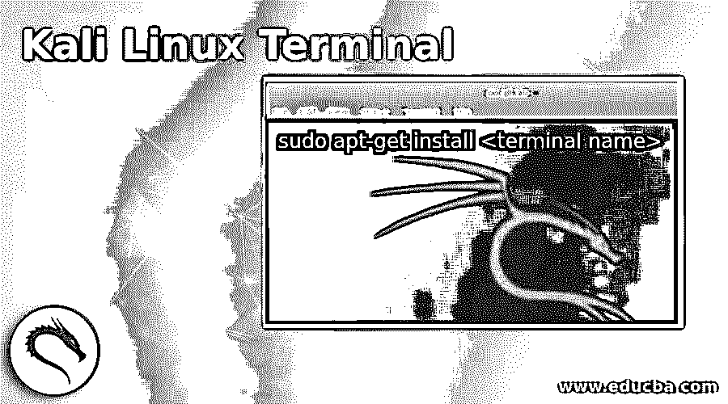

## Kali Linux 终端简介

Kali Linux 终端被定义为物理终端的软件表示，这些物理终端在多年前是可用的，当时计算机是大学和大公司拥有的多用户系统。机器本身曾经坐在一个没有人参观的地方，通过这个终端进行互动。在目前的情况下，终端是一个界面，它允许用户为公用事业和机器执行命令，而不管它位于何处，响应命令并完成任务。如果终端用于机器本身，它可以被认为是一个允许用户执行任务的 GUI，如果用户通过 SSH 进入另一个 Kali Linux 服务器，终端就充当连接的中介。

### 如何使用 Kali Linux 终端？

现在我们已经了解了 Kali Linux 中的终端的用途，让我们来看看 Kali Linux 的简史。Kali Linux 是基于 Debian 的 Linux 发行版，主要用于渗透测试和数字取证。在当今世界，Linux 是安全专家和黑客使用的最流行的操作系统，Kali Linux 提供的特性和功能无法与其任何其他替代产品相媲美(除了少数几个)。Kali Linux 的一个特性是终端，它让一个新手和一个有经验的 Linux 用户有机会尝试这个操作系统来完成任务。

<small>网页开发、编程语言、软件测试&其他</small>

要使用 Kali Linux 终端，需要在 Kali Linux 操作系统中安装一个终端。默认情况下，Kali Linux 发行版预装了一个名为 GNOME 终端的终端。如果您配备了一些特定的终端，并且 Kali Linux 支持相同的终端，用户可以执行下面的命令来安装终端。

`sudo apt-get install <terminal name>`

终端安装完成后，会以应用程序的形式出现，用户可以进入应用程序选项卡，点击终端打开应用程序。终端打开后，可能需要几秒钟才能工作。

### 在终端中使用命令并举例说明

在这里，我们将看看在终端中使用的不同命令，它们的用途和实例，以供读者实践。

一般来说，命令大致分为 5 个不同的类别。

*   一般
*   操纵
*   阅读
*   编辑
*   许可

我们将逐一浏览每个类别，并查看类别中广泛使用的各种命令。

#### 1.一般

*   **uname:** 该命令使用户能够理解系统规格。这个命令就像新手开始熟悉 Kali Linux 的第一个命令。

**代码:**

`uname`

**输出:**

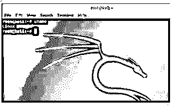

*   **pwd:** 该命令允许系统提供工作目录的名称，并将其打印在控制台上。

**代码:**

`pwd`

**输出:**

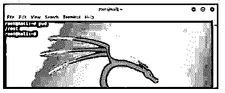

*   **ls:** 该命令显示当前命令行指向的目录中包含的内容列表。该命令有各种选项，使用特定选项详细说明特定格式。

**代码:**

`ls -l`

**输出:**

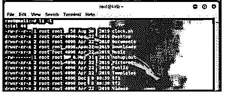

*   **history:** 在终端会话中，有时会不经意地需要重用之前输入的命令，该命令将允许您列出所有这些命令。

**代码:**

`history`

**输出:**

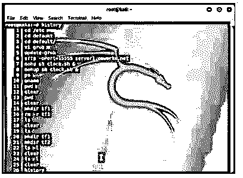

*   **macchanger:** 该命令使用户能够更改系统的 MAC 地址，实质上是更改系统在网络中的身份。

**代码:**

`macchanger --help`

**输出:**

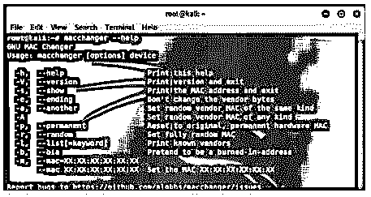

*   **ifconfig:** 该命令使用户能够查看当前的网络配置，并根据用户的要求进行更改。

**代码:**

`ifconfig`

**输出:**

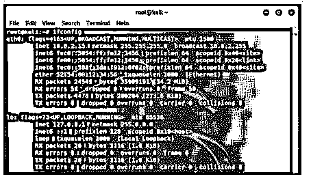

*   这个命令使用户能够读取文件，然后将它们链接在一起，允许交换、交换内容。

**代码:**

`cat --help`

**输出:**

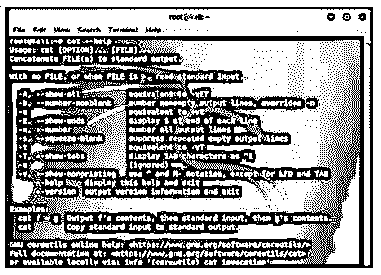

#### 2.操纵

*   **mkdir:** 该命令使用户能够在命令执行的当前目录下创建一个目录。

**代码:**

`mkdir tf1
mkdir tf2
ls -l`

**输出:**

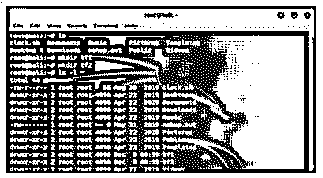

最初，当我们执行 ls 时没有目录，但是后来你会看到两个文件夹(tf1 和 tf2)正在形成。

*   **cd:** 该命令允许用户切换到另一个目录，在那里将执行其他操作活动。

**代码:**

`cd tf1
pwd`

**输出:**

*   **cp:** 该命令允许用户将文件从一个位置复制到另一个位置。在下面的截图中，我们看到 sample1.txt 被移动到一个新位置“tf1”。

**代码:**

`ls tf1/
cp sample.txt tf1/
ls tf1/`

**输出:**

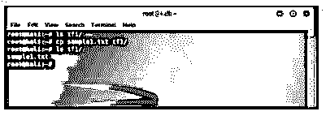

*   **mv:** 与复制文件相反，这个命令将文件从一个位置移动到另一个位置。在下面的代码片段中，我们看到在 mv 命令执行之后，sample3.txt 从当前位置移动到 tf1。

**代码:**

`mv sample3.txt tf1/
ls tf1/`

**输出:**

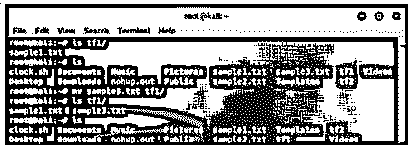

*   rm: 该命令使用户能够通过按照命令删除文件或目录来操作它们。在下面的代码片段中，sample1.txt 文件从当前位置被删除。

**代码:**

`rm sample1.txt
ls`

**输出:**

#### 3.阅读

*   **more:** 该命令使用户能够从鸟瞰的角度理解文件的内容。

**代码:**

`more sample3.txt`

**输出:**

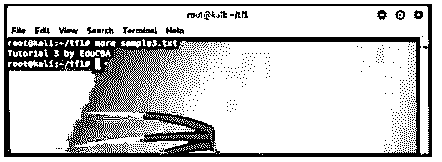

*   **less:** 非常类似于 more 命令，除了它不加载文件。

**代码:**

`less sample3.txt`

**输出:**

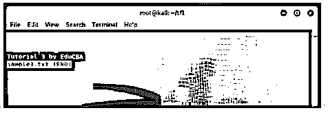

*   **排序:**该命令允许用户对内容进行有序排列。在下面的代码片段中，执行 sort 命令时，句子是按字母顺序排列的。

**代码:**

`sort sample3.txt`

**输出:**

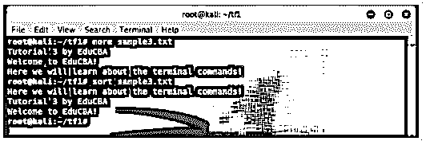

#### 4.编辑

*   **vi:** 该命令允许用户在文本编辑器中打开文件进行编辑。

**代码:**

`vi sample.txt`

**输出:**

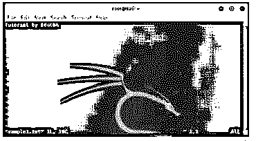

*   **nano:** 与 vi 命令类似，它也是在文本编辑器中打开文件，但文本编辑器的应用是不同的。

**代码:**

`nano sample1.txt x`

**输出:**

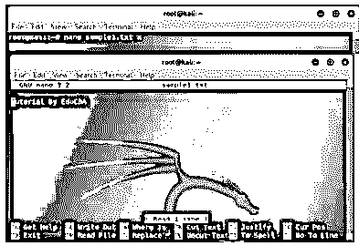

*   再次，类似于 vi 和 nano，这个命令在一个简单的 GTK+文本编辑器中打开文件，非常类似于 windows 中的编辑器。

**代码:**

`leafpad sample1.txt`

**输出:**

#### 5.许可

在我们看到本节中的命令之前，我们需要知道不仅 Kali Linux，而且任何 Linux 发行版都可以访问。

3 个访问级别是:

*   **读取:**该级别允许用户打开并读取文件。对于目录，用户可以查看内容。
*   **Write:** 这个级别允许用户打开、阅读甚至编辑一个文件。对于目录，用户可以查看、创建和重命名目录中的内容。
*   **执行:**该级别除了读写之外，还允许执行文件。

现在，下面执行关于权限的更改。

*   **chmod:** 该命令是 change mod 的缩写。根据不同用户组的特定级别，可以通过提及 r/w/x 来限制内容。我们将执行权限授予用户组！查看从-rw-r 到-rwxr-的变化

**代码:**

`chmod +x sample1.txt
ls -l`

**输出:**

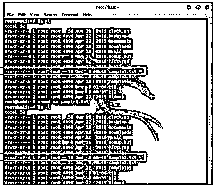

*   **chown:** 该命令允许用户更改文件或目录的所有者，此外，它还有一个非常类似于 chmod 的实用程序。在下面的截图中，请注意用户所有者从 root 更改为 AmKy。

**代码:**

`chown Amky sample1.txt
ls -lh`

**输出:**

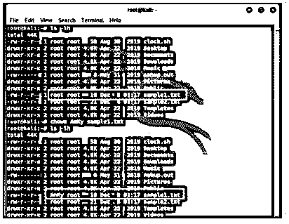

### 结论

本文介绍了终端在 Kali Linux 中的含义，以及终端支持哪些不同的实用程序。有各种各样的终端，用户可以自由选择使用。虽然 Kali Linux 对于新手来说可能非常可怕，但是掌握这些基础知识将会在使用 Kali Linux 执行一些很酷的事情时派上用场。

### 推荐文章

这是一个 Kali Linux 终端的指南。这里我们讨论一下入门，如何使用 Kali Linux 终端？举例说明在终端中命令的使用。您也可以看看以下文章，了解更多信息–

1.  [Kali Linux 命令](https://www.educba.com/kali-linux-commands/)
2.  [Linux 分割命令](https://www.educba.com/linux-split-command/)
3.  [Linux LVM](https://www.educba.com/linux-lvm/)
4.  [Linux nslookup](https://www.educba.com/linux-nslookup/)

