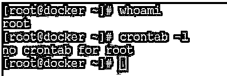
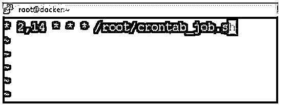

# Crontab in Linux

> 原文：<https://www.educba.com/crontab-in-linux/>

## Linux 中的 Crontab 简介

在 Linux 环境中，我们可以使用不同类型的调度器来处理或调度特定时间窗口内的作业。但是就 Linux 生态系统中的作业调度和管理而言，crontab 是一个更可靠的解决方案。crontab 将提供定期安排的命令或作业列表。在这里，我们还可以提供相应命令的名称。相同的名称将进一步用于管理 cron 列表。

换句话说，crontab 持有 cron 表。它使用 cron 来管理作业调度，并在 Linux 环境下执行任务。cron 这个词来自 Chronos 这个词。Chronos 这个词来自希腊语。cron 只不过是系统进程；这将有助于在特定的时间框架内执行任务或安排作业。该计划也称为 crontab。根据需求或应用程序的需要，我们需要选择哪种类型的作业调度程序来调度作业。

<small>网页开发、编程语言、软件测试&其他</small>

### 如何修改 Crontab 和 List？

*   crontab 的修改非常容易。根据需求或应用程序的需要，我们将编辑 crontab 条目。
*   在 crontab 条目中，我们可以确定在 crontab 中调度的作业或命令的列表。
*   crontab 将表示在同一登录用户的帮助下配置的命令或作业的数量。
*   我们还可以检查不同用户的计划作业或命令列表。
*   要修改 crontab 中的条目，我们需要使用特定的命令。
*   要编辑 crontab 条目，我们需要使用“crontab -e”命令。
*   “-e”代表编辑实体。类似地，随着 crontab 的修改，我们也可以在 crontab 中列出命令或作业的列表。
*   要在 crontab 中列出作业或命令的数量，我们需要使用“crontab -l”命令。“-l”代表所列实体。
*   按照默认配置，它将只列出由登录用户安排的命令或作业。

### Linux Crontab Format

在 crontab 中调度作业或命令之前，首先，我们需要理解格式。然后，我们需要了解我们需要如何定义作业调度时间窗口的每一步。以便作业仅在特定的时间范围内触发和执行。在某些情况下，作业可能提前或推迟触发；这可能是由于不适当的时间定义。为了避免这样的情况，我们需要在正确的格式下进行调度。

分钟小时 DOM MON DOW“作业或 CMD”

*   **分钟:**在分钟框架中，我们需要根据分钟时间框架来查找或调度作业或命令。它将允许从 0 到 59 的值。
*   **HOUR:** 在小时框架中，我们需要根据小时框架来查找或调度作业或命令。它将允许从 0 到 23 的值。
*   **DOM:** 在 DOM 框架中，我们需要根据一个月中的某一天的时间框架来查找或调度作业或命令。它将允许从 1 到 31 的值。
*   **MON:** 在 MON 框架中，我们需要根据月字段时间框架来查找或调度作业或命令。它将允许从 1 到 12 的值。
*   **DOW:** 在 DOW 框架中，我们需要根据一周中的某一天的时间框架来查找或调度作业或命令。它将允许从 0 到 6 的值。
*   **“作业或命令”:**在这里，我们需要查找或调度作业或命令；我们可以定义任何命令、shell 作业、bash 作业、应用程序级作业等。

### Crontab in Linux

*   在 Linux 环境中，crontab 在调度多个作业中起着非常重要的作用。
*   这需要适当的时间安排。它将根据 cron 表来管理 cron。

### 在 Linux 中设置 Crontab 的示例

下面提到了不同的例子:

#### 示例#1

设置 crontab:列出 Crontab 条目。

在 Linux 环境中，我们能够在 crontab 中列出条目的数量。

**代码:**

`crontab -l`

**说明:**

*   按照上面的命令，我们能够在 crontab 下列出条目的数量。
*   根据下面的截图，没有作业时间表；因此，它输出“没有根的 crontab”。

**输出:**

#### 实施例 2

设置 crontab:编辑 Crontab 条目。

在 crontab 中，我们可以编辑 crontab 并添加不同的作业。

**代码:**

`crontab -e`

**说明:**

*   按照上面的命令，我们能够安排作业。
*   但是，按照下面的截图，没有条目；因此，它显示为空白。

**输出:**

#### 实施例 3

设置 crontab:在 Crontab 中调度 shell 作业。

在 crontab 中，我们可以一天安排两次作业。

**代码:**

`* 2,14 * * * /root/crontab_job.sh`

**说明:**

*   按照上面的命令，我们计划在每天凌晨 2 点和下午 2 点运行 crontab_job.sh shell 脚本。

**输出:**

#### 实施例 4

设置 crontab:列出不同用户的 Crontab。

在 Linux 环境中，我们能够列出与不同用户相关联的 crontab 条目的数量。

**代码:**

`crontab -u test -l`

**说明:**

*   按照上面的命令，我们能够列出与“测试”用户相关的计划作业的数量。这里，我们需要使用“-u”关键字。

**输出:**

### 结论

我们已经看到了“Linux 中的 crontab”的完整概念，以及正确的示例、解释和带有不同输出的命令。crontab 有助于在 Linux 生态系统中管理适当的作业调度。它拥有适当的 cron 表，这将有助于管理多个作业。我们还可以列出/编辑不同用户的作业。

### 推荐文章

这是 Linux 中的 Crontab 指南。这里我们讨论一下入门，如何修改 crontab 和 list？格式和示例。您也可以看看以下文章，了解更多信息–

1.  [Linux 压缩多个文件](https://www.educba.com/linux-zip-multiple-files/)
2.  [Linux XRDP](https://www.educba.com/linux-xrdp/)
3.  [Linux QT](https://www.educba.com/linux-qt/)
4.  [Linux 磁盘空间](https://www.educba.com/linux-disk-space/)

