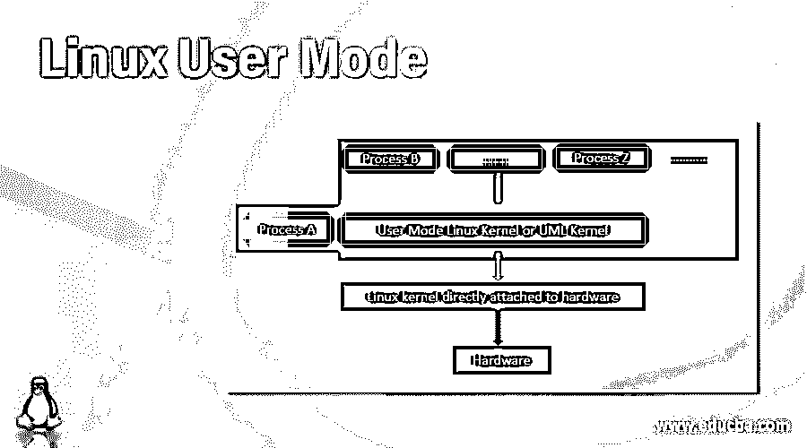
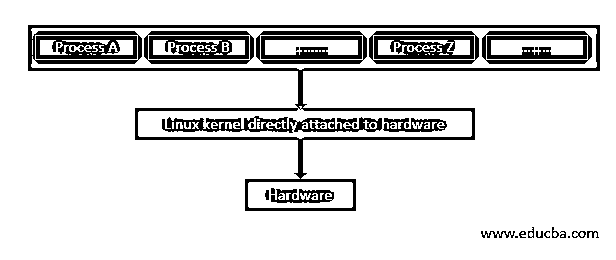
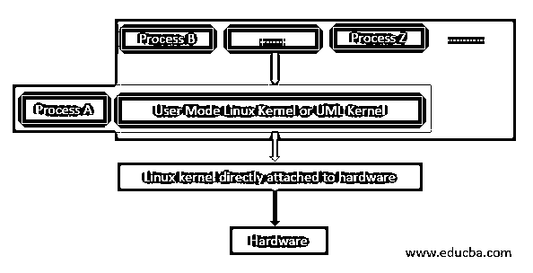

# Linux 用户模式

> 原文：<https://www.educba.com/linux-user-mode/>

## Linux 用户模式介绍

在 Linux 中，Linux 用户模式也称为用户模式 Linux，缩写为 UML。这种方法有助于支持许多基于内核的操作系统，这些操作系统是另一个 Linux 系统中的 Linux 操作系统本身。基于内核的 Linux 操作系统也称为客户机，运行它们的 Linux 系统称为主机。这使得多个用户能够运行他们自己的一组 Linux 版本，但是限制了所使用的硬件数量。这也确保了在不损害隔离性、保密性和对主机操作系统配置的影响的情况下，涉及最小的硬件成本。这也确保了原始的主机环境是稳定的，即使任何基于内核的操作系统崩溃了！

### 过程和语法

在这一节中，我们将看看设置用户模式需要遵循的步骤。在相同的上下文中，我们还会为您提供语法，以便您在设置时可以方便地使用它！所以我们开始吧:

<small>网页开发、编程语言、软件测试&其他</small>

1.  根据您可能拥有的 32 位或 64 位操作系统，从 UML 的源页面下载内核。发布内核下载后，您需要下载另一个名为 FedoraCore5-x86-root_fs.bz2 (32 位)或 fedoracore 6-AMD64-root _ fs . bz2(64 位)的文件系统。
2.  一旦它们被下载，你需要解压下载文件，其语法如下:

`host% bunzip2 <Kernel file name downloaded><File system file downloaded>`

这里，<kernel file="" name="" downloaded="">是准备 UML 时要下载的内核文件。bunzip2 允许用户解压缩文件，文件名跟在命令后面。<file system="" file="" downloaded="">需要替换为 32 位版本(FedoraCore5-x86-root_fs.bz2)或 64 位版本(FedoraCore6-AMD64-root_fs.bz2)</file></kernel>

3.  一旦解压缩过程完成，就需要如下运行 UML。语法是:

`host% chmod755 ./<Kernal File which got created after unzip>
host% ./<Kernal File which got created after unzip>ubda=<File system which got created after unzip> mem=128M`

4.  运行相应的命令时，以 root 用户身份登录系统(不需要密码)。
5.  执行你为自己计划的各种探索。
6.  一旦一切都完成了，记得关闭内核！

### Linux 用户模式在 Linux 中是如何工作的？

在这一节中，我们将学习 Linux 中用户模式的工作过程，首先，我们将看一个图表，然后详细讨论工作过程。所以，我们开始吧！

#### 1.没有 UML 的正常流程

在上面的配置中，进程 A、B、C …等等直接与 Linux 内核交互，通过这种方式，任何进程直接向内核请求，相应地内核将自己链接到硬件。现在，这种设置的一个问题是，一旦任何进程被破坏，它往往会影响原来的 Linux 内核，因此，整个系统会被破坏，很多时候，唯一的解决方案是再次刷新内核，导致所有为内核做的设置被擦除。

然后来拯救我们的是 UML 方法论，我们现在将讨论它！

#### 2.使用 UML 进行处理

当我们对比之前的建筑和这个， 我们看到，在体系结构的层次上有一个非常微小的变化，它的不同之处在于，任何不需要与原始 Linux 内核直接通信的进程都将通过用户模式 Linux 内核，而这种变化的原因是，容易损坏的进程将把损坏传递给仅为特定用户分离的 UML 内核，并且将保护原始内核 内核不会被破坏，因此任何使用相同 Linux 硬件和原始 Linux 内核的用户都将得到保护！

在所有用户共享硬件的情况下，这种特定的体系结构在保护利益和环境方面取得了很大的进步，并且考虑到资源的有效和优化使用，硬件共享的概念占主导地位。

接下来，要了解 Linux 用户模式或 UML 工作的完整流程，了解 UML 建立后的实用程序也非常重要，这就是我们所说的“配置 UML 后的下一步”。

内核配置完成后，人们可以做很多事情。因此，在每一种情况下，我们都会减少几行来了解 UML 在每一种情况下是如何工作的！

*   将配置好的 uml 放到网络上:使用 uml_net 和 eth0 设备，可以将通过网络配置的 UML 放到网络上，这样它就可以被该内核的所需用户访问。
*   从源代码构建内核:在这里，UML 将给出如何构建内核的灵活性。在这样做的时候，默认的配置 UML 被用于装箱，所需的更改在 menuconfig 或 xconfig 中完成。
*   从已配置的 UML 配置虚拟机:在这里，配置了一个虚拟机，并且相应机器的硬件在能够访问内核的不同用户之间共享。
*   主机文件访问:在这里，一个文件系统被安装在 UML 内的系统中，所有的内容都准备好供所需的受众访问。
*   侵入内核:通过使用 GDB，一种检查内存的直接方法变得可行，它本质上构建了一种通过理解处理器和段来检查内存以进行调试的能力，并有助于弄清楚到底发生了什么！

### 结论

在这篇文章中，我们深入探讨了一些概念，这些概念对于在 Linux 中使用用户模式功能来实现各种实用程序是非常重要的。此外，使用它作为一个沙箱，并在不担心破坏内核的情况下与环境进行游戏，这是研究和创新的重点！因此，任何寻求相同可用性的人都应该至少尝试一次！

### 推荐文章

这是 Linux 用户模式的指南。这里我们讨论 Linux 用户模式如何在 Linux 中工作，以及过程和语法。您也可以看看以下文章，了解更多信息–

1.  [Linux 写](https://www.educba.com/linux-write/)
2.  [Linux Inode](https://www.educba.com/linux-inode/)
3.  [Linux 自由命令](https://www.educba.com/linux-free-command/)
4.  [Linux 网络命令](https://www.educba.com/linux-network-command/)

