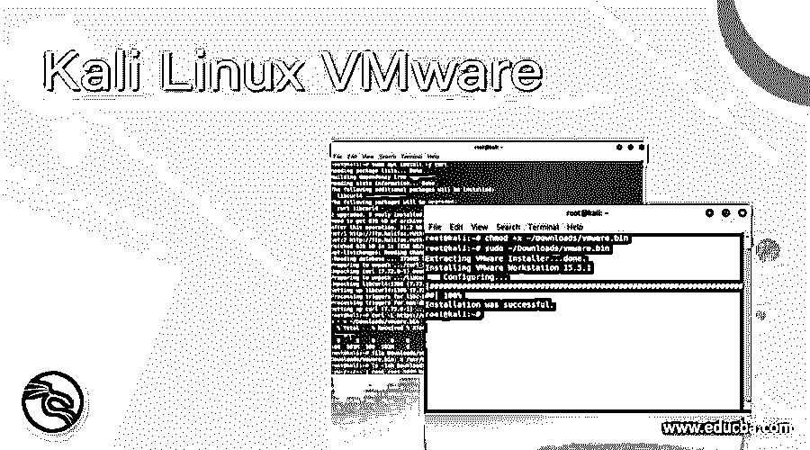
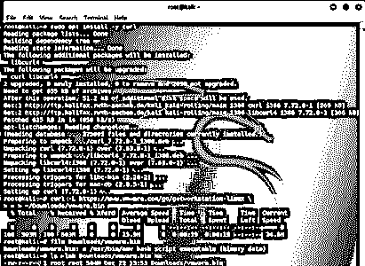
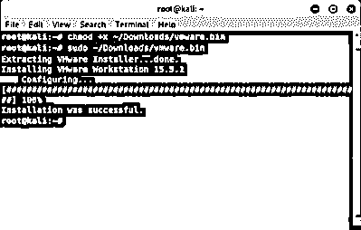
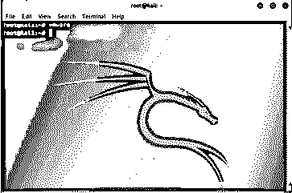
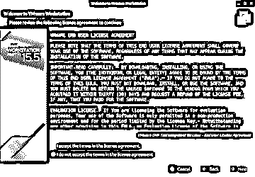
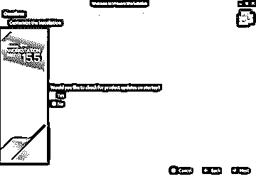
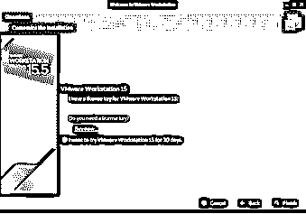
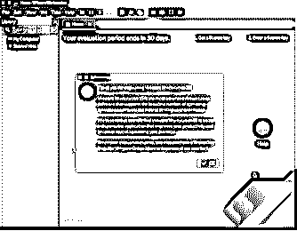

# Kali Linux VMware

> 原文：<https://www.educba.com/kali-linux-vmware/>

## Kali Linux VMware 简介

Kali Linux VMware 被定义为使用户能够进行虚拟化的云计算软件。Kali Linux 是一个基于 Debian 的 Linux 发行版，旨在帮助用户进行渗透测试。现在，在虚拟化的世界中，通过 Live DVD 将整个硬件专用于运行 Kali Linux 或者从内部硬盘引导安装的操作系统可能是不必要的。这就是 VMWare 的虚拟化技术派上用场的地方。有了虚拟化的概念，人们就可以在另一台物理机器上运行另一台机器，执行所有任务，并像安装了 Kali Linux 的任何系统一样工作。在这篇文章中，让我们探讨一下 Kali Linux VMWare 的工作原理和安装过程！

### Kali Linux VMware 的工作原理

正如我们现在所知，Kali Linux 是一个基于 Debian 的操作系统，是 BackTrack Linux 的重建版，专门为安全审计和渗透测试而构建。Kali Linux 中有 600 多种渗透测试工具。在当今世界，共享硬件已经成为一种普遍的做法。为了解决这类问题，VMware 提供了帮助。物理服务器中安装了一个虚拟机管理程序，允许许多虚拟机在同一台服务器上运行。虚拟机管理程序是一个虚拟机监视器(缩写为 VMM ),用于创建和运行虚拟机。虚拟机管理程序的任务是通过共享内存和处理等资源，允许一台主机连接到多个来宾虚拟机。因此，整个硬件就像一台 PC 的物理存在一样只是“一个”，其余的是关于共享这台 PC 的资源。有了它，IT 移动性得到了极大的提高，这也确保了虚拟机可以移动，并具有空间能源优势和维护需求。

<small>网页开发、编程语言、软件测试&其他</small>

在了解 VMware 的工作方式之前，我们需要了解虚拟机管理程序的工作方式，因为这种工作方式在 VMware 的运行中起着重要作用。虚拟机管理程序从 PC 的硬件中抽象出软件，从而创建和管理虚拟机。在主板基本输入/输出系统(BIOS)级别，虚拟机管理程序是嵌入式的，因此支持操作系统访问和使用虚拟化软件。

该虚拟机管理程序允许多个虚拟机运行同一个物理服务器。现在，每个虚拟机都可以运行自己的操作系统(OS ),网络和 RAM 是在 VMware 上运行的不同操作系统之间共享的一些资源。在下一部分，我们将介绍安装 VMware 的整个步骤。

### 如何安装适用于 Kali Linux 的 VMware？

在本节中，我们将讨论在 Kali Linux 中安装 VMware 软件。VMware 的整个安装包括 3 个步骤:准备、安装和验证。事不宜迟，让我们开始吧。

**准备**

在我们安装 VMware 之前，我们需要确保 Kali Linux 是最新的，具有所有需要的更新，以便 Kali 上的 VMware 安装和延续是无缝的，没有干扰。如果没有，我们将需要运行一些命令来确保机器的更新和系统的重启。我们要求重启的原因是，一些更新只有在电脑重启后才会生效。这些命令如下所示:

*   sudo apt 更新
*   sudo apt 完全升级-y
*   [-f/var/run/reboot-required]& & sudo reboot-f

系统更新后，下一步准备工作是下载 VMware，可以通过命令行，也可以从 VMware 的下载页面下载。对于命令行，命令如下:

*   sudo 易于安装-y 卷曲
*   科尔-L https://www.vmware.com/go/getworkstation-linux

~/Downloads/vmware.bin

*   文件下载/vmware.bin
*   ls -lah 下载/vmware.bin

下载后，我们需要确保文件(vmware.bin)是可执行的，如果不是，我们使用 chmod 通过执行下面的命令使其可执行，并提交执行 bin 文件。

*   chmod +x ~/Downloads/vmware.bin
*   sudo ~/Downloads/vmware.bin

**设置**

安装完成后，我们需要使用关键字“vmware”来继续设置。只是为了确认，操作系统可以要求确认更新模块，它需要给出这样做的许可。一旦获得许可，就需要接受 VMware 的法律协议。

**VMware**

**法律协议**

接下来，安装程序会询问用户，它是否要求 VMware 在启动时检查任何更新。人们需要根据需求来回答是或否。发布后，设置会要求提供当前用户名。

完成后，我们需要放置共享虚拟机的位置，从这里开始，需要输入 https 访问工作站服务器的端口。

**端口可用性检查**

此时，如果用户已经购买了产品，则需要输入可用的产品密钥。如果没有，显然可以免费试用 VMware workstation 30 天(这是将在此处显示的选项。

一旦选择了相应的选项，最终屏幕将如下所示:

### 结论

在本文中，我们试图带您一步一步地在 Kali Linux 中安装 VMware。安装 VMware Kali Linux 时可能也会遇到一些挑战，比如 libaio 缺失。对于这些，你可以参考 Kali Linux 文档中的 FAQ 部分，它会指出处理错误的正确步骤。除此之外，我们现在可以通过上面提到的步骤开始在 Kali Linux 中为不同的用户拥有不同的虚拟机。

### 推荐文章

这是一个 Kali Linux VMware 的指南。在这里，我们讨论了 Kali Linux VMware 的工作，并通过一步一步的过程安装 VMware。您也可以看看以下文章，了解更多信息–

1.  [安装 Kali Linux](https://www.educba.com/install-kali-linux/)
2.  [Linux JQ](https://www.educba.com/linux-jq/)
3.  [Kali Linux 命令](https://www.educba.com/kali-linux-commands/)
4.  [Kali Linux 软件包](https://www.educba.com/kali-linux-packages/)

