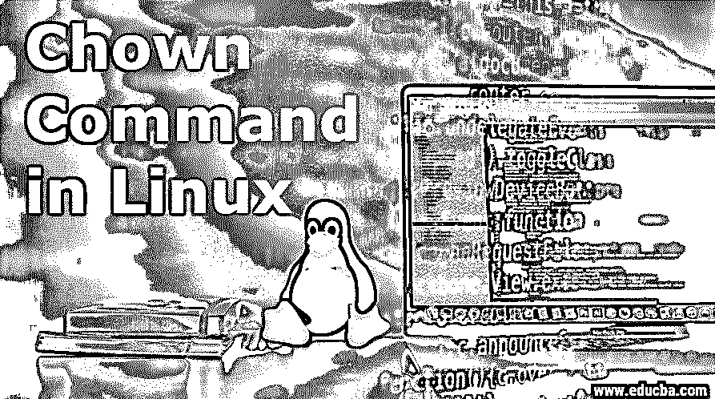

# Linux 中的 Chown 命令

> 原文：<https://www.educba.com/chown-command-in-linux/>




## Linux 中 Chown 命令简介

在 Linux 中，当我们创建文件、文件夹或链接时，每个文件或文件夹都与一个组和一个所有者相关联，该所有者被分配了文件所有者、组成员和其他人的访问权限。

要在 Linux 中创建一个文件，我们可以使用下面的语法:

<small>网页开发、编程语言、软件测试&其他</small>

**语法:**

```
touch file_name
```

**输出:**


创建文件时，创建文件的用户成为所有者，所有者拥有的组成为用户的当前组。

由于可能会有很多人同时使用 Linux，我们需要提高每个用户访问他们的文件的安全性。访问文件的权限授予:

*   **用户:**只有文件的所有者被授予访问该文件的权限。
*   **组:**一组用户被授予访问文件的权限。
*   **其他:**试图访问该文件的所有其他用户都可以访问。

CHOWN 的意思是改变文件/文件夹/链接的所有权。

### 如何在 Linux 中使用 Chown 命令？

CHOWN 命令的基本语法是:

```
chown [OPTIONS].. USER[:GROUP] FILE(s)..
```

*   **【选项】:**上述命令可与或不与附加选项一起使用。
*   **【用户】:**用户名或数字用户 ID (UID)是文件的新所有者。
*   **[:]:** 要更改一组文件/文件夹/链接，请使用冒号
*   **【组】:**更改文件的组所有权是可选的。
*   **文件*:***chown 命令要应用到的目标文件名*。*

**输出:**


**检查 chown 版本:**要检查您系统上的 chown 版本，我们需要遵循以下步骤

**语法:**

```
chown –version
```

### 例子

列出了几个在 Linux 中使用 chown 命令的例子:

**1。要更改文件的所有权:**下面是更改文件所有者的语法:

**语法:**

```
chown owner_name file_name
```

chown 有不同的选项，如下所示:

*   **–c:**更改文件时的结果。例如:chown–c 所有者名称文件名
*   **–v:**Results 为您提供每个文件的详细信息。例如:chown–v 所有者名称文件名
*   **–f:**导致文件所有权的强制变更。当不允许您更改所有权时，它会隐藏大多数错误消息。
*   **–R:**递归文件和目录的结果。例如:chown–R 所有者名称文件名 1 文件名 2

| **选项** | **描述** |
| **-c****–变化** | 冗长地描述对其所有权被改变的文件的动作 |
| **–解引用** | 它不作用于符号链接本身，而是作用于它们所指向的内容 |
| **-f****–静音** | Do not print or it hides the error messages for the files whose ownership cannot be changed |
| **–reference =文件名** | Use the user and group information of the reference file instead of an explicit new owner value |
| **-R****–递归** | 递归地改变目录及其内容的所有权。 |
| **-v****–冗长** | 详细描述对每个文件采取的操作(或非操作)。 |

**2。更改文件组:**以下是更改文件组的语法。

**语法:**

```
chown :group_name file_name
```

另一种更改组名的方法是使用命令 chgrp。

**3。要更改文件的所有者和组:**下面是同时更改所有者和组的语法。为此，我们使用 chown 命令，后跟由冒号( :)分隔的 owner_name 和 group_name。

**语法:**

```
chown owner_name:group_name file_name
```

**4。要更改某个特定所有者的所有权:**如果我们想要更改某个特定所有者并授予他们对 root 的访问权限，请使用以下语法:

**语法:**

```
sudo chown --from=owner_name  root file_name
```

**5。仅从特定组中更改组:**如果我们想要删除文件的特定组并分配给新组，使用以下语法:

**语法:**

```
chown –from:group-name :new_group_name file_name
```

**6。要从参考文件中更改所有权/组信息:**如果我们要从其他文件中更改所有者/组信息，而不是手动更新到该文件，我们可以使用以下语法:

**语法:**

```
chown –reference=ref_file_name file_name
```

7 .**。要将所有权和组名更改为 Uid 和 Gid:** 我们可以使用用户 id 和组 id 来更改文件的所有权和组。为此，我们可以使用下面的语法:

**语法:**

```
chown 1000:1001 file_name
```

### 目录的 Chown 命令

正如我们对文件所做的那样，Chown 命令也适用于目录。要查看目录的权限，请使用 ls-l 命令，下面给出了 out。

**输出:**

drwxr-xr-x 2 用户组 4096 3 月 20 日 17:39 目录名称

这里，用户是所有者，组是分配给目录名的组名

**1。改变目录的所有权**

**语法:**

```
chown owner_name /directory_name
```

**2。更改目录的组名**

**语法:**

```
chown :grp_nme /directory_name
```

**3。要更改所有者和群组名称**

**语法:**

```
chown owner_name:group_name /directory_name
```

**4。要更改多个文件或目录的所有权/组名**

**语法:**

```
chown owner:grpname file1 file2 file3..
```

### 用于链接的 Chown 命令

符号链接是对现有文件的引用。要创建一个符号链接，我们可以通过“ln”来实现。让我们假设，我们将创建一个符号链接作为文件测试的 symbolic link。

**语法:**

```
ln –s test.txt  symblink
```

要检查所有者和组访问，我们可以使用 ls–lrt 命令，如下所示:

```
lrwxr-xr-x  1 root root 5 Feb 29 22:11 symblink -> test.txt
-rw-r--r--  1 root root  0 Feb 29 22:11 test.txt
```

我们可以在这里看到，有两个条目可用，一个是测试文件，另一个是链接到测试文件的符号链接。

现在让我们尝试改变符号链接的所有权，看看会发生什么，

**语法:**

```
chown user symblink
```

要查看对所有权所做的更改，请执行 ls–lrt 命令，输出如下所示:

**输出:**

-rw-r–r–1 用户 root 0 Feb 29 22:11 test . txt
lrwxr-xr-x 1 root root 5 Feb 29 7 22:11 symbol link->test . txt

### 推荐文章

这是一个 Linux 中 Chown 命令的指南。这里我们讨论 Linux 中 chown 命令的语法和例子，以及用于目录和链接的 chown 命令。您也可以浏览我们推荐的其他文章，了解更多信息——

1.  [Linux 系统命令](https://www.educba.com/linux-system-commands/)
2.  [Kali Linux 命令](https://www.educba.com/kali-linux-commands/)
3.  [Linux 操作员](https://www.educba.com/linux-operators/)
4.  [Linux 路由命令](https://www.educba.com/linux-route-command/)


