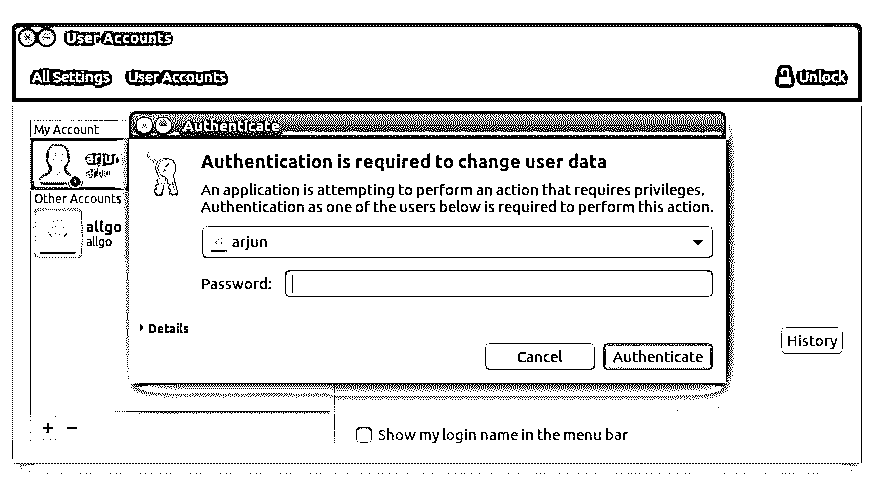
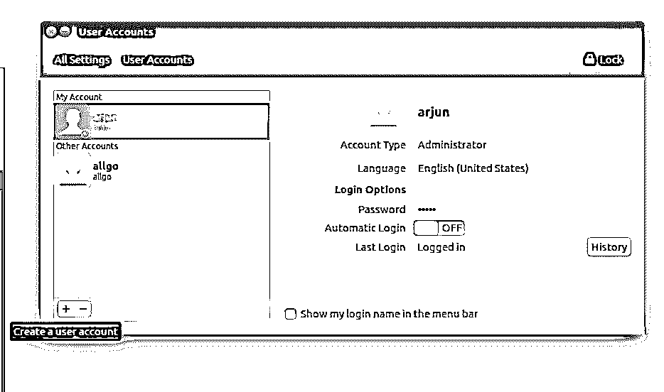
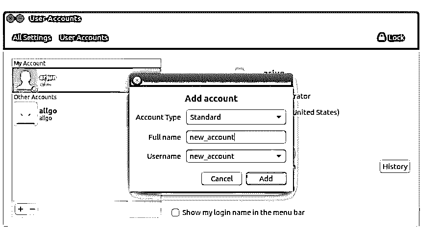
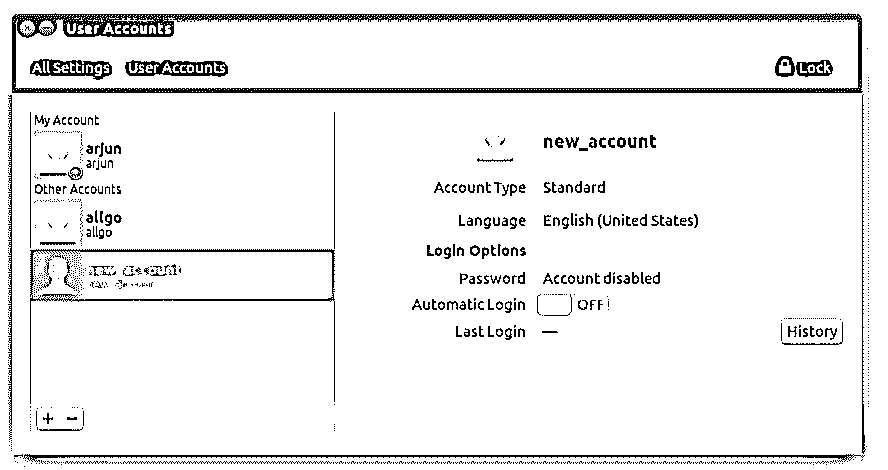

# 在 Linux 中创建用户

> 原文：<https://www.educba.com/create-user-in-linux/>

## Linux 下创建用户简介

在这些中，我们将学习在 Linux 中创建一个用户。是什么让 Linux 成为开发人员最喜欢的内核。但是在此之前，在继续下一步之前，有一件重要的事情你必须知道，Linux 不是一个操作系统，而是一个内核。内核是操作系统最重要的部分，但是仅仅有一个内核是无法让操作系统正常工作的。操作系统需要其他软件与内核一起工作。在 Linux 的情况下，它将是 GNU 软件。Linux 之所以出名，是因为它是免费的、开源的，并且提供了对操作系统的强大控制。

### Linux 中的用户

Linux 有一个多用户选项，这意味着不止一个用户可以同时使用 Linux。管理多个用户是系统管理员的工作。系统管理员可以添加或删除用户。因此，如果您是系统管理员，请继续阅读，了解如何在您的 Linux 系统中添加用户。

<small>网页开发、编程语言、软件测试&其他</small>

### 向 Linux 添加用户的类型

在 Linux 中有两种添加用户的方法。

*   从 shell/终端使用“useradd”
*   从 GUI 使用系统设置

**Note:** Here, Ubuntu 16 Linux is used. The steps are similar to the steps mentioned here, with minimal changes.

#### 1.从 shell/终端创建一个用户

大多数专业人士和有经验的 Linux 用户都使用这种方式。要从 shell/终端添加用户，必须遵循以下步骤。您还应该优先关注步骤中给出的语法，并严格遵循它们。

**第一步:**打开外壳或终端。

**第二步:**以 root 身份登录，在终端中键入“su -”，输入密码。

*   如果密码正确，您应该拥有系统的超级用户权限。如果密码错误，您将收到如下所示的消息。

**第三步:**获得 root 权限后，输入“useradd username”。

**第四步:**输入“密码用户名”，终端会要求输入新密码。确认新密码。输入新密码。

**第五步:**你应该可以看到新用户在确认，键入“cat /etc/password”，你应该可以看到你的新用户名在那边。

#### 2.从 GUI 创建用户

这种创建用户的方式非常简单，当您不太熟悉 Linux 时可以使用。

**步骤 1:** 进入应用程序，选择系统设置。

**Step 2:** Click on User Accounts.

**第三步:**在右上角，找到用户的对话框。

**第四步:**系统会询问管理员的密码，输入错误的密码，如果对话框说锁定了就应该解锁；点击它解锁。

**第五步**:解锁对话框后，在对话框左下方找到一个添加用户按钮，点击它。

第六步:输入您要创建的账户的名称。您还可以选择帐户类型，标准或管理。

**第 7 步:**点击 Add，你应该可以在框的左侧选项卡上看到你的用户名。

### 结论

嘿，恭喜你知道如何在 Linux 上创建/添加用户。多用户访问是使用 Linux 的一大优势，您已经学会了它的第一步。您可以添加任意数量的用户，但请记住要保持您的密码足够安全。

### 推荐文章

这是一个在 Linux 下创建用户的指南。在这里，我们以两种形式讨论在 Linux 中逐步创建用户:shell/终端用户和 GUI 用户。您也可以浏览我们的其他相关文章，了解更多信息——

1.  [Linux 文件系统](https://www.educba.com/linux-file-system/)
2.  [什么是 Linux？](https://www.educba.com/what-is-linux/)
3.  [什么是 GUI？](https://www.educba.com/what-is-gui/)
4.  [Linux 操作员](https://www.educba.com/linux-operators/)

