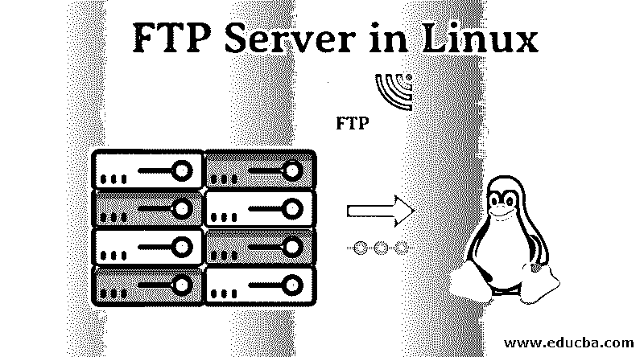
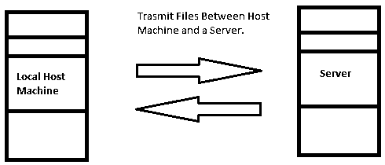
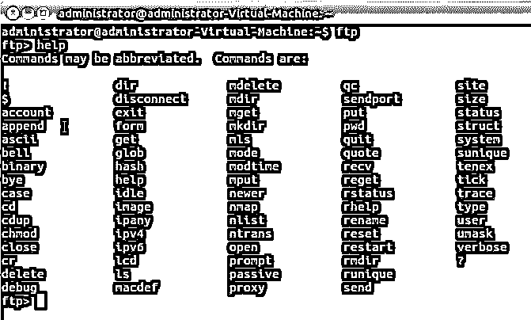

# Linux 中的 FTP 服务器

> 原文：<https://www.educba.com/ftp-server-in-linux/>

## Linux 下 FTP 服务器简介

在本文中，我们将简要了解 Linux 中的 FTP 服务器、使用和安装。简而言之，FTP 是一种互联网协议，用于通过互联网/网络将文件从源计算机传输到目的地。FTP 代表“文件传输协议”

基本上， [FTP 服务器](https://www.educba.com/what-is-ftp-server/)使用客户端-服务器架构来传输文件。FTP 服务器是一个软件应用程序，它使用文件传输协议通过互联网在客户机和主机之间共享文件。这里我们有两台机器，终端用户是本地主机，目的地是远程主机。两台机器运行相同的 FTP 服务器应用软件。

<small>网页开发、编程语言、软件测试&其他</small>

FTP 服务器类型的文件传输有许多优点，如

*   它允许您传输多个文件和目录/文件夹。
*   在连接中断的情况下，您的文件不会丢失，相反，您可以从中断的地方继续传输。
*   FTP 比 HTTP 快
*   最后，您可以安排文件传输。

尽管有上述优点，FTP 也有一些缺点:

*   基本上，在一个实例中同时传输多个文件会导致后面的文件被添加到一个队列中，而不是同时上传每个文件。
*   很少有安全点像使用简单的暴力攻击一样，任何外来者都可以获得访问权。
*   您的登录凭证(如用户名和密码)以明文格式发送。
*   通过简单的访问，一个新手，没有经验的人可以很容易地(意外地)清除 FTP 或任何其他主要操作。

### 两种类型的连接

连接是两点之间获得的简单关系。在 FTP 中，我们有两个基本连接，首先是控制连接和数据连接。

1.  **控制连接:**这是一个初始连接，在发送登录凭证并且 TCP 端口 20 或 21 之一打开时立即建立。
2.  **数据连接:**这是为了传输数据的特定目的而建立的后一种连接。

除了两种类型的连接，FTP 以两种不同的模式工作，主动和被动 FTP。这些模式取决于发起数据连接的客户端或服务器。

*   **在主动模式:**服务器发起数据连接，客户端监听随机端口，以接收来自服务器的数据连接。
*   **被动模式:**客户端通过发送数据发起数据连接，服务器监听。

接下来，我们将学习如何在装有 Linux 操作系统的计算机上安装 FTP 服务器软件应用程序。在这里，我们将使用“VSFTPD”，这是一个用于类似于 Unix 的系统的 FTP 服务器，它是在 GNU 通用公共许可证下授权的，支持 IPv6 和 SSL。它还支持 FTPS，这是安全的 FTP 扩展社区。VSFTPD 代表“非常安全的文件传输协议守护程序”。VSFTPD 是基于 Unix 的操作系统(如 Linux Ubuntu、Fedora、CentOS 和 RHEL 发行版)的默认 FTP 服务器。

让我们从 VSFTPD 安装开始。

**建议:**在任何基于 Unix 的系统中开始任何工具/软件应用程序的安装过程之前，建议启动更新命令。

**进一步的过程**:为了简单说明，我们现在将执行一个简单的“apt-get install”查询来安装 VSFTPD 应用程序，然后我们将继续编辑。最后，我们将启动 VSFTPD 服务器。

### 安装 VSFTPD 应用程序的步骤

让我们详细了解一下如何安装 VSFTPD 应用程序。

#### 步骤 1:安装

根据您使用的 Linux 发行版的类型，安装命令可能会有所不同。

对于基于 Linux Ubuntu/Debian 的系统，安装 VSFTPD 非常简单，只需执行以下命令:

`sudo apt-get install vsftpd`

对于 Red Hat/CentOS:执行以下命令

`yum install vsftpd`

**提示:**如果你对 Ubuntu 的未满足的依赖关系有错误，只需发出一个简单的“sudo apt-get–f install”命令，就可以解决问题，然后继续安装。

#### 第二步:配置

从这里我们将为 Ubuntu 配置文件。配置文件位于/etc/vsftpd/文件夹中。

***Note:** The configuration file, changes might be in form of adding a line, modifying an existing one or uncommenting a line.

但是在编辑默认更改之前，我们将制作一份原始更改的副本。运行下面的命令。

`Sudo cp /etc/vsftpd.conf /etc/vsftpd.conf.copy`

现在我们有了原始文件的副本，让我们做一些配置更改。通过执行以下命令打开配置文件。

`Sudo nano /etc/vsftpd.conf`

| **匿名 _ 启用=否** | 禁用默认匿名登录 |
| **local_enable=YES** | 允许本地登录。 |
| **write_enable=YES** | 允许 FTP 命令的权限 |
| **chroot_local_user=YES** | 允许本地用户访问文件。 |
| **userlist_enable=YES0** | 将加载用户名 |
| **userlist_file=/etc/vsftpd.userlist** | 存储用户名 |
| **用户列表 _ 拒绝=否** |  |
| **tcp_wrappers=YES** | 打开 TCP 包装 |

以上是应在 vsftp.conf 文件中进行的更改。除了上面列出的更改之外，根据您的系统，可能还需要进行一些更改。

现在，保存更改并关闭文件。一旦保存了更改并关闭了文件，我们将重新启动 VSFTPD 服务以使更改生效。执行以下命令:

`systemctl restart vsftpd`

至此，我们已经成功安装了 VSFTPD，在配置文件中进行了所需的更改，并按下了重新启动按钮。

现在让我们看看使用 FTP 的基本命令。

*   其中一个最基本也是最有用的命令是:**"？/help"** ，首先是打印基本信息。
*   **打开**:连接到远程服务器。
*   **get** :这个命令只是从服务器获取文件并存储在本地机器上。
*   **目录:**打印目录中的内容列表。

***下图显示了帮助查询的输出**

**

** 

*   **关闭/断开:**两者都用于终止 FTP 会话。
*   **退出**终止 FTP 会话并退出。
*   **ls:** 打印服务器上目录中的内容列表。

*   **删除**:删除一个文件。
*   **mdelete** :删除多个文件。

上面提到的是 Linux 的基本 FTP 命令，如果你需要更多的命令，使用“帮助”命令就可以得到列表。

### 结论

FTP 是通过网络传输文件的最简单的方式，但它有自己的安全缺陷，FTP 命令类似于 Unix 终端命令，FTP 有其优点和缺点，在两种基本连接上运行。总之，我们已经了解了什么是 FTP 服务器，了解了它的优点和缺点，在 Linux Ubuntu 上安装它的逐步过程，并且我们尝试了它的一些基本命令。

### 推荐文章

这是一个 Linux 中 FTP 服务器的指南。在这里，我们将详细讨论基本概念、两种类型的连接以及安装 VSFTPD 应用程序的步骤。你也可以浏览我们的文章来了解更多-

1.  [什么是 FTP？](https://www.educba.com/what-is-ftp/)
2.  [FTP 命令](https://www.educba.com/ftp-commands/)
3.  [FTP vs SFTP](https://www.educba.com/ftp-vs-sftp/)
4.  [Linux 操作员](https://www.educba.com/linux-operators/)

