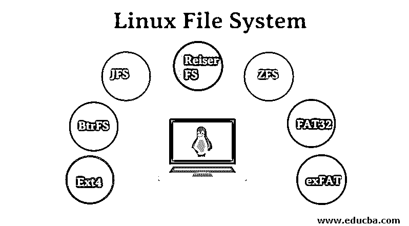

# Linux 文件系统

> 原文：<https://www.educba.com/linux-file-system/>

## Linux 文件系统简介

对于使用任何类型软件的任何类型设备，他们必须有一个在其上运行的操作系统，该操作系统可以为确保该设备正常工作所需的软件提供一个平台。从中，我们可以估计出操作系统对任何设备的工作有多重要。同样，我们将在这里看到，有些东西对操作系统至关重要。操作系统的一个主要特性是它提供了空间来存储通过使用文件系统而变得可用的数据。在这里，我们将看到 Linux 中关于文件系统的一切，比如它是什么，它如何帮助操作系统，以及是什么使它成为操作系统的一个重要部分。

### Linux 文件系统

文件系统可以定义为以特定方式存储数据的方式，以便在需要时可以顺利定位。基于操作系统，取决于遵循了哪种文件系统。文件系统的主要目的是使用户和操作系统以指定的方式存储文件变得容易，以便各方都可以轻松地存储或获取文件。顾名思义，文件系统使用任何操作系统处理应该保存在存储设备中的文件和目录。操作系统只是扮演一个媒介的角色，促进数据传输到存储设备，以便可以存储在那里。

<small>网页开发、编程语言、软件测试&其他</small>

在 Linux 操作系统中，当操作系统正在运行时，不能安装和卸载硬盘驱动器。因此，在开始安装操作系统时，您将有机会选择您将使用的磁盘部分或您希望被任何文件系统占用的磁盘部分。下面是在系统中安装 Linux 时可以选择的一些文件系统。有几个文件系统可供用户使用，根据他们的需求，可以选择任何一个文件系统。

### 7 大最佳 Linux 文件系统

以下是 2019 年 9 月最佳的 7 个 Linux 文件系统:

#### 1.Ext4

Linux 操作系统允许您使用 Ext2、Ext3、Ext4 文件系统，其中 Ext4 被认为是现代发行版，也是最有效的一个。如果用户没有选择任何文件系统，那么 Ext4 将被视为默认文件系统。它允许用户管理大容量的磁盘驱动器。

#### 2.btr 护堤

这是 Linux 操作系统提供的另一个文件系统。在通常情况下，它被称为黄油金融服务。由 oracle 开发的[，它是能够处理大量数据的最高效的文件系统之一。在安装时，您必须确保您已经选择了它，因为它不是 Linux 中的默认文件系统。](https://www.educba.com/oracle-string-functions/)

#### 3.JFS

这种文件系统因其简单性和根据硬盘大小工作的能力而广受欢迎。它代表日志文件系统，由 IDM 开发。它适用于两种硬盘:小型和大型存储。这种文件系统使用很少的 CPU 处理能力，由于它的这个特性，它是一些系统管理员的首选。

#### 4.ReiserFS

ReiserFS 是 Linux 中的一种文件系统，由于效率低下，Reiser4 取代了它。当涉及到长期存储或保存数据时，建议选择 Butter FS 而不是 ReiserFS。任何系统管理员都很少使用它，因为他们需要更高效的东西来处理数据和硬盘。

#### 5.ZFS

当谈到具有许多特殊功能的最先进的文件系统时，它总是 ZFS。这个文件系统允许动态磁盘分条和驱动器池，这在使用数据存储设备时非常有用。sun microsystem 开发了它，该组织负责该文件系统中的所有更新和升级。

#### 6.FAT32

这是所有操作系统(如 Linux、Windows 等)中最常用的文件系统。这是因为它提供了存储文件的最佳方式，以便操作系统可以轻松处理这些文件和目录。重要的是要明白，尽管这是最常见的一种，但用户在为他们的操作系统选择文件系统之前，必须选择最适合他们的文件系统。

#### 7.exFAT

它是属于 FAT 家族的另一个文件系统。它也被认为是处理数据或文件的常用文件系统。为了提高工作效率，所有的操作系统都可以使用这个文件系统。这个文件系统非常适合处理低容量或高容量的数据。

### 结论

Linux 文件系统被认为是树状的存储结构，层次结构的顶端被根或/占据。在 Linux 中，每个用户都有主目录，从他们的主目录中，他们可以访问他们分支下的所有文件。有些文件包含系统配置，只能由 root 用户使用。这些文件或目录不允许普通用户访问。普通用户不应该更改操作系统的内部文件，因此这些文件的使用受到限制。在用户主目录的分支下，他们有几个其他文件，可以用来存储他们选择的文件，使他们能够轻松地使用操作系统。

### 推荐文章

这是一个 Linux 文件系统的指南。在这里，我们讨论了 linux 文件系统的概述以及 7 个最好的 linux 文件。您也可以浏览我们推荐的其他文章，了解更多信息——

1.  [Linux 的优势](https://www.educba.com/advantage-of-linux/)
2.  [Linux 替代品](https://www.educba.com/linux-alternatives/)
3.  [Linux 系统命令](https://www.educba.com/linux-system-commands/)
4.  [Linux 发行版](https://www.educba.com/linux-distributions/)

