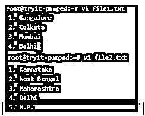
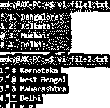
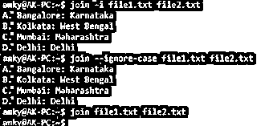
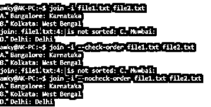
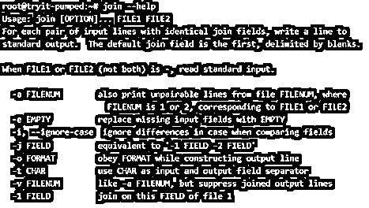

# Linux 加入

> 原文：<https://www.educba.com/linux-join/>

## Linux Join 的定义

在当今世界的某种情况下，当数据稀疏时，有必要将包含部分相同数据的两个文件连接起来。换句话说，使用 **join** 可以实现“连接”两个文件的效用，这样 **join** 的输出更有意义，也更完整。在许多应用中，**加入**命令都能派上用场。**连接**发生在一个键上，这个键同时出现在两个文件中，默认情况下，它是第一个被作为键的列。让我们用一个例子让你更清楚。假设有两个文件，一个文件中有员工名单，另一个文件中有他们的地址。Linux 中的 Join**对于这些类型的连接情况来说非常方便！**

**语法:**

<small>网页开发、编程语言、软件测试&其他</small>

附加到**连接**的基本语法是:

`join [OPTION]… FILE1 FILE2`

其中，文件 1 和文件 2 是内容所在的文件，**选项**表示我们将在此讨论的各种选项，这有助于实现所需的要求。

**1。-a <文件号>选项:也打印不成对行的方式**

**语法:**

`join <FILE_1> <FILE_2> -a 1`

**2。-v 选项:仅打印非成对行的方式**

**语法:**

`join <FILE_1> <FILE_2> -v 1`

**3。连接 2 个文件的自定义列**

**语法:**

`join -1 <Column for join in File 1> -2 <Column for join in File 2> <FILE_1> <FILE_2>`

**4。-I/–ignore-Case 选项:不区分大小写的连接**

**语法:**

`join -i <FILE_1> <FILE_2>
OR
join --ignore-case <FILE_1> <FILE_2>`

**5。–Check-order/–nocheck-order:检查所有输入行的排序**

**语法:**

`join --nocheck-order <FILE_1> <FILE_2>
OR
join --check-order <FILE_1> <FILE_2>`

**6。–帮助选项:显示帮助信息**

**语法:**

`Join --help`

### 在 Linux 中 Join 是如何工作的？

Linux 中的 Join 在各种用途中都有应用，在本节中，我们将研究一些最常用的方法，在解释每种方法的过程中，我们将在本节的适当时间轮流解释每种方法的工作原理。

第一个也是最重要的是基本连接，其目的是通过一个公共键连接两个文件，这里的键也称为索引，其作用类似于在一些相似的基础上匹配两个内容。可以把这想象成一场体育比赛，各队在一些共同的场地上比赛，可能是足球比赛中的进球，板球比赛中的得分，等等。现在，由于只有两个队可以相互对抗，而不是像锦标赛中那么多队，所以有一些共同的规则来判断冠军和亚军。现在，在同样类似的情况下，将比较这两个文件，只要索引匹配，对应于该索引的内容就会连同间隙一起被复制。现在，我们需要小心任何空白或空字符，因为它们往往会连接在一起。在下一个例子中，可能存在这样的情况，其中“索引”可能从任何一个文件中缺失，因此用户可能选择在连接期间添加未配对的文件，目的是使结果文件类似于文件的联合，并且将包含“两个世界的最佳”。为此，用户可能需要使用"-a <file number="">"，其中文件号实际上意味着该文件，其非配对行将在连接期间被包括。此外，在某些情况下，用户可能只需要看到未配对的行，为此，用户可以使用“-v a <file number="">”选项。这两个选项最终会包括非配对的选项，并且根据-a 或-v 的使用，采取必要的行动。默认情况下，索引总是第一个不间断字符集。不间断字符集是指未被空格分隔的字符集。但是，在某些情况下，用户会希望使用一些自定义编号的字符集，例如，代替第一组不间断字符，用户会选择使用第三组不间断字符。在这个场景中，参数-1 <custom numbered="">和-2 <custom numbered="">可以满足这个目的。更简单地说，如果两个文件的字符集位置相同，上面的命令可以替换为-j <custom numbered="">。</custom></custom></custom></file></file>

此外，必须注意 Linux 中的 join 是区分大小写的。现在，在一些场景中，用户可能会忽略用于连接的索引的情况。现在，很明显，如果索引是数字，大小写无关紧要，但是如果索引是字母，小型大写字母的 ascii 值与所有大写字母相比是不同的，因此 Linux 默认加入是有问题的。因此，用户可以使用-i 使索引在连接期间不区分大小写。

需要记住的另一点是，需要对索引的顺序进行排序，否则需要使用选项–nocheck-order，以便不对顺序进行检查。最后，如果你觉得有必要探索更多的 Linux join，你可以使用 Linux 中的——help 来访问其他的命令集。

### 例子

让我们讨论 Linux Join 的例子。

#### 示例#1

加入打印文件 2 中所有未配对的行。

**语法:**

`join file1.txt file2.txt -a 2`

加入打印文件 1 中所有未配对的行:

**语法:**

`join file1.txt file2.txt -a 1`

**输出:**

输入文件:

加入打印文件 2 中所有非成对的行:

加入打印文件 1 中所有未配对的行:

#### 实施例 2

仅打印文件 2 中的非配对行:

**语法:**

`join file1.txt file2.txt -v 2`

仅打印文件 1 中的非配对行:

**语法:**

`join file1.txt file2.txt -v 1`

**输出:**

**T2】**

 **#### 实施例 3

**语法:**

当自定义列的顺序不同时:

`join file1.txt file2.txt -1 2 -2 1`

当自定义列的顺序相同时:

`join file1.txt file2.txt -j 2`

**输出:**

当自定义列的顺序不同时:

当自定义列的顺序相同时:

#### 实施例 4

**语法:**

`join -i file1.txt file2.txt
join --ignore-case file1.txt file2.txt`

**输出:**

如果不使用任何选项，连接将返回空值！

#### 实施例 5

**语法:**

没有选择

`join -i file1.txt file2.txt`

使用检查订单选项

`join -i --check-order file1.txt file2.txt`

使用不检查订单的选项

`join -i --nocheck-order file1.txt file2.txt`

**输出:**

当没有–nocheck-order 选项时，会报告一个错误，而使用该选项时，不会出现这样的错误，未排序的行会被忽略。当使用–check-order 选项时，联接在索引未排序的位置停止，并且不会发生进一步的联接。

#### 实施例 6

**语法:**

`join --help`

**输出:**

**

** 

### 结论

有了在 Linux 中使用 join 的一系列例子和解释，你一定很习惯于使用这些例子和解释，这将使你能够更多地尝试 Linux join 的其他参数并了解更多！

### 推荐文章

这是一个 Linux 加入指南。这里我们讨论一下定义，Join 在 Linux 中是如何工作的，并给出一些例子。.您也可以看看以下文章，了解更多信息–

1.  [Linux 列表组](https://www.educba.com/linux-list-groups/)
2.  [Linux 容器](https://www.educba.com/linux-container/)
3.  [Linux 睡眠](https://www.educba.com/linux-sleep/)
4.  [Linux Sed 替换](https://www.educba.com/linux-sed-replace/)

**