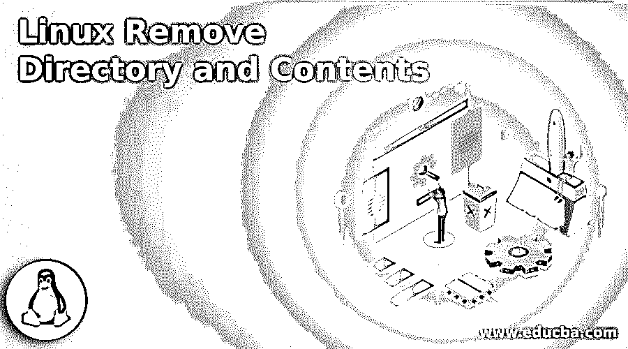
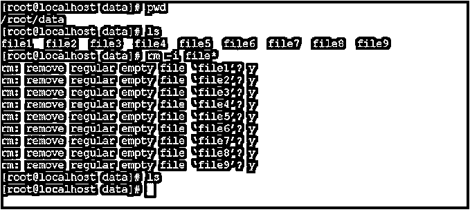
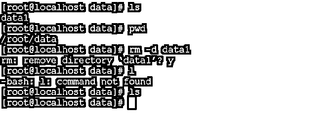

# Linux 删除目录和内容

> 原文：<https://www.educba.com/linux-remove-directory-and-contents/>

## Linux 简介删除目录和内容

在 Linux 操作系统中，我们在多用户操作系统上工作。每个用户，如用户帐户或服务帐户，都有一堆分层数据。数据块在多个分组层次结构中可用。移除或删除相同的嵌套数据将非常困难。在 Linux 中，我们有删除目录的功能。借助相同的功能，我们可以删除嵌套的内容目录。从 Linux 环境中删除内容有不同的方法。通常，我们使用“rm”命令或实用程序来删除嵌套的内容。

rm 实用程序是由 Paul Rubin、David MacKenzie、理查德·M·斯托曼和 Jim Meyering 编写的。

<small>网页开发、编程语言、软件测试&其他</small>

**语法:**

`rm [ OPTION ] ... INPUT FILE ...`

*   **rm:** 我们可以在语法或命令中使用“rm”关键字。它需要不同的参数，比如选项，输入文件。根据提供的参数，它将以递归模式或单次模式删除输入文件。
*   **选项:**我们可以提供不同的标志作为与“rm”命令兼容的选项。
*   **输入文件:**根据条件或要求，我们可以为 cat 命令提供文件或文件路径。

### Linux 如何删除目录和内容？

正如我们所说的，Linux 是一个多用户支持的操作系统，管理多个用户环境的数据。删除目录，即“rm”实用程序用于单次或递归删除数据或文件内容。根据需求，我们可以在 rm 命令中使用多个选项。同样，我们需要将输入文件或目录传递给 rm 命令。根据提供的参数，即选项和输入文件。rm 命令将删除该文件。

默认情况下，rm 命令将无法删除该目录。要删除目录，我们需要使用 rm 命令添加选项，尽管我们需要有适当的权限来删除目录或内容。

以下是与 cat 命令兼容的选项列表。

| **服务请求编号** | **选项** | **描述** |
| One | -f，–力 | 它永远不会提示任何更新或输入。它将直接处理 rm 命令。我们也可以在需要强行删除或移除数据的时候使用。 |
| Two | ［构成来自拉丁语、结尾为-us 的名词的复数］ | 在删除任何内容之前提供提示信息会有所帮助 |
| Three | 我 | 它类似于前面的“-i”选项，但在删除三个以上的文件之前，它只会提示一次。当我们在递归模式下删除文件时，我们也可以使用相同的功能。 |
| Four | –交互式[=何时] | 根据 WHEN 条件使用提示选项会有所帮助。它将与“-i”选项以及“-I”一起使用。没有 when 的选项，则提示将总是。 |
| Five | –一个文件系统 | 当我们需要递归地删除层次结构内容，并且需要从文件系统中跳过任何目录时。文件系统不同于相应命令行参数的文件系统。 |
| Six | –不保留根 | 它不会处理“/”，尤其是在 rm 环境中。 |
| Seven | –保留根 | 它不会删除“/”(这是默认设置) |
| Eight | -r，-R，–递归 | 这将有助于删除嵌套目录或多个内容或文件。文件删除模式将是递归的。 |
| Nine | -d, –dir | 在 rm 命令中，如果没有选项，我们无法直接删除。我们可以使用“-d”选项来删除空目录 |
| Ten | -v，–详细 | 这将有助于打印信息，即正在发生的事情及其状态。 |
| Eleven | 救命 | 它将在屏幕上给出兼容的命令信息，并退出命令窗口。 |
| Twelve | –版本 | 它将打印 rm 命令的版本信息并退出打印窗口 |

### 实现 Linux 删除目录和内容的示例

下面是一些例子:

#### 1.Linux 删除目录–交互模式

在 Linux 环境中，我们能够在交互模式下删除多个文件。

**命令:**

`rm -i file*`

**解释:**按照上面的命令，我们在“/root/data”位置有多个文件。借助“-i”选项，我们能够在交互模式下删除多个文件。

**输出:**

#### 2.Linux 删除目录和内容–使用递归模式

当删除多个目录或文件时，rm 工具将始终执行该操作。为了避免这种情况，我们需要使用递归模式。

**命令:**

`rm -rf *`

**解释:**根据上面的命令，我们在 remove 命令中使用了“-r”选项。这将有助于删除所有的文件或目录递归。

**输出:**

#### 3.Linux 删除目录和内容–删除目录

在 rm 应用工具中，我们有删除目录的功能。要删除空目录，我们需要使用“-d”选项。

**命令:**

`rm -d data1`

**解释:**我们在“/root/data”位置查找文件。要删除空目录，我们需要在 rm 命令中使用“-d”选项。

**输出:**

#### 4.Linux 删除目录和内容–使用“-f”选项

在 Linux 中，我们拥有强制删除或移除文件/目录的功能。

**注意:**使用 rm 命令或工具运行“-f”选项时。我们需要非常小心地使用它，因为它不会弹出窗口。它将删除所有内容。恢复起来会非常困难。

**命令:**

`rm -df *`

**解释:**根据上面的命令，我们在 rm 命令中使用“-f”选项。它将删除其中所有可用的文件或目录。

**输出:**

### 结论

我们已经看到了“Linux Remove Directory and Contents”的完整概念，以及正确的示例、解释和带有不同输出的命令。根据需求，我们可以在 rm 命令中使用不同的选项。这将是非常有用的删除多个内容在同一时间。

### 推荐文章

这是一个 Linux 删除目录和内容的指南。在这里，我们还讨论了 linux 删除目录和内容的工作原理。并附有示例。您也可以看看以下文章，了解更多信息–

1.  [Linux Untar](https://www.educba.com/linux-untar/)
2.  [Linux Ping](https://www.educba.com/linux-ping/)
3.  [Linux nslookup](https://www.educba.com/linux-nslookup/)
4.  [Linux LVM](https://www.educba.com/linux-lvm/)

