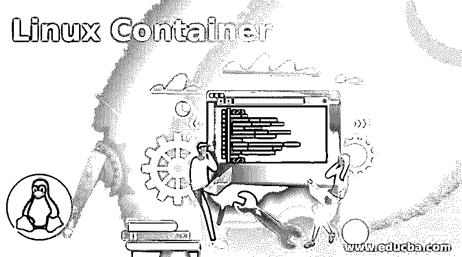
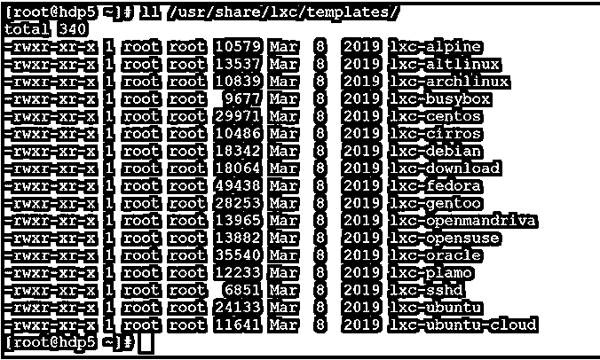
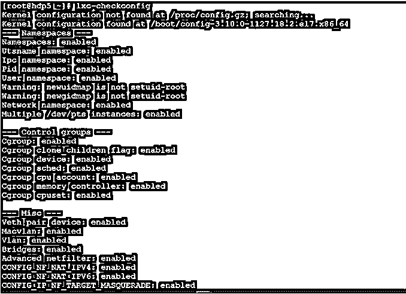
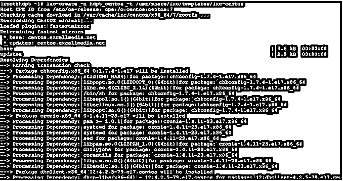
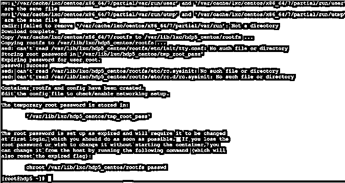
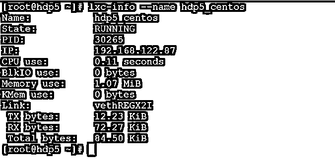

# Linux 容器

> 原文：<https://www.educba.com/linux-container/>

## Linux 容器简介

在 Linux 操作系统中，Linux 容器被称为 LCX。LCX 是虚拟化的一部分，但它不同于 KVM、VMware、Citrix 虚拟机管理程序等。在传统的虚拟化工具中，我们需要大量的资源(RAM、CPU、存储等)来运行虚拟化工具上的虚拟实例。但是与普通的虚拟化实例相比，容器的重量较轻。虚拟化实例和容器之间的主要区别是内核共享。Linux 容器的目标是为 LCX 技术的开发提供发行版和厂商中立的环境。

**语法:**

<small>网页开发、编程语言、软件测试&其他</small>

`lxc-create -n [ containername ] -t [ Default/Own Container Template ]`

*   **lxc-create:** 我们可以在语法或命令中使用“lxc-create”关键字。它需要不同的参数，比如"-n "、"-t "等等。按照提供的参数，它将在 Linux 内核上创建新的 Linux 容器。
*   **选项:**我们可以提供不同的标志作为与“lxc-create”命令兼容的选项。
*   **容器名称:**在创建 Linux 容器时，我们需要指定容器的名称。
*   **默认/自己的容器模板:**当我们安装了 Linux 容器包后，我们会得到默认的模板。我们可以使用相同的模板，也可以创建自己的模板。

### Linux 容器是如何工作的？

当我们在单机服务器上部署多个关键应用程序时，我们需要注意多个方面，如版本、库信息、兼容性、应用程序的可用性等。为了满足需要；如果我们将创建多个虚拟实例，那么将会有巨大的成本。成本将涉及 RAM、处理能力(CPU)、存储空间、输入和输出操作、时间等。维护虚拟化实例的多个实例将是开销。

为了克服上述情况，我们可以使用 Linux 容器(LCX)。与传统虚拟实例相比，它是非常轻量级的。它不需要任何不同的设置环境。Linux 容器将共享当前的操作系统内核。当任何应用程序将在 Linux 容器上工作时，它将只消耗必要的资源，而不会在启动虚拟实例时消耗大量的资源。在 Linux 容器环境中，我们能够实现应用程序的高可用性，容器的复制，如果需要我们可以改变应用程序的版本等。

Linux 容器是一个开源项目，任何人都可以参与其中。目前，它有四个活跃的项目，像 LXC，LXD，LXCFS，distrobuilder。

**LXC:**Linux LXC 以设置工具、定制模板、语言和库绑定而闻名。这是一个非常轻量级，非常灵活，相当低的水平。它将考虑所有的容器环境和特性。它将得到 Linux 内核的支持。在 LTS 版本的帮助下，Linux LXC 生产环境已经准备好了。安全和错误修复更新将在未来 5 年内修复。

**LXD:**Linux LXD 是 LXC 环境的新体验。它在单一窗口(命令行工具)中提供了全新而直观的用户体验。这将有助于管理集装箱。在 REST API 的帮助下，我们可以通过网络管理容器。它也将有助于或工作在大规模的环境，如 OpenStack，opennybulla 等。

LX CFS:LX CFS 提供了文件系统功能。它提供两个主要的东西:

1.  CPU 信息、内存信息、状态和正常运行时间的文件。
2.  在 cgroupfs 兼容树的帮助下，它允许非特权写入。

LXCFS 通过导出文件来解决 procfs、sysfs 和 cgroupfs 的缺点。

**distro builder:**distro builder 是一款用于 LXC/LXD 的图像构建工具:

它提供了以下优势

1.  复杂图像定义的帮助(简单的 YAML 文档)。
2.  它支持多种输出格式，如 chroot，LXD，LXC 等。
3.  它将支持许多架构和发行版。

基本上，创建发行版是为了替换旧的 shell 脚本。这是一个有用的 LXC 形象创作。

### 实现 Linux 容器的例子

下面是一些例子:

#### 1.列出 LXC 的模板

当我们安装了 LXC 环境后，我们将获得环境中可用的模板列表。我们可以使用相同的默认模板来创建定制的 Linux 容器。

**命令:**

`ll /usr/share/lxc/templates/`

**解释:**我们列出了 LXC 软件包自带的默认模板。

**输出:**

#### 2.检查 LCX 服务状态

在使用 Linux 容器时，安装 LXC 包非常容易。但是工作的操作系统不符合标准，那么 LXC 环境也不符合标准。必须检查 LXC 内核虚拟化状态是否运行良好。

**Co**T2】mmand:

`lxc-checkconfig`

**说明:**我们可以列出所有的 LXC 服务，并检查其状态。

**输出:**

#### 3.创建新的 Linux 容器

在 LXC 环境中，我们可以创建新的 Linux 容器。在创建新的 Linux 容器时，我们需要使用“lxc-create”关键字。

**命令:**

`lxc-create -n hdp5_centos -t /usr/share/lxc/templates/lxc-centos`

**说明:**根据上述命令，我们正在创建 CentOS flavour 的新 LXC 容器(hdp5_centos)。

**输出:**

#### 4.启动 Linux 容器

在 Linux 环境中，我们可以在后台启动 Linux 容器。

**命令:**

`lxc-start -n hdp5_centos -d`

**说明:**根据上面的 LXC 命令，我们正在后台启动“hdp5_centos”容器。

**输出:**

#### 5.集装箱信息

在 LCX，我们可以得到 Linux 容器的信息。

**命令:**

`lxc-info --name hdp5_centos`

**说明:**我们可以列出“hdp5_centos”容器的所有详细信息。

**输出:**

### 结论

我们已经看到了“Linux 容器”的完整概念，以及正确的示例、解释和带有不同输出的命令。Linux 容器是轻量级的。它使用工作的操作系统内核。

### 推荐文章

这是一个 Linux 容器指南。这里我们也讨论一下简介和 linux 容器是如何工作的？以及不同的示例及其代码实现。您也可以看看以下文章，了解更多信息–

1.  [Linux 用户](https://www.educba.com/linux-users/)
2.  [Linux tracepath](https://www.educba.com/linux-tracepath/)
3.  [Linux 挂载命令](https://www.educba.com/linux-mount-command/)
4.  [Linux mdadm](https://www.educba.com/linux-mdadm/)

