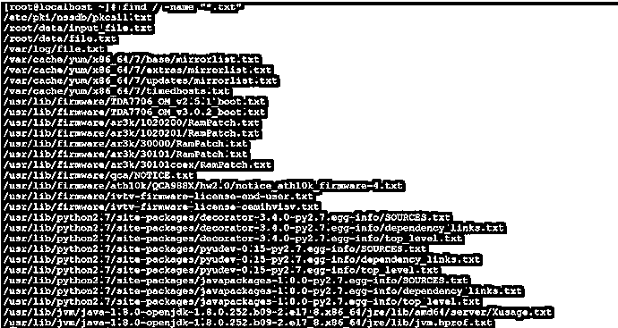

# Linux 通过名称查找文件

> 原文：<https://www.educba.com/linux-find-file-by-name/>

## Linux 按名称查找文件简介

在 Linux 操作系统中，我们能够在基于目录的层次结构中搜索或找到文件和目录，并对每个匹配的搜索文件执行用户要求的操作。在“查找文件”命令中，我们可以搜索文件，也可以获得文件的位置。在 find 命令的帮助下，我们能够以不同的方式找到文件或目录，例如文件或目录权限、文件类型、更新日期、文件/目录的大小。我们可以将 find 命令与 sed、grep、awk 等不同的命令组合使用。

**语法:**

<small>网页开发、编程语言、软件测试&其他</small>

查找文件命令的语法

`find [-H] [-L] [-P] [-D debugopts] [-Olevel] [path...] [expression]`

*   **find:** 我们可以在语法或命令中使用“find”关键字。它将采用不同的参数，如选项、路径、表达式等。按照提供的参数，它将从当前环境中找到请求的文件。
*   **[-H] [-L] [-P]:** 选项如-H、-L 和–P，它将控制符号链接的处理。
*   表达式:我们可以提供不同的标志作为与“find”命令兼容的表达式。
*   **路径:**我们可以为“find”命令提供具体的文件路径。这将有助于搜索文件的文件位置。

### Linux 查找文件命令是如何工作的？

在每个操作系统中，都有很多方法可以在系统环境中搜索文件。通常，文件搜索功能默认存在于操作系统中。但是，如果桌面版本不可用或者只有 CLI 环境，那么找到相应的或特定的文件将是一个大问题。为了克服这种情况，我们可以使用 find 命令在当前操作系统中搜索或查找特定的文件。

find 命令主要作用于选项、文件或目录的路径和表达式。一旦这些输入将提供给 find 命令，它将使用位置路径搜索相应的文件或目录。

查找命令中的-D 调试。

| **服务请求编号** | **选项** | **描述** |
| One | 帮助 | 它将在 find 命令中打印调试选项 |
| Two | 树 | 它将以原始和优化的格式打印表达式树 |
| Three | 斯达 | 当 stat 和 lstat 等系统调用检查文件时，它将显示打印消息。 |
| Four | 选择 | 它将显示优化表达式树的诊断信息。 |
| Five | 等级 | 它将显示摘要信息，指示每个谓词成功或失败的频率。 |

linux find 命令中的一些错误。

*   在“find”命令中，有一些固有的安全问题，并且还没有修复。“POSIX 标准”规定了同样的安全问题。该操作本质上是不安全的，并且“-execdir”将使用相同的内容。
*   find 命令中的环境变量，即“LC_COLLATE”。它将影响“-ok”动作

### 实现 Linux 查找文件命令的例子

下面是一些例子:

#### 1.名叫

按名称查找文件是在 Linux 操作系统中实践 find 命令的最常见方式。我们需要在 find 命令中使用“-name”选项。

**注意:**搜索文件名时，确保文件名正确。因为它区分大小写。

**命令:**

`find / -name "file.txt"`

**说明:**根据上面的命令，我们正在查找文件名为“file.txt”的文件。我们将获得所有具有相似名称的文件列表(在“/”位置)。

**输出:**

#### 2.按文件扩展名

在 find 命令中，我们可以通过扩展名来查找文件。

**Co**T2】mmand:

`find / -name "*.txt"`

**说明:**我们能够打印所有的列表文件。txt "扩展名。它不会考虑或打印带有大写文件名的文件名。

**输出:**

#### 3.通过带有“-i”选项的文件名

在“查找文件”命令中，我们可以通过文件名来搜索文件。但是搜索文件区分大小写。为了避免这种情况，我们可以使用“-i”选项来避免区分大小写的搜索。

**命令:**

`find / -iname "file.txt"`

**解释:**根据上面的命令，我们在 find 命令中使用了“-i”选项。它将打印所有大写和小写文件名的文件。

**输出:**

#### 4.在新文件中捕获搜索文件名

在 Linux 环境中，我们可以通过文件名找到文件，并在接收文件中捕获完整的文件名。我们可以使用重定向操作符来执行 find 命令。

**命令:**

`find / -iname "file.txt" > /root/data/search_file.txt
cat search_file.txt`

**说明:**我们可以将 find 命令输出重定向到“/root/data/search_file.txt”文件。我们将在“/root/data/search_file.txt”文件中获得所有查找文件的列表。

**输出:**

#### 5.用大小搜索文件名

在“查找文件”命令中，我们可以找到带有大小的文件名。我们可以在 find 命令中使用不同的选项，如“名称”和“大小”。

**命令:**

`find / -name "file.txt" -size +4M`

**说明:**在 find 命令中，我们可以根据大小找到文件。按照上面的 find 命令，我们正在查找所有大小超过 4MB 的“file.txt”文件。

**输出:**

#### 6.用文件类型查找文件名

在“查找文件”命令中，我们搜索文件名及其类型。我们可以搜索不同的类型，如常规文件、目录、符号链接、字符设备、块设备等。

**命令:**

`find /dev/ -type b -name "sda*"`

**解释:**我们在块设备的查找命令中使用“b”选项。我们正在查找所有仅带有名称(即“sda”)的块设备信息。

**输出:**

### 结论

我们已经看到了“Linux Find File Command”的完整概念，以及正确的示例、解释和带有不同输出的命令。按名称查找文件命令用于查找文件及其位置。在 CLI 环境中，find 命令对于在环境中查找相应的文件非常重要。

### 推荐文章

这是一个 Linux 按名称查找文件的指南。这里我们也讨论一下 linux find file 命令的介绍和工作原理？以及不同的示例及其代码实现。您也可以看看以下文章，了解更多信息–

1.  [Linux 写](https://www.educba.com/linux-write/)
2.  [Linux 导出](https://www.educba.com/linux-export/)
3.  [Linux 粉碎](https://www.educba.com/linux-shred/)
4.  [Linux comm](https://www.educba.com/linux-comm/)

