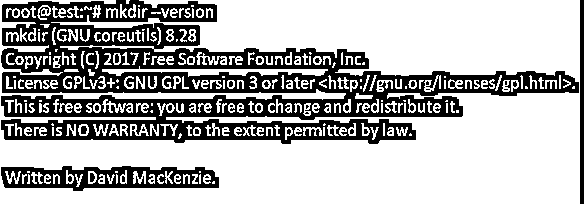
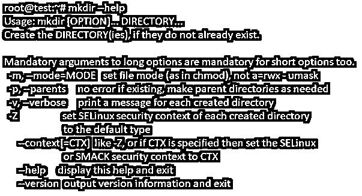
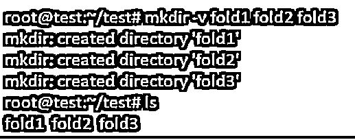

# 在 Linux 中创建文件夹

> 原文：<https://www.educba.com/create-folder-in-linux/>

## Linux 中创建文件夹的定义

要在 Linux 中创建文件夹，我们可以在 Linux 服务器中使用' mkdir '命令行。该命令还有助于同时创建多个目录，甚至授予文件夹的权限。任何创建文件夹的用户都应该在父目录中拥有足够的权限，否则他们可能会收到“权限被拒绝”错误。在本文中，我们将学习如何在 Linux 服务器中创建一个文件夹。为了更好地理解，我们还将通过示例和截图来了解如何为文件夹设置权限。

**语法:**

<small>网页开发、编程语言、软件测试&其他</small>

在 Linux 中创建文件夹的语法:

我们使用' mkdir '命令创建一个文件夹。根据我们的要求，通过该命令提供或传递不同的选项。我们可以指定在 Linux 中同时创建多少个目录。创建文件夹的语法如下所示:

`mkdir [options..] [directories..]`

**选项包括:**

*   **-m:** 设置文件夹的权限级别。默认情况下，如果没有指定权限，它将使用其父级的相同权限。
*   **-p:** 从父路径创建目录结构。
*   **-v:** 它将打印显式创建的目录。
*   **-Z:** 默认情况下，会设置 SELinux 安全。

### 如何在 Linux 下创建文件夹？

要在 Linux 中创建一个文件夹，我们可以使用如下不同的选项。为了更好地理解，提到了每个选项的描述。

| **选项** | **描述** |
| -m，–MODE =模式 | 它将有助于像 chmod 命令一样设置文件模式。 |
| 父母 | 它将从父目录创建文件夹结构，如果存在，它不会抛出错误。 |
| -v，–详细 | 它会在创建每个目录时打印消息。 |
| #姓名？ | 它设置默认创建的每个目录的 SELinux 安全数据。 |
| –上下文[=CTX] | 它类似于-Z 选项，或者如果在参数中传递了 CTX，那么它会将 SELinux 或 SMACK 安全数据设置为 CTX。 |
| 救命 | 它打印选项和退出列表。 |
| –版本 | 它将打印输出版本信息并退出。 |

### 在 Linux 中创建文件夹的示例

下面是如何在 Linux 中创建文件夹的选项和例子。

#### 1.没有选择

当在 Linux 中没有通过 mkdir 命令传递选项时，它将简单地创建目录。我们可以一次创建一个或多个目录，如下所示。

**语法:**

`mkdir [directories]`

**举例:**

`mkdir folder1 folder2 folder3
ls`

#### 2.选项–版本

此选项将有助于显示 Linux 中“mkdir”命令的版本。它还提供了关于许可证和作者的其他信息。一旦所有信息都显示出来，它就会退出。

**语法:**

`mkdir --version`

**举例:**

#### 3.选项–帮助

选项'–help '将显示' mkdir '命令可用的所有选项及其说明，然后退出。

**语法:**

`mkdir --help`

**举例:**

我们可以看到–help 命令显示了 mkdir 命令可用的选项。

#### 4.选项-v，–详细

它将显式显示所有过程。对于' mkdir '命令，它将显示我们通过该选项时创建的所有目录。

语法:

`mkdir -v [directories..]`

**举例:**

在下面的例子中，我们可以看到如何一个接一个地创建文件夹的信息。

`mkdir -v fold1 fold2 fold3`

#### 5.选项-p

选项-p 将有助于从父路径创建目录。如果目录存在，则不会引发错误。如果我们不指定'-p '并尝试从父路径创建目录，它将抛出一个错误，指出'没有找到这样的文件或目录'。

**语法:**

`mkdir -p [directories]`

**举例:**

从下面的例子可以清楚地看出，目录是通过使用-p 选项从父路径创建的。

`mkdir -p -v fold4/first/second/third`

#### 6.选项-m

选项-m 有助于设置文件权限。它类似于 Linux 中的 chmod 命令。我们可以根据需要指定文件夹的权限。

**语法:**

`mkdir -m a=rwx [directories]`

**举例:**

在这里，对文件夹的权限设置为 rwx，这意味着文件夹被赋予所有权限，如读、写和执行。

`mkdir -m a=rwx folder
ls`

### 结论

要在 Linux 中创建文件夹，我们可以在 Linux 服务器中使用' mkdir '命令行。该命令还有助于同时创建多个目录，甚至授予文件夹的权限。任何创建文件夹的用户都应该在父目录中拥有足够的权限，否则他们可能会收到“权限被拒绝”错误。在这篇文章中，我们将学习如何在 Linux 服务器上创建一个文件夹。命令' mkdir '是 Linux 中通过 CLI 创建文件夹最有用的命令之一。

### 推荐文章

这是一个在 Linux 下创建文件夹的指南。这里我们还讨论了定义和如何在 linux 中创建一个文件夹，以及在 linux 中创建一个文件夹的例子。您也可以看看以下文章，了解更多信息–

1.  PHP URL
2.  [Django 网址](https://www.educba.com/django-url/)
3.  [Java URLEncoder](https://www.educba.com/java-urlencoder/)
4.  [Laravel 重定向到 URL](https://www.educba.com/laravel-redirect-to-url/)

