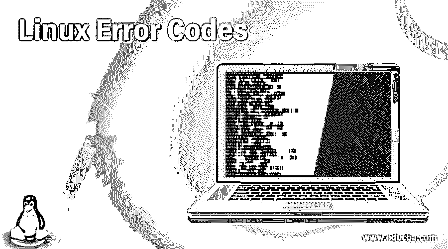

# Linux 错误代码

> 原文：<https://www.educba.com/linux-error-codes/>

## Linux 错误代码介绍

在 Linux 操作系统中，我们正在开发许多组件。工作时，我们会遇到很多错误。Linux 错误代码可以确认相同的错误。根据执行错误，有不同的错误代码。我们也可以在“echo”命令的帮助下捕获错误代码。

要修复 Linux 级作业/查询或应用程序级作业中的错误消息，我们必须了解错误的性质、错误描述和错误代码。因此，我们可以在 Linux 级别上修复应用程序或作业。

<small>网页开发、编程语言、软件测试&其他</small>

错误代码实用程序，即“errno”由 Lars Wirzenius 编写。

### 错误代码的语法

`errno [ OPTION ] [ STRING ] echo $?`

*   **errno:** 我们可以在语法或命令中使用“errno”关键字。它将两个参数作为访问选项和字符串。按照提供的参数，它将按照字符串或错误代码提供错误信息。
*   **选项:**我们可以提供不同的标志作为与“errno”命令兼容的选项。
*   **字符串:**我们可以根据“错误”定义提供短字符串。它将提供关于所提供的字符串的错误信息。
*   **echo $？:**echo 命令还会提供错误代码。我们需要使用“？”带有 echo 命令的符号。

### Linux 错误代码是如何工作的？

在 Linux 中，我们总共有 134 个错误代码。Linux 环境中的每一个错误消息或故障，都会有它们的错误代码。在错误代码的帮助下，我们可以获取错误描述并帮助修复问题或错误消息。如果我们将错误信息保持原样，那么它将对服务器级别产生重大影响。

当我们在 Linux 级别上执行任何命令或作业而没有任何错误时，它就会很好。但是，如果 Linux 命令不能正确执行，那么 Linux 编译器将向登录用户通知相关的错误消息。

以下是可用的错误代码信息列表，

| **服务请求编号** | **错误代码** | **错误号** | **错误描述** |
| One | 草莓！草莓 | One | 如果操作不被允许，它将打印错误消息。 |
| Two | ENOENT | Two | 如果没有这样的文件或目录存在，它将打印错误消息。 |
| Three | ESRCH | Three | 如果不存在这样的进程，它将打印错误消息。 |
| Four | EINTR | Four | 如果任何中断的系统调用，它将打印错误消息。 |
| Five | EIO | Five | 如果是任何输入/输出错误，它将打印错误消息。 |
| Six | 恩西欧 | Six | 如果没有这样的设备或地址，它将打印错误信息。 |
| Seven | E2BIG | Seven | 如果参数列表太长，它将打印错误消息。 |
| Eight | ENOEXEC | Eight | 如果有 exec 格式错误，它将打印错误消息。 |
| Nine | EBADF | Nine | 它将打印错误信息，因为它是一个错误的文件描述符。 |
| Ten | ECHILD | Ten | 如果没有子进程退出，它将打印错误消息。 |

### 实现 Linux 错误代码的示例

下面举几个例子

#### 示例# 1–打印列表

“errno”实用程序是在 Linux 环境中检查错误代码列表的一种非常简单和常见的方法。它将打印所有的错误代码列表，包括错误号和错误描述。

**命令:**

`errno -l`

**说明:**

按照上面的命令，我们可以打印 Linux 环境中所有可用的错误代码列表。它将打印错误代码的详细信息，如错误代码名称、错误代码编号和错误代码描述。

**输出:**

#### 示例 2–单个错误号的信息

默认情况下，我们会得到所有错误代码信息的列表。但是我们也可以获得单个错误号信息。

**Co**T2】mmand:

`errno 9`

**说明:**

在“errno”实用程序中，我们可以借助一个错误号来获得特定的信息错误信息。我们使用了错误号“9 ”,并且只得到“错误号 9”的信息。

**输出:**

#### 示例 3–单个错误名称的信息

在错误代码中，我们可以获得单个错误号信息。类似地，我们拥有打印单个错误名称信息的功能。

**命令:**

`errno EBADF`

**说明:**

根据上面的命令，我们可以借助错误名称获得具体的错误信息。我们使用了错误名称“EBADF”，并且只获得了“错误名称(EBADF)”的信息。

**输出:**

**示例# 4–来自输入字符串的错误代码信息**

在 Linux 环境中，我们拥有从输入字符串中获取错误代码和错误号信息的功能。我们需要在“errno”实用程序中使用“-s”选项。

注意:我们需要提供相关的输入字符串作为“errno”命令的输入。

**命令:**

`errno -s access`

**说明:**

当我们不知道确切的错误号或名称时，我们可以使用相关的字符串来识别错误代码及其描述。我们已经使用了“access”字符串并获得了 access 的相关信息。

**输出:**

#### 示例 5–使用“echo”命令获取错误代码信息

在 Linux 生态系统中，我们拥有通过“echo”命令检查快速错误代码信息的功能。如果它将返回“0”输出，那么该命令执行得很好。如果它将返回除“0”之外的输出值，那么在命令或作业中有一些问题。

**命令:**

`cat test_file.txt
echo $?`

**说明:**

在屏幕截图 1 (a)中，我们得到的 echo 命令输出为“0”。因此，这表示命令执行正确。在屏幕截图 1 (b)中，我们得到的 echo 命令输出为“1”。因为之前的命令没有成功执行。

**输出:**

截图 1 (a)

截图 1 (b)

### 结论

我们已经看到了“Linux 错误代码”的完整概念，以及正确的示例、解释和带有不同输出的命令。每个错误代码都有其唯一的错误名称和错误号。错误代码对于在命令或作业级别解决问题非常重要。

### 推荐文章

这是一个 Linux 错误代码指南。这里我们讨论 Linux 错误代码是如何工作的，以及命令和输出的例子。您也可以看看以下文章，了解更多信息–

1.  [Linux 挂载命令](https://www.educba.com/linux-mount-command/)
2.  [Linux Inode](https://www.educba.com/linux-inode/)
3.  [Linux tac](https://www.educba.com/linux-tac/)
4.  [Linux 自由命令](https://www.educba.com/linux-free-command/)

