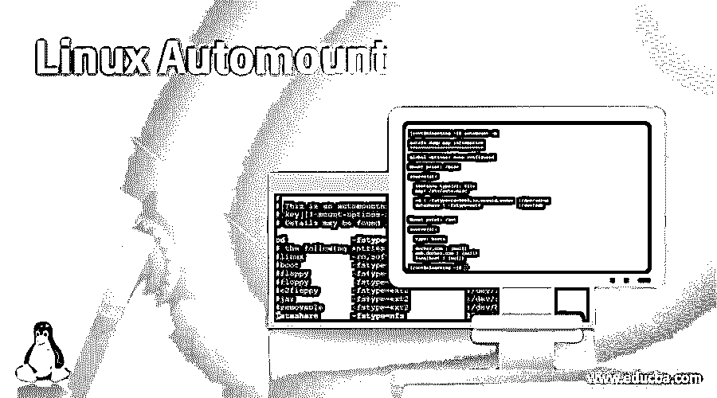
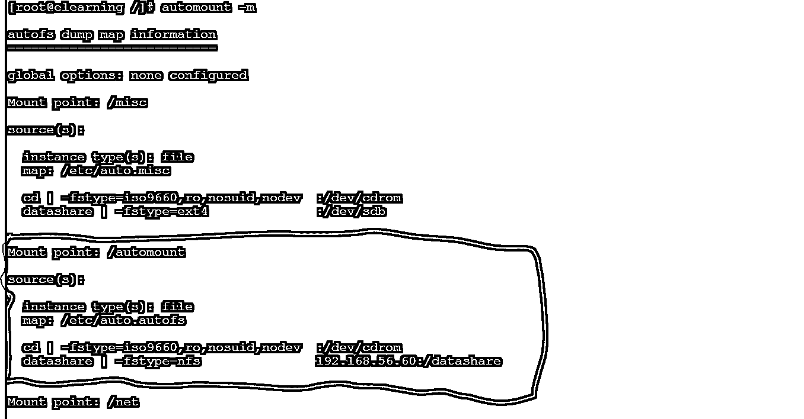

# Linux 自动挂载

> 原文：<https://www.educba.com/linux-automount/>

## Linux 自动挂载简介

在 Linux 操作系统中，自动挂载实用程序用于管理 autofs 的自动挂载点，即 Linux 自动挂载程序。Linux 的自动挂载功能是根据需要提供它们，以及自动卸载到环境中的文件系统。在此实用程序中，不需要进行手动安装。automount 实用程序的主要优点是用于远程应用程序或远程用户。它将自动从各自的存储器中访问或获取数据。自动装载的完整活动由“autofs”实用程序管理。

autofs 实用程序是由 Christoph Lameter 编写的(电子邮件:- chris@waterf.org)。将由 H. Peter Anvin(电邮:-hpa@transmeta.com)和 Ian Kent(电邮:- raven@themaw.net)进一步编辑。

<small>网页开发、编程语言、软件测试&其他</small>

### 文本编辑器的语法

`automount [options] [master_map_name]`

**主要文件**

`/etc/auto.master
/etc/auto.XXXX
systemctl start autofs`

**注意:**因此，autofs 实用程序没有主要命令。我们需要主要关注上面的主文件和自动挂载文件配置。

*   **automount:** 我们可以在语法或命令中使用“automount”关键字。它将采用不同的参数，如 options 和 master_map_name。根据所提供的参数，它将管理 Linux 环境中的 autofs 功能。
*   **/etc/auto.master:** 这是 autofs 实用程序的主文件。顾名思义，它将管理 Linux 操作系统上的全部自动挂载功能。在这个文件中，我们将为自动装载添加根目录信息。
*   **/etc/auto。XXXX:** 根据自动主文件配置，我们需要为自动装载活动创建支持的自动数据库/文件。根据需要，我们可以定义文件名。但要共享与主配置以及 etc 文件名相似的文件名。
*   **systemctl 启动 autofs:** 一旦所有的配置参数都配置好了，我们就需要启动 autofs 服务。根据需要，我们可以重启、停止或启动 autofs 服务。

### Linux 自动挂载是如何工作的？

在 Linux 环境中，我们可以在环境中挂载不同类型的文件系统，如 NFS、ext3、ext4、xfs 等。但是在添加或挂载文件系统时，我们需要运行手动命令来挂载 Linux 操作系统。这也类似于卸载过程。但是，如果我们需要自动挂载文件系统的功能，并且不需要手动添加命令，那么我们需要使用“autofs”实用程序。在该实用程序中，当有访问请求时，文件系统将自动装载。当没有待处理的访问请求或配置超时窗口时，它将自动卸载。

Linux fstab 的主要缺点是挂载点信息的数量。当我们向它添加挂载点信息的数量时。它将分配专用资源来处理它，而不管用户访问已装载文件系统的频率如何。如果不能正确处理，那么 Linux 系统会有开销。不必要的系统资源被消耗，系统性能将下降。

下面是我们可以在 automount 命令中使用的选项列表。

| 服务请求编号 | [计]选项 | 描述 |
| One | 救命啊 | 它将打印自动化选项并退出 |
| Two | –p–PID-文件 f | 它将写入进程 id |
| Three | -t–超时 n | 作为“n”的值，它将卸载文件系统。 |
| Four | -v–详细 | 它将打印处理信息 |
| Five | -d–调试 | 这将有助于记录调试信息 |
| Six | -D–定义 | 它将定义全局宏变量 |
| Seven | -O–全局选项 | 这将有助于指定全局挂载选项 |
| Eight | -l–set-log-priority 优先级路径[path，…] | 帮助设置守护程序日志的详细程度 |
| Nine | -C–不检查守护进程 | 如果守护程序已经处于运行状态，它将不会检查它 |
| Ten | -F–力 | 它将在开始时强制清除已知的自动装载 |
| Eleven | -V–版本 | 它将打印版本信息并退出 |

### 实现 Linux 自动挂载的示例

下面是下面提到的例子:

#### 示例# 1–自动装载列表

在 automount 命令中，我们能够找到 Linux 环境中自动挂载文件系统的列表。我们需要在 automount 命令中使用“-m”选项。

**命令:**

`automount -m`

**说明:**

按照上面的命令，我们能够在系统中找到自动挂载文件系统的列表。

**输出:**

#### 示例 2–安装软件包

在 Linux 中，autofs 包不可用。我们需要安装带有必要依赖项的 autofs 包。

**命令:**

`yum install autofs -y`

**说明:**

在上述 yum 命令的帮助下，我们正在系统中安装 autofs 包。

**输出:**

#### 示例 3–编辑主文件

在自动挂载中，我们需要配置自动主文件。同一文件有助于识别自动装载信息。

**命令:**

`vi /etc/auto.master
“/automount      /etc/auto.autofs        --timeout=40”`

**说明:**

我们编辑以添加主文件中的信息，即“/”路径上的/automount、mount 目录，“/etc/auto.autofs”挂载文件，以及“–time out = 40”，理想超时值。

**输出:**

#### 示例# 4–编辑装载文件

在 Linux 中，当使用自动挂载时，我们需要配置挂载文件信息。

**命令:**

`vim /etc/auto.autofs
datashare       -fstype=nfs             192.168.56.60:/datashare`

**说明:**

按照上面的命令，我们正在添加挂载信息，即“datashare”共享目录名，“-fstype=nfs”文件系统类型和“192.168.56.60:/datashare”共享位置路径。

**输出:**

#### 示例 5–启动 Autofs 服务

一旦全部配置完成。我们需要启动 autofs 服务，并检查文件系统在 automount 环境中是否可用。

**命令:**

`systemctl start autofs`

**说明:**

我们正在启动 autofs 服务并打印自动挂载文件系统的列表。

**输出:**

#### 示例 6–检查共享数据

在 Linux 自动挂载中，一旦文件系统自动挂载，我们就能够检查共享位置中的数据。

**命令:**

`cd /automount/datashare/; ls`

**说明:**

按照上面的命令，我们正在检查共享数据。

**输出:**

### 结论

我们已经看到了“Linux Automount”的完整概念，以及正确的示例、解释和带有不同输出的命令。根据需求，我们可以配置自动挂载文件系统。不需要自动装载和卸载。这将减少系统开销。

### 推荐文章

这是一个 Linux 自动挂载的指南。在这里，我们讨论 Linux Automount 是如何工作的，以及用命令和输出实现 Automount 的例子。您也可以看看以下文章，了解更多信息–

1.  [Linux 列表组](https://www.educba.com/linux-list-groups/)
2.  [Linux Zcat](https://www.educba.com/linux-zcat/)
3.  [Linux bg 命令](https://www.educba.com/linux-bg-command/)
4.  [Linux 读取](https://www.educba.com/linux-read/)

