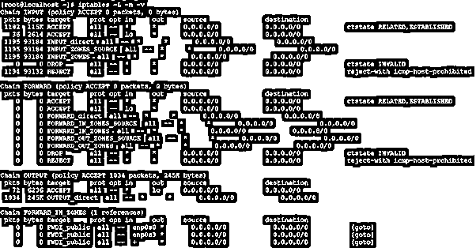

# Linux iptables

> 原文：<https://www.educba.com/linux-iptables/>

## Linux iptables 简介

在 Linux 操作系统中，iptables 是管理环境中防火墙规则的实用程序或工具。同样，我们在 Linux 上多了一个管理防火墙规则的工具，即 firewalld。iptables 用于管理设置和检查 Linux 内核中的 IP 包。这将有助于限制环境中不需要的数据包。它将保存称为系统链和用户定义链的内置链的数量。

Rusty Russell 最初在与 Michael Neuling 的早期磋商中编写了 iptables。iptables 的手册页最初是由 Herve Eychenne 编写的(电子邮件 ID: rv@wallfire.org)。

<small>网页开发、编程语言、软件测试&其他</small>

**Linux Iptables 的语法**

`iptables [-t table] {-A|-C|-D} chain rule-specification`

*   **iptables** :我们可以在语法或命令中使用“iptables”关键字。它将采用不同的参数，如表名、选项、系统或用户链、特定规则集等。按照提供的参数，它将管理设置并检查 IP 表。
*   **选项**:我们可以提供不同的标志作为与“iptables”命令兼容的选项。
*   **链**:根据条件或要求，我们可以使用系统链或自定义链。

### Linux Iptables 是如何工作的？

Linux 是一个支持多用户的操作系统。它将支持多个服务器或应用程序。在运行这些服务器或应用程序时，管理数据包的安全性是非常重要的。iptables 有能力管理它。它将在环境中创建一组规则，根据这些规则，流动的数据包将允许或限制。

以下是与 iptables 命令兼容的选项列表。

| **服务请求编号** | **选项** | **描述** |
| One | -A，–附加链规则-规范 | 这将有助于将一个或多个规则附加到所选或当前链的末尾。 |
| Two | -C，–检查链规则-规格 | 这将有助于检查规则是否与所选链中的规范相匹配。 |
| Three | -D, –delete chain rule-specification-D，–删除链规则数 | 这两个选项都将有助于从选定的或当前的链中删除一个或多个规则。 |
| Four | -I，–insert chain[rule num]规则规范 | 这将有助于在当前或选定的链中插入一个或多个规则(根据给定的规则编号)。 |
| Five | -R，–替换链 rulenum 规则-规范 | 这将有助于替换所选链中的规则。 |
| Six | -L，–list[chain] | 这将有助于列出所选链中的所有规则。如果没有选择链，那么它将列出所有的链。 |
| Seven | -S，–列表规则[链] | 这将有助于打印所选链中的所有规则。如果选择了“无链”,那么它将在保存 iptables 时打印所有链。 |
| Eight | -w，–等待[秒] | 这个选项有助于等待 xtables 锁。这将有助于防止作业或应用程序出现多个实例。默认情况下，如果无法获得锁，程序将自动退出。它将持有该程序，直到获得独占锁。 |
| Nine | -W，–等待间隔微秒 | 这将有助于等待每次迭代的间隔。运行敏感应用程序时，可能会观察到应用程序或作业级别的延迟。它将长时间等待 xtables 锁(这可能是不可接受的)。此选项仅适用于"-w。" |
| Ten | -n，–数字 | 这将有助于以数字格式给出输出。IP 地址和端口号将以数字格式打印。但是在默认情况下，程序会尝试根据网络名称、主机名或适用的服务来打印输出。 |
| Eleven | -x，–精确 | 这将有助于扩大人数。它还有助于显示字节计数器和数据包的正确值。此选项将有助于恢复-L 命令。 |
| Twelve | –行号 | 这将有助于获得规则在链中的位置信息。当列出规则时，在每个规则的开头添加行号 |
| Thirteen | –modprobe =命令 | 同时向链中添加或插入规则。它将有助于使用该命令加载任何必要的模块，如目标、匹配扩展等。 |

### 实现 Linux Iptables 的例子

以下是 Linux Iptables 的示例:

#### 示例 1–检查 IP 表规则

在 Linux 环境中，我们可以检查环境中可用的 iptables 规则列表。

**命令:**

`iptables -L -n -v`

**说明:**

按照上面的命令，我们列出了工作环境中可用的规则数量。

**输出:**

#### 示例 2–阻止 IP 地址

在 iptables 中，我们有在环境中阻止特定 IP 地址的功能。

**命令:**

`iptables -A INPUT -s 10.10.189.57 -j DROP`

**说明:**

根据上面的命令，我们封锁了 IP 地址 10.10.189.57。

**输出:**

#### 示例 3–解除对 IP 地址的封锁

在使用 Linux iptables 时，我们还可以解除对 IP 地址的封锁。

**命令:**

`iptables -D INPUT -s 10.10.189.57 -j DROP`

**说明:**

根据上面的命令，我们正在解除对 10.10.189.57 IP 地址的封锁。

**输出:**

#### 示例# 4–阻止传出端口

在 Linux 中，我们可以禁用输出端口流量。

**命令:**

`iptables -A OUTPUT -p tcp --dport 80 -j DROP`

**说明:**

我们正在阻止环境的传出流量，并阻止端口号 80。

**输出:**

#### 示例 5–阻止传入端口

在 iptables 中，我们有阻止传入端口流量的功能。

**命令:**

`iptables -A INPUT -p tcp --dport 80 -j ACCEPT`

**说明:**

我们正在阻止环境的传入流量，并阻止 80 号端口。

**输出:**

### 结论

我们已经看到了“Linux Iptables”的完整概念，以及正确的示例、解释和带有不同输出的命令。根据要求，我们可以创建或删除 iptables 或防火墙规则。我们也可以阻止或解除阻止 IP 地址或端口。

### 推荐文章

这是一个 Linux iptables 指南。在这里，我们讨论 Linux Iptables 的工作原理和例子，以及命令和输出。您也可以看看以下文章，了解更多信息–

1.  [Linux 大小](https://www.educba.com/linux-size/)
2.  [Linux 自动挂载](https://www.educba.com/linux-automount/)
3.  [Linux Kill 信号](https://www.educba.com/linux-kill-signals/)
4.  [Linux 列表组](https://www.educba.com/linux-list-groups/)

