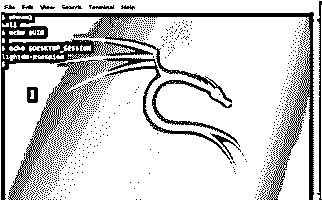
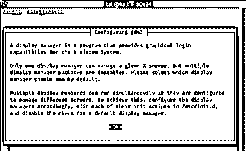
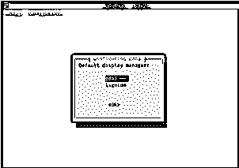
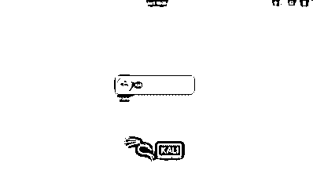

# Kali Linux GNOME

> 原文：<https://www.educba.com/kali-linux-gnome/>

## Kali Linux GNOME 的定义

Kali Linux gnome 被定义为一个免费的开源环境，它是为类似 Unix 的操作系统而构建的。类 Unix 操作系统是操作系统的那些版本，其行为方式与 Unix 相似，但不一定证明是 Unix 系统。最初，GNOME 这个词是一个缩写词，意为 **G** NU **N** 网络 **O** 对象 **M** 模型 **E** 环境，但是进步和改进不再描绘 GNOME 项目的愿景，因此，现在，这个缩写词被放弃了。这个项目最初是一个为软件开发和最终用户应用程序开发软件框架的国际项目。这个项目也是协调软件国际化和本地化以及可访问性的工具。

### Gnome 在 Kali Linux 中是如何工作的？

现在我们知道 GNOME 是一个开源环境，并且完全依赖于 GTK+ toolkit。它被看作是依赖于 QT 工具包的 K 桌面环境的替代品，自从它发布以来，它成为 Fedora 和 Ubuntu 的主要发行版最喜欢的默认桌面环境。GNOME 最吸引人的地方是它的简单性，最有效的指导原则是从 2.0 版本开始就严格遵循的人机界面指南。

<small>网页开发、编程语言、软件测试&其他</small>

现在了解了 GNOME 的工作原理，在顶部有一个面板，它由活动按钮、当前应用程序的名称、当前时间和表示状态的指示器组成。在面板中，选定的活动是启动和切换应用程序的主要界面。桌面的放置如下，Dock 在左边，打开的窗口在中间，工作区在右边。

活动按钮是 GNOME 桌面的核心。通过点击 activities 按钮或按下 Super 键或悬停光标，包含概览的窗口出现，并包含喜爱的应用程序、搜索工具虚拟桌面和 dash。最小化和运行中的应用程序也出现在活动概览中。在活动中，**破折号**是最关键的元素。它包含标记为收藏夹的应用程序。添加和删除已安装的应用程序。最后，出现了九个圆圈，显示了应用概述，用户可以根据需要使用**频繁**或**全部**按钮进行过滤。 **Activities** 中的 search 按钮使用户能够快速导航到所需的应用程序(如果知道名称的话)。该搜索将显示与搜索栏中的字符串匹配的所有匹配文件。当所需的文件可见时，用户可以点击它来打开它。

除了“活动”按钮，还有一个显示当前日期和时间的通知区域。当用户点击它时，GNOME 会打开一个交互式的日历，同时还有一个通知窗口。

使用另一个按钮，应用程序菜单出现，其中提到当前应用程序，其行为与 macOS 非常相似。打开的应用程序没有窗口控制按钮，如最大化，关闭，最小化，并根据需要获得这些功能和管理。

### 如何在 Kali Linux 中安装 Gnome？

现在我们已经理解了，让我们看看在 Kali Linux 中安装 gnome 的步骤。

1.  检查当前的配置，并检查该配置是否足以安装 GNOME。需要执行的命令:

`whoami
echo $UID
echo $DESKTOP_SESSION`

1.  记下用户名后(如果需要访问相关选项)，让我们执行下一步命令:

`sudo apt update && sudo apt install kali-desktop-gnome -y`

1.  在下一步中，将出现“配置 gdm3”弹出窗口，必须通过选择 **OK** 并按下**回车键给予同意。**

1.  继续之后，我们需要选择 **gdm3** 作为显示管理器。

1.  一旦执行了前面的命令，我们需要通过执行以下命令来重新启动系统:

`sudo reboot`

1.  重启后，gnome 桌面环境被激活。

1.  我们现在可以使用 Kali Linux 的用户名和密码登录环境。

### 特征

在写这篇文章的时候，最新的 GNOME 版本是 3.38，它包含了以下特性。在这里，我们列出了这个版本的 GNOME 3.38 中的一些最好的特性。

*   新的 Welcome Tour 应用程序:这个应用程序为那些不熟悉 GNOME shell 的人充当向导。这个应用指向了桌面 UI 的核心元素，比如活动按钮，为新老用户定位的消息托盘。
*   **改进的指纹支持:**这个应用程序支持使用指纹登录系统，但唯一的先决条件是，一个人应该有读取指纹的硬件，然后将其转发给 GNOME 应用程序并执行所需的操作！
*   **更好的应用网格:**随着 GNOME 的最新更新，常用应用选项卡被移除，并且提供了一个定制的网格，以便用户可以根据喜好重新安排和定制。
*   **系统菜单中的重启选项:**系统中有一个可视的重启选项，方便了用户。虽然它总是可以使用 GNOME shell，但是这个特性的增加确实节省了时间。
*   **显示电池百分比选项:**当电池以图片形式显示时，它始终是定性的，但将%作为一个特征会给桌面增添定量的感觉。
*   **新的家长控制:**在最新版本中，开发人员增加了添加家长控制的权限，以限制一些限制网络浏览器、特定应用程序、阻止新应用程序安装、设置应用程序的年龄分级的明确内容。
*   GNOME 地图:像谷歌地图等许多其他地图一样，GNOME 地图终于做出了响应，并且随着一些选项如“夜间模式”和卫星视图的出现，GNOME 地图成为了一种享受。

### 结论

在这篇文章中，我们试图带你一步一步地在 Kali Linux 中安装 GNOME，它的特性，以及 GNOME 环境的不同动态的工作。读者可以免费尝试安装它们，并了解最简单的环境！

### 推荐文章

这是一个 Kali Linux GNOME 的指南。这里我们讨论一下 Gnome 在 Kali Linux 中的定义和工作原理，以及如何在 Kali Linux 中安装 Gnome？.您也可以浏览我们的其他相关文章，了解更多信息——

1.  [Kali Linux 软件包](https://www.educba.com/kali-linux-packages/)
2.  [Kali Linux 库](https://www.educba.com/kali-linux-repository/)
3.  [安装 Kali Linux](https://www.educba.com/install-kali-linux/)
4.  [Kali Linux 命令](https://www.educba.com/kali-linux-commands/)

