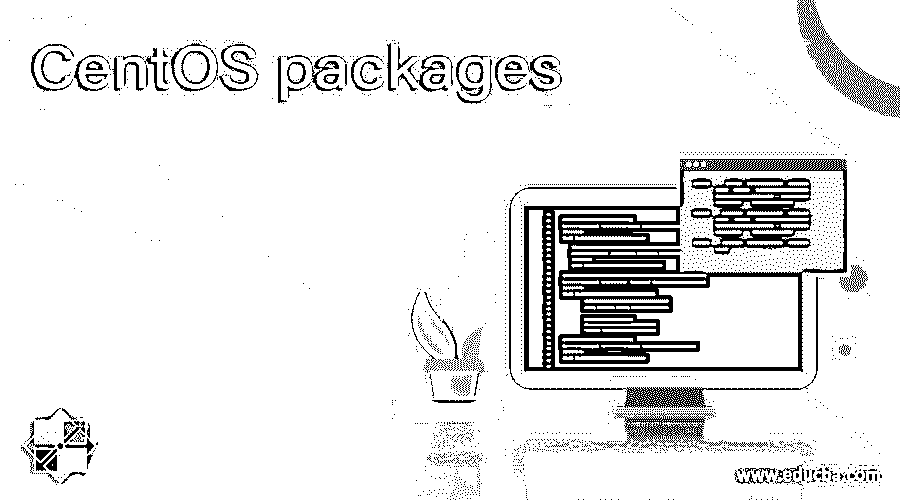
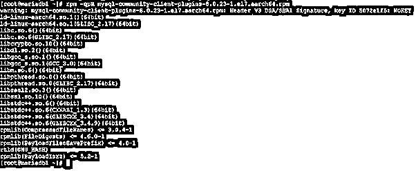
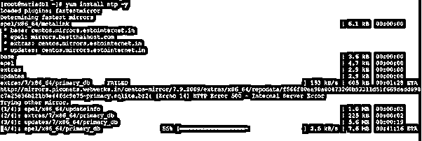
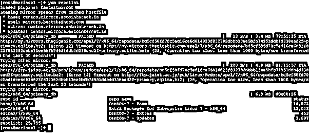

# CentOS 包

> 原文：<https://www.educba.com/centos-packages/>

## CentOS 软件包简介

Linux 操作系统，我们有各种版本，如 RHEL，Debian，Gentoo，Ubuntu，Linux Mint，Red Hat Enterprise Linux，CentOS，Fedora，Kali Linux 等。我们见过不同类型的包装。每个 Linux 发行版都有自己的能力、功能和工作经验。包装发挥着非常重要的作用。我们没有使用 CentOS 或 Linux 发行版的 UI 界面。一般我们都是用 CLI interphase。这里，我们需要了解包的类型以及如何使用它们，这一点很重要。在 CentOS 中，我们得到不同类型的包，如 rpm、tar 文件等。为了安装包，我们有两种方法，比如 rpm 和 yum。

**Useradd 命令的语法**

<small>网页开发、编程语言、软件测试&其他</small>

`rpm [ options ] [ Package Name ] yum [ options ] command [ Package Name ]`

*   rpm:我们可以在语法或命令中使用 rpm 关键字。它将接受不同选项之类的参数。我们在其中使用了不同的选项，如选择选项、查询选项、验证选项、安装选项等。rpm 命令将有助于在 CentOS 操作系统中安装软件包。
*   yum:我们可以在语法或命令中使用 yum 关键字。它将接受不同选项、命令、包名等参数。yum 命令将帮助安装具有完全依赖性的软件包。
*   选项:我们可以提供不同的标志作为与“rpm”和“yum”命令兼容的选项。
*   包名:根据需要，我们可以使用不同的 CentOS 包。

### CentOS packages Command 是如何工作的？

在 CentOS 环境中，我们可以用两种不同的方式处理包，比如 rpm 和 yum。

以下是与 rpm 软件包安装兼容的选项列表。

*   -?，–help:这将有助于打印比平时更长的使用信息。
*   –version:它将显示所用 rpm 包版本号的单行信息。
*   –quiet:它将显示尽可能短的信息。按照正常情况，它将只打印错误信息。
*   -v:这将有助于在 CentOS 系统中安装软件包时打印详细的消息信息。
*   -vv:在屏幕上打印大量难看的调试信息会有帮助。
*   –RC file file list:在 rpm 中，冒号分隔的文件列表将按 rpm 顺序读取。
*   –pipe CMD:它将把 rpm 的输出管道到命令行。
*   –dbpath 目录:这将有助于在目录级别使用数据库，而不是默认路径，即/var/lib/rpm 路径。
*   –根目录:它将使用文件系统作为目录级别的根目录。它将用于所有操作。
*   -D，–define = '宏 EXPR ':这将有助于在 CentOS 系统中定义值为 EXPR 的宏。
*   –undefine = ' MACRO ':这将有助于在 CentOS 系统中取消宏的定义。
*   -E，–eval = ' EXPR ':这将有助于打印 EXPR 中的宏展开。

以下是与 yum 软件包安装兼容的选项列表。

*   install:这将有助于在 yum 命令的帮助下安装软件包。
*   update-to:它会像 update 命令一样帮助更新包。但是在这个选项中会指定要更新的版本信息。
*   update-minimal:这将有助于像 update 命令一样更新包。但这并不完全像第一步、第二步、第三步那样。根据要求，我们可以安装软件包。
*   check-update:如果我们需要在不交互运行的情况下检查更新，那么我们可以使用这个选项。如果可以在系统中更新软件包，它将打印值 100。它将返回的值是“0 ”,那么我们可以认为它是没有可用的包来更新。
*   升级:此选项仅指向设置了–obsoletes 标志的更新包。有关更多详细信息，请参见更新。
*   upgrade-to:它将像 update 命令一样帮助升级软件包。但是这个选项可以指定要更新的版本信息。
*   info:这将有助于获得可用软件包的描述和摘要信息。
*   clean:这将有助于清理收集在 yum 缓存位置或目录中的东西。
*   makecache:用于使元数据可用，并下载当前启用的 yum repos。如果我们将使用该选项并将参数设置为“fast ”,那么我们需要确保回购当前处于状态。

**理解 CentOS packages 命令的示例**

下面举几个例子

#### 1.CentOS 软件包:安装 rpm 软件包

在 CentOS 环境中，我们能够安装 rpm 包。包扩展名是. rpm。

注意:rpm 包是一个独立的包，即它不包含任何依赖包信息或解析包依赖关系。

**命令:**

`rpm -ivh mysql-community-client-plugins-8.0.23-1.el7.aarch64.rpm`

**说明:**

根据下面的截图，rpm 包不能安装依赖包。

**输出:**

#### 2.CentOS 包:如何检查依赖包

在 rpm 命令中，我们可以看到依赖包。

**命令:**

`rpm -qpR mysql-community-client-plugins-8.0.23-1.el7.aarch64.rpm`

**说明:**

按照上面的命令，我们能够获得依赖包的列表，这对于安装 MySQL-community-client-plugins-8 . 0 . 23-1 . el7 . aarch 64 . rpm 包很重要。

**输出:**

#### 3.CentOS 软件包:用 yum 安装软件包

在 CentOS 环境中，我们能够从 yum 实用程序安装软件包。

**命令:**

`yum install ntp -y`

**说明:**

按照上面的命令，我们从 yum 实用程序安装 ntp 包。

**输出:**

#### 4.CentOS Packages:通过 yum 查看回购清单

在 yum 实用程序的帮助下，我们能够列出环境中可用的回购数量。

**命令:**

`yum repolist`

**说明:**

按照上面的命令，我们列出了环境中软件包的数量。

**输出:**

### 结论

我们已经看到了“CentOS packages”的完整概念，它有适当的示例、解释和带有不同输出的命令。在 CentOS 环境中，我们有两种方式来安装 rpm 和 yum 之类的包。rpm 实用程序不会解析依赖包。但是 yum 实用程序将解决包的依赖性。

### 推荐文章

这是 CentOS 软件包的指南。在这里，我们讨论了“CentOS 包”的完整概念，并给出了适当的示例、解释和带有不同输出的命令。您也可以看看以下文章，了解更多信息–

1.  [什么是 CentOS？](https://www.educba.com/what-is-centos/)
2.  [CentOS 命令](https://www.educba.com/centos-commands/)
3.  [如何安装 CentOS？](https://www.educba.com/install-centos/)
4.  [Linux 删除用户](https://www.educba.com/linux-delete-user/)

