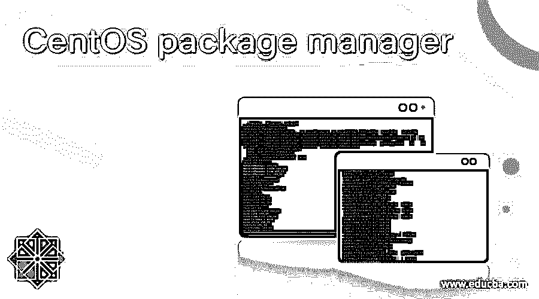
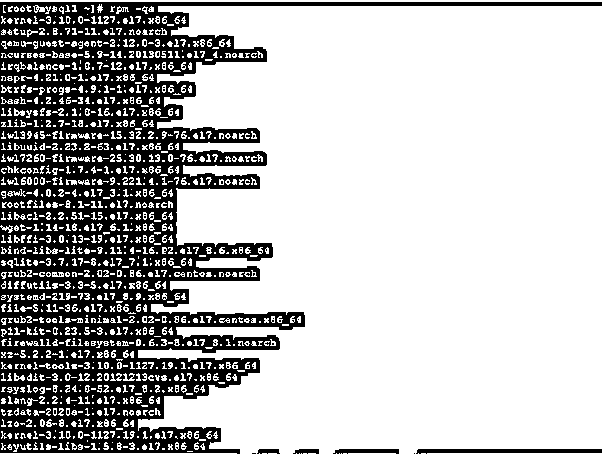
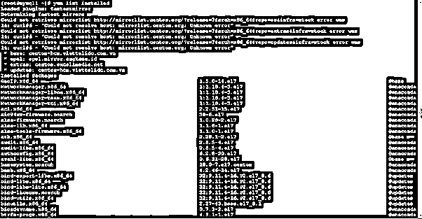
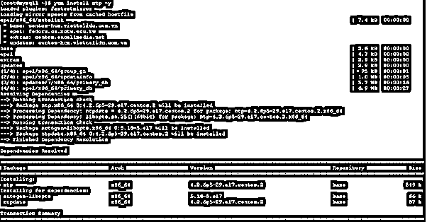

# CentOS 软件包管理器

> 原文：<https://www.educba.com/centos-package-manager/>

## CentOS 软件包管理器简介

众所周知，Linux 操作系统支持多道程序和多任务处理。因此我们需要多个软件来执行任务。要进行这样的软件或软件包安装，我们需要一个软件包管理器实用程序。它将管理软件包安装的完整工作流程。在 Linux 环境中，软件或工具通过包分发。相同的包与元数据信息链接。元数据信息包括对下载包、包描述、软件持久性等很重要的依赖关系列表。安装软件包时，它们将与存储库链接。存储库位置可以是本地的，也可以是集中的。在本主题中，我们将了解 CentOS 软件包管理器。

**CentOS 包管理器的语法**

<small>网页开发、编程语言、软件测试&其他</small>

`[ Package manager Name/Type ] [ Option ] [ Package / Software Name ]`

*   **包管理器名称/类型:**根据需要，我们可以在语法或命令中使用包管理器名称作为关键字。它将接受不同选项、包名等参数。它将自动解决依赖性，并在 CentOS 环境中安装必要的软件包
*   **选项:**我们可以提供不同的标志作为与包管理器命令兼容的选项。
*   **包/软件名:**根据需求或工作/应用需要，我们需要通过包或软件名来安装必要的包。**T3】**

### CentOS 软件包管理器命令是如何工作的？

在 Linux 工作环境中，我们有多种包管理器选项，如 Pacman、apt-get、YUM、rpm、DNF、apt、urpmi、zipper、yaourt、packer 等。按照包管理器的说法，我们也能够安装带有依赖项的包。每个包装经理都有自己的工作方法；如果我们需要与相应的包管理器一起工作，我们需要理解工作方法以及它的语法。我们可以从命令行界面和用户界面来运行软件包管理器。这取决于用户希望从哪个方面管理软件包。

在 CentOS 中，我们以两种不同的方式进行包管理，比如 rpm 和 yum。这两种方法之间的主要区别是包依赖性。rpm 方法无法解析包的依赖性。但是在 yum 包管理器中，它将解决包依赖性，即，当安装任何包并且需要相同的包时，需要安装任何不同的包，那么 yum 包管理器将处理该请求。

下面是与 rpm 软件包管理器兼容的选项列表

*   **-？，–help:**它将显示比普通消息更多的详细信息。
*   **–版本:**它将显示单行信息，显示所用 rpm 的版本号。
*   **–静音:**尽可能少的显示信息。按照默认的性质，它将只打印错误消息。
*   **-v:** 这将有助于打印详细信息。按照默认的性质，正常情况下，进度消息是例行的。
*   **-vv:** 屏幕上会显示很多难看的调试信息。

下面是与 yum 包管理器兼容的选项列表

*   **-h，–help:**会帮助打印消息，然后自动退出。
*   **-y，–假设 yes:** 这个选项可以假设为 yes。可以假定，任何问题的答案都是肯定的。它将自动接受来自用户界面的整个提示。
*   **–假设否:**该选项可以假设为否。可以假设任何问题的答案都是否。它不会自动接受 UI 的整个提示。
*   **-c，–config =[配置文件]:** 这将有助于指定配置文件的位置。它还将接受来自 FTP、本地机器 URL 和 HTTP 的输入。
*   **-q，–quiet:**该选项将在没有输出的情况下运行。
*   **-v，–verbose:**我们可以使用这个选项来运行带有大量调试输出的命令。

### CentOS 软件包管理器示例

理解 CentOS 软件包管理器命令的示例

1.CentOS 程序包管理器命令:获取 RPM 中的程序包列表

在 CentOS 环境中，找到系统中安装的软件包列表是一种非常简单的方法。

**命令:**

`rpm -qa`

**说明:**

按照下面的命令，我们能够获得系统中安装的软件包列表。这里，我们在 rpm 命令中使用“qa”选项。

**输出:**

2.CentOS 程序包管理器命令:获取 RPM 中最近安装包的详细信息

在 CentOS 环境中，我们能够获得最近安装的软件包的详细信息。

**命令:**

`rpm -qa --last`

**说明:**

按照上面的 rpm 命令，我们能够获得最近安装的软件包。我们在 rpm 包管理器中使用“-qa”选项。

**输出:**

3.CentOS 软件包管理器命令:获取 YUM 中的软件包列表

在 yum 命令中，我们能够获得机器中安装的包的数量。

**命令:**

`yum list installed`

**说明:**

按照上面的命令，我们能够列出 CentOS 系统中安装的包的数量。在 yum 命令中，我们使用“list”选项来获取已安装软件包的列表。

**输出:**

4.CentOS 软件包管理器命令:用 YUM 安装软件包

在 CentOS 环境中，我们能够在 CentOS 环境中安装软件包。我们可以在 yum 包管理器的帮助下完成这项工作。

**命令:**

`yum install ntp -y`

**说明:**

按照上面的命令，我们正在系统中安装“ntp”包。

**输出:**

### 结论

我们已经看到了“CentOS 包管理器”的完整概念，以及正确的示例、解释和带有不同输出的命令。对于需求，我们可以选择合适的包管理器。因此，它将负责包的正确分发，并解决包的依赖性。

### 推荐文章

这是 CentOS 软件包管理器的指南。在这里，我们讨论了“CentOS 包管理器”的完整概念和适当的例子。您也可以看看以下文章，了解更多信息–

1.  [什么是 CentOS？](https://www.educba.com/what-is-centos/)
2.  [CentOS 命令](https://www.educba.com/centos-commands/)
3.  [如何安装 CentOS？](https://www.educba.com/install-centos/)
4.  [PostgreSQL 命令](https://www.educba.com/postgresql-commands/)

