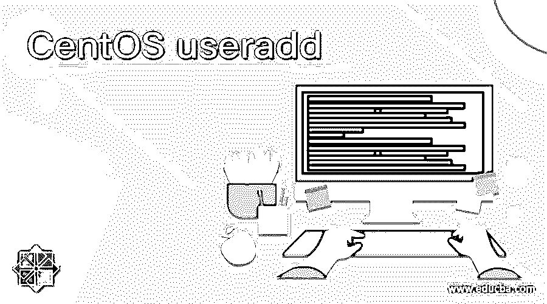
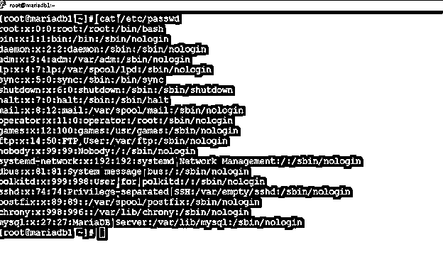
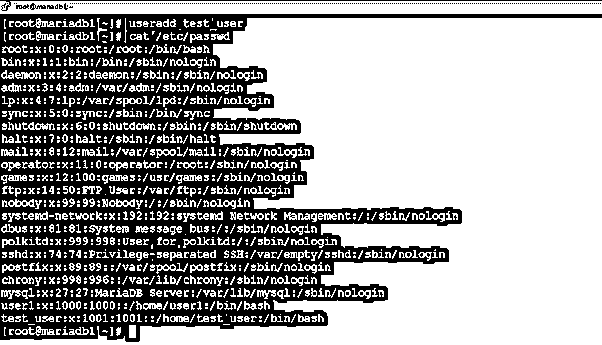

# CentOS useradd

> 原文：<https://www.educba.com/centos-useradd/>

## CentOS useradd 简介

CentOS 是一种 Linux 操作系统。众所周知，Linux / CentOS 是支持多用户的操作系统。换句话说，我们可以说它有能力管理多个用户。在 Linux 中，每个用户都有不同的权限和访问信息。useradd 命令用于在 CentOS 操作系统中创建用户。这也有助于更新默认的新用户信息。在 CentOS 中，我们需要管理多个用户，因此必须保持对用户级别的适当管理。

**Useradd 命令的语法**

<small>网页开发、编程语言、软件测试&其他</small>

`useradd [options] LOGIN User_Name
useradd –D User_Name
useradd -D [options] User_Name`

*   **useradd:** 我们可以在语法或者命令中使用 useradd 关键字。它将接受不同选项、用户名等参数。useradd 命令将有助于在 CentOS 生态系统中创建用户。
*   **选项:**我们可以提供不同的标志作为与“useradd”命令兼容的选项。
*   **用户名:**根据要求或行业术语，我们需要定义

### CentOS useradd 命令是如何工作的？

正如我们所讨论的，CentOS 支持多用户。因此，对用户进行适当的管理是非常重要的。useradd 命令有助于将新用户添加到 CentOS 生态系统中。一旦用户将创建，它将影响多个部分。受影响的部分将在主目录创建、shell 访问、框架信息、概要文件创建等方面。一旦用户将创建，我们不知道正确的密码。我们可以从根用户切换用户。但是，如果我们使用普通用户或系统，我们就无法处理数据。为此，我们需要设置新用户的密码，然后只有系统或普通用户才能访问它。

以下是与 useradd 命令兼容的选项列表。

*   **-b，–BASE-DIR BASE _ DIR:**在 CentOS 中创建新用户时，如果我们没有借助“-d”选项提供主目录。然后，基本目录(BASE_DIR)将能够与当前用户帐户连接，以定义主用户目录。

在 useradd 命令中，我们没有使用“-m”选项，那么 BASE_DIR 应该存在。

*   **-c，–COMMENT 注释:**一般情况下，该选项用于为当前用户保留一些注释或信息。它是文本格式的。通常，我们使用这个字段来表示用户的全名。
*   **-d，–HOME-DIR HOME _ DIR:**在 CentOS 中，任何用户登录时。它将第一次登录他的主目录。该选项将有助于为新用户设置主目录。默认情况下，用户对同一目录拥有完全访问权限。
*   **-e，–EXPIRE DATE EXPIRE _ DATE:**在 useradd 命令中，我们具有设置用户到期日期的功能。一旦到期日将到来，然后用户帐户将自动禁用它。有一个特定的格式来设置日期。格式将是年月日。
*   **-f，–INACTIVE INACTIVE:**在此选项的帮助下，一旦密码过期。用户帐户将被永久禁用的天数。如果该值为零“0 ”,则一旦用户密码过期，用户帐户将被禁用。如果我们将设置值“-1”，那么这个选项将被禁用。
*   **-g，–GID 组:**借助该选项，我们可以为用户设置组。创建新用户时，用户必须使用相同的用户名组。它是同一用户的主要组。
*   **-G，–groups group 1[，GROUP2，…[，GROUPN]]:**该选项将有助于为同一用户设置辅助组的数量。换句话说，我们可以说同一个用户将成为 CentOS 环境中补充组的一部分。
*   **-h，–help:**该选项将帮助打印帮助或与选项相关的信息以及命令。一旦信息在屏幕上共享，它将自动退出。
*   **-k，–skel SKEL _ 目录:**创建任何用户时。CentOS 操作系统将为用户创建骨架目录。它会将所有必需的文件放在用户主目录中。

**注意:**只有当选项“-m”指定时，该选项才有效。

### 理解 CentOS useradd 命令的示例

下面举几个例子

#### 1.Useradd 命令

在 useradd 命令中，这是在 CentOS 中添加用户的简单方法。

注意:如果我们只运行 useradd 命令而不使用任何选项，那么它将使用默认参数。

**命令:**

`useradd test_user`

**说明:**

按照上面的 useradd 命令，我们将在 CentOS 环境中添加 test_user。

**输出:**

截图 1 (a)

截图 1 (b)

**2。Useradd 命令:登录 Shell 选项**

在 useradd 命令中，我们可以为新用户设置 shell 选项。

**命令:**

`useradd -s /sbin/nologin user3
cat /etc/passwd | grep -i user3`

**说明:**

按照上面的命令，我们为 user3 用户设置了 nologin shell 选项。

**输出:**

#### 3.Useradd 命令:更改主目录

在 CentOS 环境中，我们可以为用户添加不同的主目录。

**命令:**

`useradd -d /user5_home_dir user5
ls /`

**说明:**

按照上面的命令，我们可以为 user5 用户设置自己的用户目录(/user5_home_dir)。

**输出:**

#### 4.Useradd 命令:具有特定的用户 id

在 useradd 命令中，我们可以设置自己的 userid。

**命令:**

`useradd -u 3000 user6
cat /etc/passwd | grep -i user6`

**说明:**

我们可以为 user6 用户设置 3000 用户 id。

**输出:**

### 结论

我们已经看到了“CentOS Useradd 命令”的完整概念，以及正确的示例、解释和具有不同输出的命令。useradd 命令对于创建用户非常有用。根据需要，我们可以使用 useradd 命令设置不同的选项。

### 推荐文章

这是 CentOS useradd 的指南。在这里，我们讨论 CentOS useradd 命令如何工作，并通过示例来理解 useradd 命令。您也可以看看以下文章，了解更多信息–

1.  [什么是 CentOS？](https://www.educba.com/what-is-centos/)
2.  [如何安装 CentOS？](https://www.educba.com/install-centos/)
3.  [CentOS 命令](https://www.educba.com/centos-commands/)
4.  [Linux 容器](https://www.educba.com/linux-container/)

