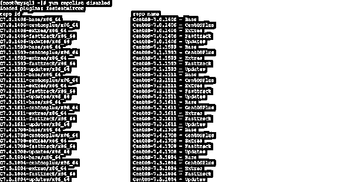
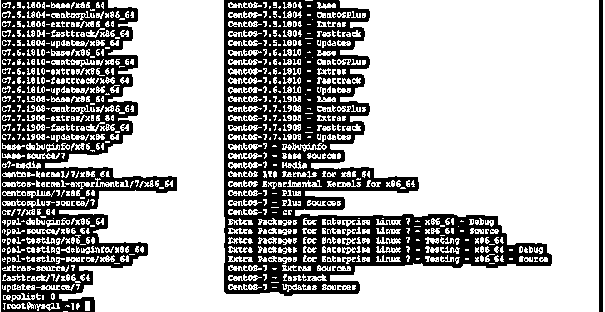
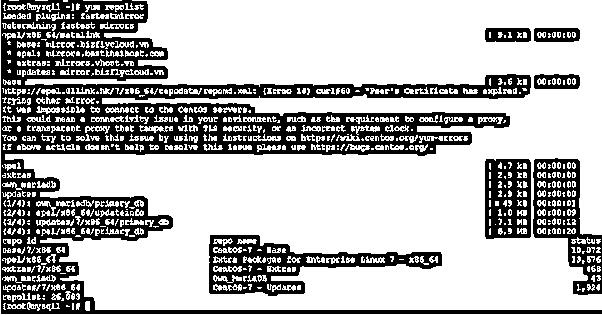
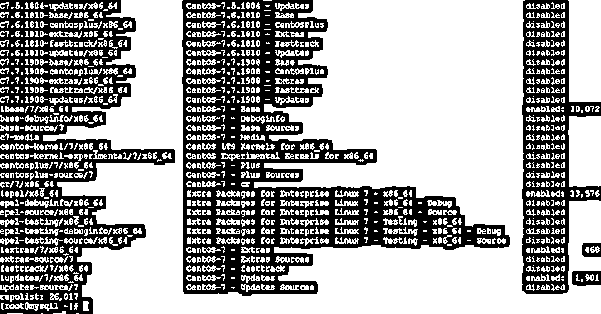

# Centos 存储库

> 原文：<https://www.educba.com/centos-repositories/>

## Centos 存储库简介

在 Linux 环境中，安装或配置存储库有多种原因，比如安装包、从任何其他位置获取数据等等。但是理想情况下，我们为软件包安装配置或安装存储库。有多种方法可以在 CentOS 操作系统中安装软件包。在 CentOS 生态系统中，我们通常遵循 yum 和 rpm 这两种方法。根据需求或用途，我们需要选择这些方法中的任何一种并安装软件包。但是在此之前，我们需要正确地配置存储库。在配置存储库时，我们需要遵循一些基本的协议或规则，然后只有我们能够在 CentOS 操作系统中使用存储库。

**语法:**

<small>网页开发、编程语言、软件测试&其他</small>

因此，存储库配置没有特定的语法。根据需求，我们可以为特定用途或包安装配置存储库。通常，我们在特定的路径下配置存储库，比如“/etc/yum.repos.d”。根据需求或应用程序用例，在配置 CentOS 存储库时，我们需要遵循一些规则。

示例方法如何配置或编辑存储库文件:VI/etc/yum . repos . d/CentOS-base . repo

vi/etc/yum . repos . d/CentOS-base . repo:按照上面的技术，我们可以使用任何编辑器如 VI、vim、nano 来编辑文件。这里，我们需要添加基本名称、存储库名称、baseurl、gpgcheck 状态等。

### Centos 存储库如何工作？

在 CentOS 环境中，我们可以使用系统回购或自己创建回购。在 repo 列表中，我们需要添加 repo 名称、baseurl、gpgcheck、enable 选项等。一旦我们创建了存储库，它将有助于从 baseurl 安装软件包。如果你想使用 reposync 命令，那么我们可以使用不同的选项。以下是与“重新同步”命令兼容的选项列表。

1.-g–当我们需要在 CentOS 环境中卸载或删除软件包时，可以使用此选项(当 GPG 检查失败时，我们正在使用此选项)

2.-l–这将有助于 yum 插件

3.-d–这将有助于移除或删除当前工作存储库中不再存在的本地包

4.-m–这将有助于下载 comps.xml 文件。它通常会根据功能捆绑软件包组

形容词（adjective 的缩写）–repo id–这里我们需要指定存储库 ID

b.–仅最新–这将有助于安装或下载最新的软件包版本。它还有助于管理存储库的大小

碳（carbon 的缩写）–下载-元数据–这将有助于下载非默认元数据

d.–下载路径–它将有助于指定您需要保存软件包的位置

### 理解 Centos 存储库的示例

**Centos 存储库:列出环境中的所有存储库**

我们能够列出 CentOS 环境中可用的存储库数量。

**命令:**

`yum repolist`

**说明:**

按照上面的命令，我们得到了 CentOS 环境中可用的存储库列表。在输出窗口中，我们将获得不同的信息，如回购 id、回购名称和状态。在某些情况下，我们得不到状态，即状态栏值为零。如果我们将得到状态列值为零，那么我们可以认为回购配置不正确，我们需要再检查一次。

**输出:**

**Centos 存储库:如何检查启用存储库**

在 CentOS 环境中，我们可以获得已启用存储库的状态。

**命令:**

`yum repolist enabled`

**说明:**

按照上面的命令，我们能够获得当前工作环境中的启用存储库的状态。

**输出:**

**Centos 存储库:如何检查禁用的存储库**

在 CentOS 环境中，我们可以获得被禁用的存储库的状态。这将有助于分析存储库，并能够对其采取必要的行动。

**命令:**

`yum repolist disable`

**说明:**

按照上面的命令，我们正在获取环境中当前被禁用的存储库的列表。根据要求，如果我们需要启用任何存储库，那么我们也可以启用它。

**注意:**下面的截图输出是 CentOS 的最小安装。

**输出:**

**截图 1 (a)**

**截图 1 (b)**

**Centos 存储库:配置新的存储库并将其列出**

根据需求，我们可以在 CentOS 环境中配置自己的存储库。

**命令:**

`vi /etc/yum.repos.d/own_mariadb.repo`

下面是“own_mariadb.repo”文件的内容

`[mariadb] name = MariaDB
baseurl = http://yum.mariadb.org/10.0/centos7-amd64
gpgkey=https://yum.mariadb.org/RPM-GPG-KEY-MariaDB
gpgcheck=1`

**说明:**

这里，我们正在配置自己的 MySQL repo。这将有助于从互联网上下载 MariaDB 软件包。在上面的文件“/etc/yum . repos . d/own _ mariadb . repo”中，我们添加了几行代码来安装来自互联网的 Maria db 包。

**输出:**

**截图 2 (a)**

**截图二(b)**

**Centos 库:启用和禁用所有库的状态**

在 CentOS 生态系统中，我们拥有启用和禁用存储库的功能。但是，如果我们需要在同一个窗口中检查所有存储库状态，我们也可以进行检查。

**命令:**

`yum repolist all`

**说明:**

按照上面的命令，我们能够在 CentOS 环境中列出整个存储库。在这里，很容易找到整个存储库的状态。在同一个工作窗口中，我们将获得状态信息，即禁用或启用状态。启用的存储库应该以绿色代码显示。禁用的存储库应该以红色代码显示。

**输出:**

**截图 3 (a)**

**截图 3 (b)**

### 结论

我们已经看到了“Centos 存储库”的完整概念，以及正确的示例、解释和带有不同输出的命令。默认情况下，我们将在 CentOS 环境中获得基本操作系统包存储库。根据需求，我们还可以配置自己的存储库。在 CentOS 环境中，我们可以获得存储库的状态。

### 推荐文章

这是 Centos 存储库指南。在这里，我们讨论定义、语法和参数，Centos 存储库如何工作，以及代码实现的例子。您也可以看看以下文章，了解更多信息–

1.  [CentOS 更改主机名](https://www.educba.com/centos-change-hostname/)
2.  [CentOS 添加 sudo 用户](https://www.educba.com/centos-add-sudo-user/)
3.  [CentOS 命令](https://www.educba.com/centos-commands/)
4.  [什么是 CentOS？](https://www.educba.com/what-is-centos/)

