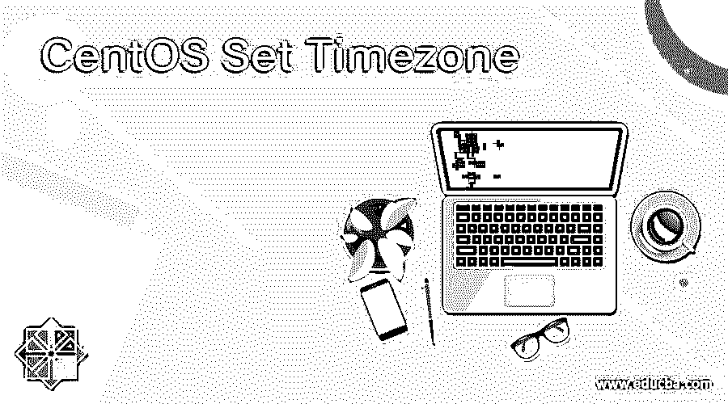
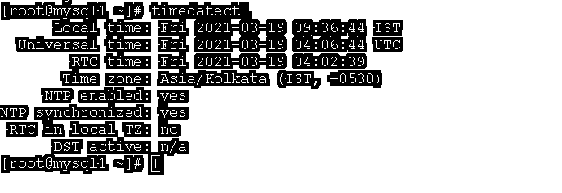
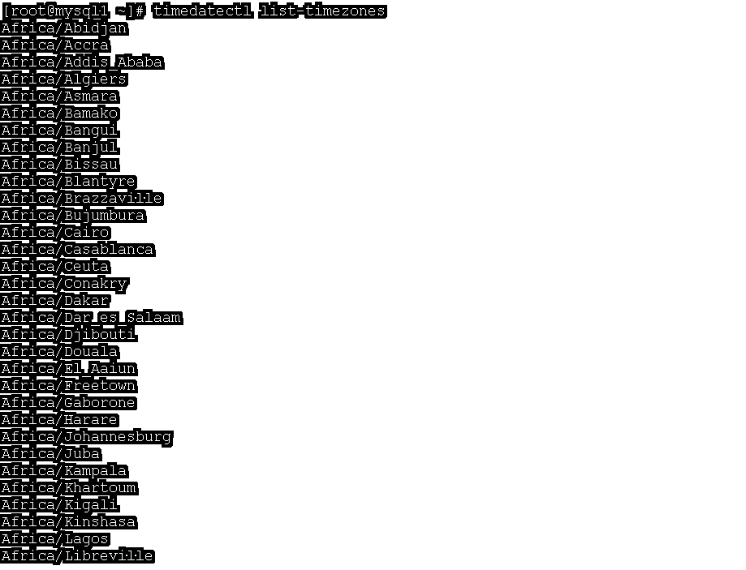
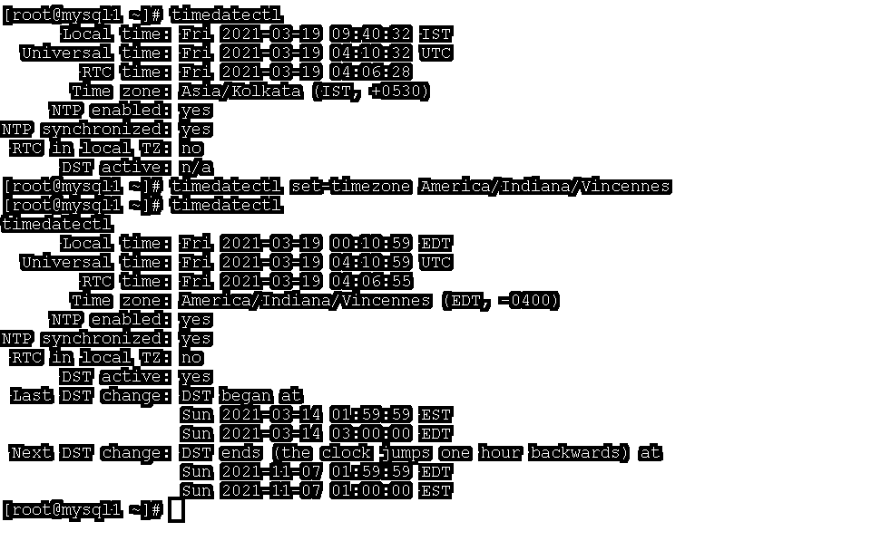

# CentOS 设置时区

> 原文：<https://www.educba.com/centos-set-timezone/>

## CentOS Set 时区简介

以下文章概述了 CentOS Set Timezone。时区对于画面中的同步非常重要。安装 CentOS 操作系统时，我们在其中配置时区。但是在某些情况下，如果我们需要更改时区配置，我们也可以这样做。在 CentOS 环境中，时区只不过是地球上的一个区域。它将遵循非正式的时间。这也将有助于维护宪法、国家和商业目的。时区中还有一个术语，即短时区。短时区将有助于表示该国的当地时间。根据需要，我们可以很容易地改变 CentOS 环境的时区。

**time date CTL 命令的语法**

<small>网页开发、编程语言、软件测试&其他</small>

`timedatectl [ OPTIONS ... ] [ COMMAND ]`

**1。time date CTL:**time date CTL 只是一个实用程序。这将有助于获得 CentOS 环境中时区的详细信息。我们可以在语法或命令中使用 timedatectl 关键字。它将接受不同选项、命令等参数。timedatectl 命令将有助于处理 CentOS 环境中的系统时区。

**2。选项:**我们可以提供不同的标志作为与 timedatectl 命令兼容的选项。

**3。命令:**根据需要，我们可以使用不同的命令或命令与 timedatectl 的组合。

### CentOS 设置时区命令是如何工作的？

正如我们已经讨论过的，时区对于应用程序、作业调度等非常重要。当 CentOS 系统处于集群模式时，它也将发挥重要作用。在一个集群中，有多台机器。所有的机器都是同步的。如果系统时区不同步，那么它也会影响身份验证机制(当机器具有 Kerberos 配置等时)。)

**注意:**一旦我们禁用了防火墙，防火墙将永久停止运行。一旦机器仍然重启，防火墙将仅处于停止状态。

以下是与 firewalld 选项兼容的选项列表。

*   **–无询问密码:**当用户触发查询时，它会要求验证。
*   **–调整系统时钟:**调用 set-local-rtc 时，如果我们正在通过“–调整系统时钟”。系统时钟将再次与 RTC 同步，然后将新设置应用到环境或帐户中。如果这种情况没有发生，RTC 将从系统时钟同步。
*   **-H，–主机:**有助于远程执行操作。该选项将使用 SSH 通信通道与远程管理器机器进行对话。容器名称将用 machinectl 枚举，即"-H，–host。"
*   **-M，–machine:**它将帮助在本地容器上执行操作。它还将指定要连接的容器名。
*   **-h，–帮助:**在屏幕上显示简短信息。输出将是文本格式。它会自动退出。
*   **–版本:**显示短版本信息。输出将是字符串格式。它会自动退出。
*   **–无分页:**这将有助于不将输出通过管道传输到分页。
*   **状态:**帮助显示系统时钟的当前设置。它还将打印 RTC 的信息。
*   **set-time [TIME]:** 这将有助于将系统时钟设置到指定的时间。它还会相应地更新 RTC 时间。它将指定时间格式，即“2012-10-30 18:17:16”。
*   **set-timezone [TIMEZONE]:** 这将有助于将系统时区设置为指定值。我们还可以列出可用的时区。如果我们已经根据本地时间配置了 RTC，它也将更新 RTC 时间。
*   **列表-时区:**这将有助于列出可用的时区。它将显示每行一个的输出。

### 理解 CentOS set timezone 命令的示例

下面举几个例子

#### 1.CentOS 设置时区:获取时区的状态

在 CentOS 环境中，我们能够获得当前时区的状态。在下面的命令中，我们使用 timedatectl 进行检查。我们也有不同的命令或实用程序来检查它。

**命令:**

`timedatectl`

**说明:**

按照下面的命令，我们能够获得 CentOS 环境的当前时区状态。当前时区是 IST 时间。

**输出:**

#### 2.CentOS 设置时区:列出时区

在 CentOS 环境中，我们能够列出所有可用的时区。

**命令:**

`timedatectl list-timezones`

**说明:**

按照上面的命令，我们能够列出可用的时区。根据要求，我们可以选择任何时区并使用它。

**输出:**

#### 3.CentOS 设置时区:如何设置时区

在 CentOS 环境中，我们还可以设置不同的时区。

**命令:**

`timedatectl list-timezones | grep -i America/Indiana/Vincennes
timedatectl set-timezone America/Indiana/Vincennes`

**说明:**

按照上面的命令，我们使用了两个命令。首先，它用于获取时区。因为我们的环境中有许多时区。因此我们直接抓住它。然后，我们将传递相同的时区作为 timedatectl 命令的输入。根据下面的截图，以前，我们得到的时间是 IST 小时。但是在把它改成“美洲/印第安纳/文森”时区后，我们可以得到美国东部时间的小时数。

**输出:**

### 结论

我们已经看到了“CentOS set timezone”的完整概念，以及正确的示例、解释和带有不同输出的命令。默认情况下，时区仅在安装时设置。但是，如果我们需要进一步更改它，我们也可以在 timedatectl 实用程序的帮助下进行更改。就 cronjob、同步过程、应用程序作业等而言，时区设置非常重要。

### 推荐文章

这是一个关于 CentOS 设置时区的指南。在这里，我们讨论了“CentOS Set Timezone”的完整概念，并给出了正确的示例、解释和带有不同输出的命令。

1.  [什么是 CentOS？](https://www.educba.com/what-is-centos/)
2.  [CentOS 命令](https://www.educba.com/centos-commands/)
3.  [如何安装 CentOS？](https://www.educba.com/install-centos/)
4.  [什么是防火墙？](https://www.educba.com/what-is-a-firewall/)

