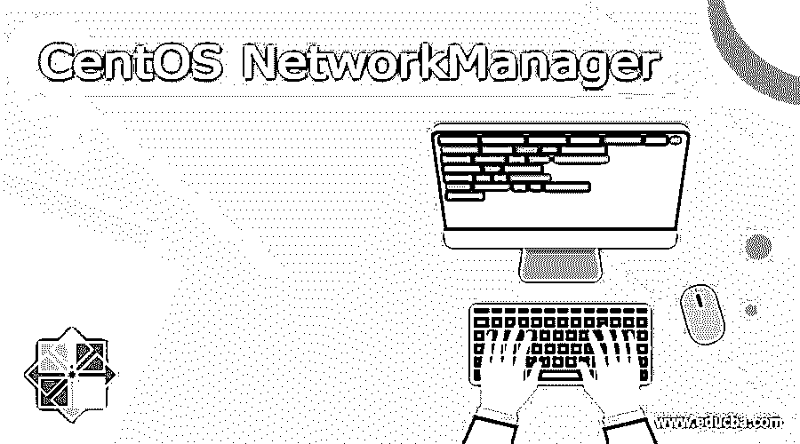
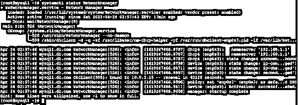

# CentOS NetworkManager

> 原文：<https://www.educba.com/centos-networkmanager/>

## CentOS NetworkManager 简介

在 Linux 环境中，我们使用多个用户支持操作系统。当我们与多个用户或组、多个应用程序或作业一起工作时，网络就成了问题。为了管理网络服务，我们有一个网络管理器。管理网络有不同的方法。网络管理器将在 CLI 或 UI 方面提供帮助。根据要求，我们可以选择可行的方案。在 CentOS 环境中，网络管理器将作为守护进程工作。网络管理器还将协助配置控制网络设备和动态改变网络。它还有助于管理网络连接状态。在本主题中，我们将了解 CentOS NetworkManager。

**Centos 网络管理器的语法**

<small>网页开发、编程语言、软件测试&其他</small>

`NetworkManager [ OPTIONS ... ]`

*   **NetworkManager** :我们可以在语法或命令中使用“NetworkManager”关键字。它将接受不同选项、子命令等参数。然后，根据所提供的输入，网络管理器将采取必要的行动，如保持网络运行或停止运行，启动或关闭网络接口卡，配置不同的网络设备等。因此，NetworkManager 命令将有助于在 CentOS 生态系统中动态管理网络。
*   **选项**:根据需要，我们可以提供不同的标志作为与“网络管理器”命令兼容的选项。

### Centos NetworkManager 如何工作？

在 CentOS 环境中，网络管理器负责管理完整的网络级活动。它将有助于管理多项任务，如网络设备的配置、连接的启动和关闭等。网络管理器将接受兼容的选项。根据选项，网络管理器将对其采取必要的行动。

下面是与 NetworkManager 命令兼容的选项列表。

1.  **–版本| -V:** 显示网络管理器软件版本信息。一旦打印出来，就会自动退出。
2.  **–help |-h:**将显示网络管理器的可用选项并自动退出。
3.  **–no-daemon |-n:**该选项不会将进程后台化。
4.  **–debug |-d:**此选项不会使进程后台化。相反，它将直接向控制终端更新日志信息。它还会添加系统日志。
5.  **–pid-file |-p:**它将有助于指定 PID 文件信息的位置。PID 文件用于存储正在运行的进程的 PID，并防止运行多个实例。
6.  **–state-file:**在网络管理器中持久化，指定存储状态的文件。如果没有指定，默认值将存储在/var/lib/network manager/network manager . state 路径中。
7.  **–config:**这将有助于指定配置文件；同一文件将有助于设置网络管理器的各种设置。如果我们没有设置该值，那么它会将该值存储在默认路径“/etc/network manager/network manager . conf”中。这也将有助于回落计划也。它位于同一目录中。如果我们需要网络管理器官方文档的更多信息
8.  **–配置并退出[initrd]:** 如果我们使用此选项，那么它将在所有设备达到稳定状态后退出。它将是 initrd 参数选项的可选项(当它将启用模式时)。如果网络管理器将停止，则没有进程将运行。(在真正的引导上，我们可以运行初始的 ramdisk)。
9.  **–插件:**列出插件的数量会有所帮助。它还将用于管理系统范围的连接设置。首选插件列表将在网络管理器配置文件中指定。它会出现在“查看主插件设置”中
10.  **–日志级别:**该选项将显示日志信息。这将有助于设置有多少网络管理器日志将发送到日志目的地。
11.  **–log-domains:**该选项有助于指定将哪些操作记录到日志目标进程中。默认情况下，大多数域都启用了日志记录。我们将在 NetworkManager 配置文件中获得登录详细信息。
12.  **–print-config:**这将有助于以标准输出的形式打印网络管理器配置信息。它将自动退出进程。
13.  **连接 _UUID:** 这将有助于获得连接配置文件的 UUID 信息。
14.  **CONNECTION_ID:** 这将有助于获取连接配置文件的名称(ID)信息。
15.  **CONNECTION_DBUS_PATH:** 这将有助于获取连接配置文件的网络管理器 D-Bus 路径。
16.  **连接文件名:**它将备份连接配置文件的文件名。
17.  **CONNECTION_EXTERNAL:** 该选项将产生一个数值，如 1 或 0。如果该值设置为“1”，则表明网络配置是在网络管理器之外创建的。

### 理解 Centos 网络管理器的例子。

下面提到了不同的例子:

#### 1.Centos 网络管理器:获取设备列表

在 CentOS 环境中，NetworkManager 将在 nmcli 或 nmtui 等不同命令的帮助下使用。

**命令:**

`nmcli device`

**说明:**

按照上面的命令，我们正在获取 CentOS 环境中可用设备的列表。

**输出:**

#### 2.Centos 网络管理器:获取活动设备

在 CentOS 环境中，我们只能获得活动设备的详细信息。

**命令:**

`nmcli connection show -a`

**说明:**

按照上面的命令，我们正在获取处于活动状态的设备列表。

**输出:**

#### 3.Centos 网络管理器:服务状态

我们有获取网络管理器状态的功能

**命令:**

`systemctl status NetworkManager`

**说明:**

按照上面的命令，我们使用 systemctl 实用程序来检查 NetworkManager 守护进程的状态。

**输出:**

### 结论

我们已经看到了“Centos 网络管理器”的完整概念，以及正确的示例、解释和带有不同输出的命令。NetworkManager 将帮助管理 CentOS 环境中的完整网络级活动。此外，它还有助于管理和配置不同的网络级设备。

### 推荐文章

这是 CentOS 网络管理器的指南。在这里，我们讨论了“Centos 网络管理器”的完整概念，并给出了正确的示例、解释和带有不同输出的命令。您也可以看看以下文章，了解更多信息–

1.  [CentOS useradd](https://www.educba.com/centos-useradd/)
2.  [CentOS 更改主机名](https://www.educba.com/centos-change-hostname/)
3.  [CentOS 命令](https://www.educba.com/centos-commands/)
4.  [如何安装 CentOS？](https://www.educba.com/install-centos/)

