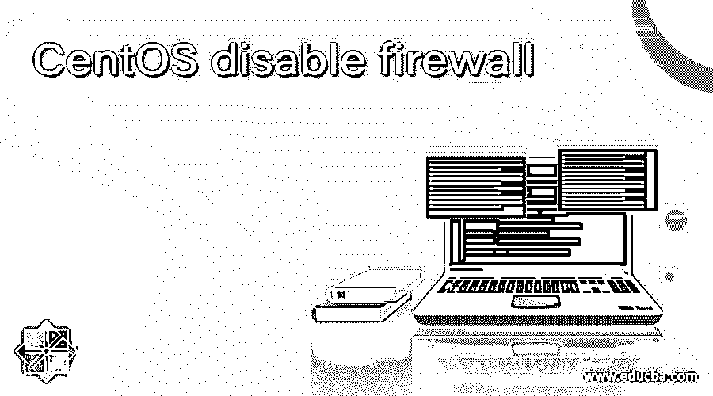

# CentOS 禁用防火墙

> 原文：<https://www.educba.com/centos-disable-firewall/>

## CentOS 简介禁用防火墙。

在 CentOS 中，我们能够管理多项任务或应用以及多用户管理。那么安全管理就变得非常重要。CentOS 防火墙有能力管理它。防火墙服务将为 CentOS 环境提供完整的安全解决方案。这将有助于管理网络接口卡(即 NIC)的信任级别。它还有助于动态管理网络连接。禁用防火墙选项不会导致任何网络或应用程序过滤。相反，它将打开所有端口上的所有通信。firewalld 服务的作者是 Thomas Woerner <twoerner>(代理开发者)、Jiri Popelka <jpopelka>(代理开发者)、Eric Garver <eric>(代理开发者)。在本主题中，我们将了解 CentOS 如何禁用防火墙。</eric></jpopelka></twoerner>

**注:**

<small>网页开发、编程语言、软件测试&其他</small>

1)禁用防火墙时，我们需要了解应用程序以及 CentOS 环境的安全风险。

2)强烈建议禁用防火墙选项。机器/ CentOS 环境应该在内部网络上。

**Useradd 命令的语法**

`systemctl [ Option ] firewalld`

**1) systemctl:** 我们可以在语法或者命令中使用 systemctl 关键字。它将接受不同选项之类的参数。我们在其中使用了不同的选项，如禁用、状态、重启、启动等。systemctl 命令将有助于在 CentOS 环境中禁用防火墙服务。

**2)选项:**我们可以提供不同的标志作为与 systemctl 命令兼容的选项。

3)firewalld:firewalld 是指防火墙服务的关键字。最后，我们使用“d”字母。这将有助于代表 CentOS 环境中的防火墙恶魔。

### CentOS 如何禁用防火墙命令？

在 CentOS 环境中，防火墙选项已经启用。这将有助于在一定程度上进行限制。在启用或禁用防火墙级别的通信时，我们需要对入站和出站连接进行更改。如果流量来自外部环境，我们需要更改入站规则。如果流量或数据包流形成了内部环境，我们需要更改入站规则。最后，根据用例或应用程序的允许，我们需要禁用防火墙。

注意:一旦我们禁用了防火墙，那么防火墙将永久停止。一旦机器仍然重启，防火墙将仅处于停止状态。

以下是与 firewalld 选项兼容的选项列表。

*   **-h，–help:**以文本格式打印一条简短信息或帮助会有帮助。一旦输出显示，它将自动存在。
*   **–default-config:**这将有助于进入防火墙默认配置路径。通常,–default-config 的默认路径是/usr/lib/firewalld。
*   **–调试[=级别]:** 这将有助于设置防火墙的调试级别。调试级别的范围是不同的。根据需求或应用程序用例，我们需要设置它。调试级别从 1 到 10。调试级别 1 是最低级别。调试级别 10 是最高级别。调试级别的输出将被写入防火墙。日志文件的路径是“/var/log/firewalld”。
*   **–debug-GC:**它将有助于显示垃圾收集器泄漏信息。如果有任何泄漏，收集器将每 10 秒运行一次。它还将打印关于泄漏的信息。
*   **–no fork:**这将有助于关闭守护进程分叉。它将强制防火墙作为前台进程运行，而不是守护进程。它将在后台运行。
*   **–no pid:**禁止在文件中写入 PID。默认情况下，程序会写一个 PID 文件。如果用这个选项调用程序，那么它不会检查现有的服务器进程。
*   **–系统配置:**这将有助于设置防火墙系统配置的路径。它通常指向/etc/firewalld。

### 理解 CentOS 禁用防火墙命令的示例

下面举几个例子

#### 1.CentOS 禁用防火墙:获取防火墙的状态

在 CentOS 环境中，我们能够获得防火墙的状态。在下面的命令中，我们使用防火墙命令实用程序进行检查。但是我们也可以用不同的工具来检查它。

**命令:**

`firewall-cmd --state`

**说明:**

按照下面的命令，我们能够列出环境中防火墙服务的当前状态。防火墙的当前状态是禁用或停止。因此，它显示“未运行”状态。

**输出:**

#### 2.CentOS 禁用防火墙:禁用防火墙

在 CentOS 环境中，我们可以禁用防火墙。我们可以在“systemctl”实用程序的帮助下做到这一点。

**Co**T2】mmand:

`systemctl disable firewalld`

**说明:**

按照上面的命令，我们正在从 CentOS 环境中禁用防火墙服务。我们可以在 systemctl 命令中使用 disable 选项。一旦禁用，它将自动从环境中删除该符号链接。

**输出:**

#### 3.CentOS 禁用防火墙:屏蔽防火墙服务

在 CentOS 环境中，我们能够屏蔽防火墙服务。这将有助于保护服务。如果任何服务想要启动防火墙服务，那么它不能启动它。

**命令:**

`systemctl mask --now firewalld`

**说明:**

按照上面的命令，我们使用 mask 关键字。这将有助于防止防火墙服务被任何其他依赖或需要的服务启动。

**输出:**

### 结论

我们已经看到了“CentOS 禁用防火墙”的完整概念，以及正确的示例、解释和带有不同输出的命令。默认情况下，防火墙服务在 CentOS 环境中处于启用状态。我们可以禁用防火墙服务，但是一旦它被禁用，CentOS 环境就没有任何限制了。如果防火墙服务被禁用，则在重新启动机器后，该服务仍然仅处于停止模式。

### 推荐文章

这是一个指南 CentOS 禁用防火墙。在这里，我们讨论了“CentOS 禁用防火墙”的完整概念，并给出了正确的示例、解释和带有不同输出的命令。

1.  [什么是 CentOS？](https://www.educba.com/what-is-centos/)
2.  [CentOS 命令](https://www.educba.com/centos-commands/)
3.  [如何安装 CentOS？](https://www.educba.com/install-centos/)
4.  [什么是防火墙？](https://www.educba.com/what-is-a-firewall/)

