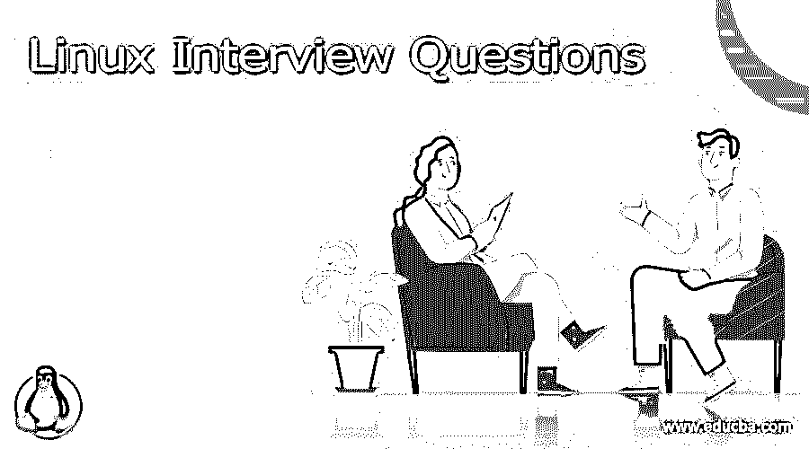

# Linux 面试问题

> 原文：<https://www.educba.com/linux-interview-questions/>

## Linux 面试问答介绍

So you have finally found your dream job in Linux but are wondering how to crack the Linux Interview and what could be the probable 2022 Linux Interview Questions. Every interview is different and the scope of a job is different too. Keeping this in mind we have designed the most common Linux Interview Questions and Answers to help you get success in your interview.

下面是 2022 Linux 面试问答列表，可以在面试的时候提问，以求新鲜和体验。

这些顶级面试问题分为两部分:

<small>网页开发、编程语言、软件测试&其他</small>

### 第 1 部分——Linux 面试问题(基础)

第一部分包括基本的面试问题和答案:

#### Q1。Linux 有哪些不同的层次？

**答案:**

下面是 Linux 的不同层次:

*   **硬件的**–最内层由物理设备组成，如 RAM、CPU 等。在某些操作系统中，可能有驱动程序软件与设备通信。
*   **内核–**内核是操作系统的心脏，它隐藏了底层硬件的复杂性，并为上层提供了高级抽象。有不同类型的内核[，比如微内核、单片内核](https://www.educba.com/monolithic-kernel-vs-microkernel/)等等。Linux 内核是一个整体类型。
*   Shell 是一个运行在内核之上的程序，它是用户和内核交互的主要方式。简单说就是一个可以运行其他程序的程序。现在 GUI 在很大程度上取代了 shell。Shell 接受命令并传递它们以供执行。
*   **实用程序(Utilities)**–这些运行在操作系统顶层的程序或软件帮助用户进行日常的常规活动，如安排 cron 作业或创建文本文档等特定任务。

#### Q2。简单解释一下三个流行的 Linux shells？

**答案:**

*   Bash Shell——许多 Linux/Unix 发行版中的默认 Shell。

它具有以下特点:

*   **Tcsh/Csh Shell(通常称为 C shell)–**Tcsh 是增强的 C Shell。
    1.  更像 C 语言的语法。
    2.  字和文件名的自动完成是可编程的。
    3.  拼写检查。
    4.  作业控制。

*   **K 壳**——它被称为 Korn Shell 或 Ksh。K shell 不仅仅是一个交互式 Shell，它还是一种完整、强大的高级编程语言。

它具有以下特点:

#### Q3。使用什么命令可以获得命令使用指南？

**答案:**

手册页存储了每个命令的解释。特定命令的手册页将有关于该命令的所有信息，它可以被称为“man <command></command>例如:“man ls”。手册页分为不同的用户命令、系统调用、库函数..等等..

手册页的一般布局是:

*   **名称:**命令或功能的名称及其简单说明。
*   **概要:**关于如何运行它的命令和它需要的参数。对于函数来说，是它所采用的参数列表以及包含其定义的头文件。
*   **描述:**我们正在搜索的命令或功能的详细描述。
*   **举例:**用法举例。最有用的部分
*   **参见:**本部分将列出相关命令或功能。

#### Q4。如何获取 Linux 中当前正在运行的进程和资源利用率的列表？

**答案:**

这是面试中问的基本 Linux 面试问题。

下面是 Linux 中的进程和资源利用情况如下:

*   *top* 是用于此的命令。这将给出运行在机器上的每个进程的所有信息，如:
    1.  进程 ID (PID)
    2.  流程的所有者(用户)
    3.  流程优先级
    4.  CPU 的百分比(%CPU)
    5.  内存百分比
    6.  花费在进程上的总 CPU 时间
    7.  用于启动进程的命令

*   top command 使用的流行选项。
    1.  top -u ->用户处理。
    2.  top–I->排除空闲任务。
    3.  top-p-->显示一个特定的进程。

#### Q5。Linux 中的管道操作符是什么？

**答案:**

Linux 中的管道操作符用于将一个程序或命令的输出重定向到另一个程序/命令，以便进一步处理。通常称为重定向。竖线，' | '(常见的 Unix 用语中的“管道”)用于此目的。例如，ls -l | grep key，会将 ls -l 命令的输出重定向到 grep key 命令。

### 第 2 部分–Linux 面试问题(高级)

现在让我们来看看高级面试问题:

#### Q6。解释 Linux 中的文件权限。怎么改？

**答案:**

为所有文件和目录建立了权限。权限指定谁可以访问文件或目录，以及访问类型。

所有文件和目录都归用户所有。

1.  权限在三个级别进行控制
    *   所有者(称为用户，或“u”)
    *   群组(' g ')
    *   其余用户(称为其他用户，或“o”)
2.  访问级别
    *   read–可以查看或复制鱼片
    *   写–文件可以被覆盖(例如，使用另存为)
    *   执行–可以执行文件

要更改权限–使用 chmod <permissions>< file(s)>。这里权限可以用不同的方法指定。参数*文件*是一个或多个文件(或目录)。指定权限的一种方法是将要应用的更改描述为 u、g、o 以及 r、w、x 的组合。</permissions>

#### Q7。Linux 环境中的过程是什么？

**答案:**

进程是一个正在运行的程序。可以从 GUI 或命令行启动进程。进程也可以启动其他进程。每当一个进程运行时，Linux 都通过一个进程 ID (PID)来跟踪它。启动后，第一个进程是一个名为 init 的初始化进程。它的 PID 为 1。从那时起，每个新进程都将获得下一个可用的 PID。

一个进程只能由另一个进程创建。我们将创建过程称为父过程，将创建的过程称为子过程。父进程产生一个或多个子进程。一个进程的产生可以通过几种方式中的一种来完成。每个都需要一个对 Linux 内核的系统调用(函数调用)。这些函数调用是 fork()、vfork()、clone()、wait()和 exec()。

#### Q8。什么是正则表达式(regex)？*、+、，是什么意思？在正则表达式中？

**答案:**

正则表达式(regex)是一个字符串，表示用于与其他字符串匹配的模式。模式要么匹配另一个字符串的某个部分，要么不匹配。正则表达式中使用了一系列预定义的元字符。

*   *用于匹配前面出现 0 次或更多次的字符。
*   +用于匹配前面出现 1 次或多次的字符。
*   ?用于匹配前面出现 0 次或 1 次的字符。

#### Q9。什么是 sed 命令？

**答案:**

这是在面试中被问到的流行的 Linux 面试问题。Sed 是一个流编辑器。流编辑器是一个获取文本流并对其进行修改的程序。使用 sed，您可以指定一个正则表达式来表示您想要替换的模式。sed 命令的一般形式是 sed 的/pattern/replacement/'文件名。

#### Q10。硬链接和软链接有什么区别？

**答案:**

软链接(符号链接)通过名称指向另一个文件。因为它只包含一个名称，所以该名称实际上不必存在或存在于不同的文件系统中。如果您替换文件或更改文件内容而不更改名称，则链接仍包含相同的名称并指向该文件。硬链接通过索引节点号指向文件。一个文件应该实际存在于同一个文件系统中。只有当删除了指向其信息节点的最后一个链接时，才会从磁盘中删除文件。

### 推荐文章

这是一个 Linux 面试问题和答案的指南，以便候选人可以轻松地解决这些面试问题。您也可以阅读以下文章，了解更多信息——

1.  [冬眠面试问题](https://www.educba.com/hibernate-interview-questions/)
2.  [如何在面试中脱颖而出](https://www.educba.com/how-to-ace-screening-interviews/)
3.  [Shell 脚本面试问题](https://www.educba.com/shell-scripting-interview-questions/)
4.  [Datastage 面试问题](https://www.educba.com/datastage-interview-questions/)

