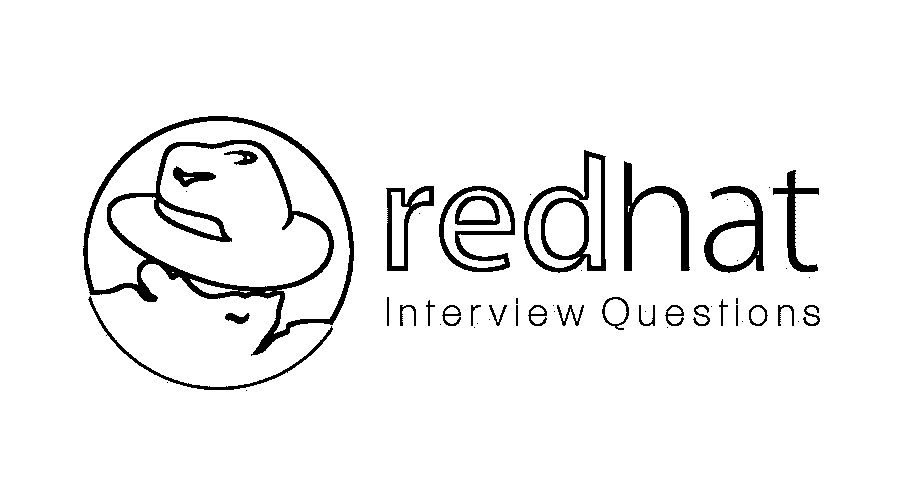

# 红帽面试问题

> 原文：<https://www.educba.com/red-hat-interview-questions/>

## 红帽面试问答介绍

[Red Hat 是一家为企业社区提供开源解决方案或产品的](https://www.educba.com/what-is-redhat/)公司。Red Hat 提供可靠性、高性能云、存储、移动、Linux、[、虚拟化、](https://www.educba.com/virtualization-interview-questions/)支持、培训和咨询服务。它服务于全球范围。红帽的创始人是鲍勃·扬和马克·尤因。它成立于 1993 年。红帽公司的总部在美国北卡罗来纳州的罗利。红帽公司的首席执行官是吉姆·怀特赫斯特，董事长是那仁·古普塔。

**以下是一些重要的红帽面试问答:**

<small>网页开发、编程语言、软件测试&其他</small>

你终于在 Red Hat 找到了你的梦想工作，但是你想知道如何通过 Red Hat 面试，以及 Red Hat 面试中可能出现的问题。每次面试都不一样，工作范围也不一样。牢记这一点，我们设计了最常见的红帽面试问题和答案，以帮助您在面试中取得成功。这些问题分为以下两部分:

### 第 1 部分 Red Hat 面试问题(基本)

这第一部分包括基本的红帽面试问题和答案

#### Q1。解释一下 Puppet Server 的功能？

**回答:**
它是一个在 Unix 类操作系统中配置管理 toll 的企业应用。它是一个开源的自动化软件，用于在代码的帮助下将配置推送给傀儡代理。借助 puppet 代码，安装新软件、[验证文件权限](https://www.educba.com/linux-file-permissions/)、更新用户帐户和其他任务都可以轻松完成。

#### Q2。解释存储集群？

**答案:**
这是面试中常见的红帽面试问题。[集群被](https://www.educba.com/what-is-cluster-computing/)定义为两台或多台计算机结合在一起工作或执行任务。存储、高可用性、负载平衡、高性能是可用集群的不同类型。存储集群用于提供集群中所有提及的服务器中文件系统的一致视图。它帮助服务器同时读写单个共享文件系统。它还通过将应用程序的安装和修补限制在单个文件系统来简化存储管理。

#### Q3。解释 ulimit 和 umask 的区别？

**答:**
ulimit 指的是 Linux 的内置命令，它为 shell 或已启动的进程提供对可用资源的控制。用户可以通过编辑 limits.conf 文件来限制特定范围，并且可以在 sysctl.conf 文件中更新系统设置。Umask 指用户文件创建掩码。创建文件或目录后，umask 会确定文件对文件和目录的权限。

让我们转到下一个红帽面试问题。

#### Q4。解释一下 SELinux？

**答案:**
SELinux 被称为安全增强型 Linux。它有助于保护服务器免受错误配置和受损守护进程的影响。它被用作 [Linux 内核](https://www.educba.com/linux-interview-questions/)的安全特性和访问控制实现。它用于设置限制并指示服务器程序访问特定的或被授予权限的文件，安全策略定义可以采取的所需操作。

#### Q5。解释一下红帽集群中的 cman 和 rgmanager？

**回答:**
cman 简称[集群经理](https://www.educba.com/hadoop-cluster-interview-questions/)。它是一个分布式集群管理器，运行在每个集群节点中。它通过监视群集节点来帮助跟踪群集仲裁，因为 cman 负责监视、表决、仲裁、心跳和每个群集节点之间的通信。
rgmanager 简称资源组管理器。它管理称为服务、资源树和资源组的集群资源集合。它将帮助 red hat 管理员配置、定义和监控集群服务。如果发生任何节点故障，这将尝试将相同的集群服务再次定位到另一个节点，以最小的服务中断。

### 第 2 部分 Red Hat 面试问题(高级)

现在让我们来看看高级红帽面试问题。

#### Q6。你对 DAS 了解多少？

**答:**
它是来自磁盘的块设备，物理上附属于主机。它应该有文件系统才能被使用。只有限定数量的服务器可以访问该设备。该存储设备需要靠近服务器存储和专用资源。有时不可能将硬盘专用于多台计算机。DAS 解决方案易于配置，且成本较低。它包括 IDE、SCSI 和 SATA 技术。

#### Q7。解释负载平衡集群？

**答:**
顾名思义，负载均衡集群用于在负载集群将网络服务请求调度到多个集群节点时，在集群节点之间均衡请求负载。负载平衡群集提供了经济高效的可扩展性，因为可以根据负载要求匹配多个节点。在负载平衡集群中，任何节点工作不正常，它将检查故障并将请求分配给其他可用的集群节点。在负载平衡群集中，节点故障在群集外部对客户端是不可见的。负载平衡附加组件有助于进行负载平衡。

让我们转到下一个红帽面试问题。

#### Q8。解释一下索引节点及其在 red hat Linux 中的功能？

**答案:**
对于 Unix 类操作系统，Inode 被定义为文件系统的数据结构。它有助于存储关于文件的所有信息，但在 Linux 和其他 Unix 操作系统上不使用它的实际名称和数据。创建文件时，会分配在文件系统中唯一的索引节点号，并为文件提供名称。名称和索引节点号存储在目录中，作为包含这些文件的用户的条目。它主要帮助用户恢复损坏的文件系统。如果丢失了任何 inode，它将出现在 lost + found 目录中。这是面试中最常被问到的红帽面试问题。

#### Q9。解释 NAS 和 SAN？

**答:**
[NAS 是一种](https://www.educba.com/what-is-a-nas-drive/)设备，主要在显示器或键盘等简化的硬件上运行嵌入式操作系统。它用于鉴定客户端，并向需要专用 IP 才能访问的网络中的其他电脑或用户提供共享。在软件程序的帮助下，可以设置自动或手动备份，甚至可以用来在 NAS 和所有其他连接的设备之间复制文件。它允许用户权限、文件夹权限、对文档的受限访问等。
SAN 是块级存储解决方案。它主要针对大量块级数据传输进行了优化。就容量和性能而言，它是高度可扩展的。它提供了存储和同时访问文件的解决方案，如流式音频、视频、云计算等。它是一种连接远程存储的体系结构，看起来像是本地连接的。

#### Q10。suid 和 sgid 术语是什么？

**答:**
当用户执行文件时，suid 提供与文件所有者相同的权限。
Sgid 在执行时继承文件的组权限。当在目录中创建文件时，它继承目录的组所有权。

### 推荐文章

这是红帽面试问题和答案列表的指南。这里我们讨论了面试中最常被问到的 10 个红帽面试问题及其详细答案。您也可以阅读以下文章，了解更多信息——

1.  [操作系统面试问题——最常被问到的问题](https://www.educba.com/os-interview-questions/)
2.  [OOP 面试问题](https://www.educba.com/oop-interview-questions/)
3.  [PHP OOP 面试问题](https://www.educba.com/php-oop-interview-questions/)

