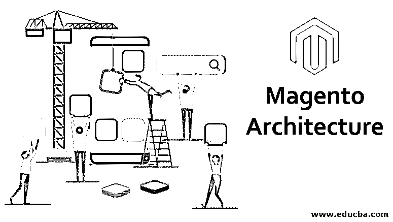
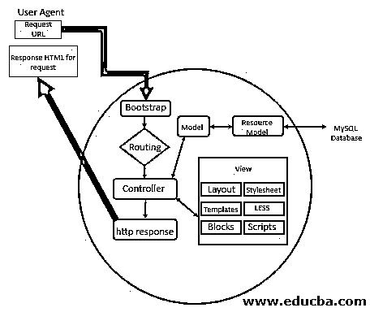

# Magento 建筑

> 原文：<https://www.educba.com/magento-architecture/>

## Magento 建筑介绍

下面的文章提供了 Magento 架构的概要。即使你不太了解 Zend 框架，你也可以学习它，因为它完全是 MVC 模式，并且充分利用了面向对象的方法。Magento 使用 PHP 面向对象的方法。在这里，我们将看到一些重要的东西，如模块化、安全性、MVS、Magento 的可扩展性等。

### Magento 建筑

我们可以将 Magento 架构分为两部分，一部分是 Magento 内部架构，另一部分是 Magento ERP 或 UI 架构。

<small>网页开发、编程语言、软件测试&其他</small>

Magento 从请求到响应的内部架构的一般架构如下所示。

*   Magento 内部建筑
*   Magento ERP 架构

#### 1.Magento 内部建筑

下面给出的是 Magento 的内部架构:

**a .用户代理:**用户代理是向 Magento 发出任何请求的软件，该软件能够读取 Magento 的响应。响应可以是 HTML 格式。一些用户代理的例子就像 web 浏览器(chrome、opera 等)。用户代理部分是应用程序的前端部分，它可以是对客户可见的 web 应用程序。

**b. Bootstrap:** Bootstrap 为 Magento app 创建运行它的环境。首先，它会检查和设置一些事情，如 PHP 版本，错误报告的设置，定义基本路径，初始化和调用自动加载程序。

以下是 bootstrap 执行的一些任务:

*   检查 PHP 的版本(如果版本低于 5.5 则显示错误)、默认错误的设置、定义路径(如根目录)、运行 autoloader 和时区设置等。
*   对象管理器初始化，从/app/etc/config.php 获取主配置
*   通过获取控制器实例和调用路由调度函数来启动应用程序。

**c .路由:**在 Magento 路由中起着重要的作用，它有决定哪个控制器将被调度的算法。

在派送之前，它将经过几个步骤，例如:

获取活动路由器 **— >** 搜索请求的控制器和动作— >在找到确切的请求控制器和动作之后，将调用解释器类文件— >解释器类的新调度函数。

**d .控制器:**在路由能够决定需要调用哪个控制器功能之后，控制器特定动作将被调用。这个被调用的函数可以调用任何特定数据的模型，因为模型包含业务逻辑。一旦控制器函数从模型中获取数据，它就可以将数据与具有特定设计的 HTML 视图绑定，或者可以根据需要简单地返回。

**e .模型:**模型是我们可以书写自己业务逻辑的地方。这里只计算业务逻辑，如获取订单详细信息和计算总金额和任何折扣。

Mysql: 这是我们存储所有重要数据的区域。这些数据是用户的详细资料，用户订单详细说明了许多重要的项目。

**g. View:** 这个部分包含了所有的 [HTML 和 CSS 样式](https://www.educba.com/html-vs-css/)。它还减少了 magento2 的添加量。它从控制器获取数据，并用 html 和 CSS 绑定这些数据。将数据与 HTML 和 CSS 绑定后，它将被返回给调用它的相应控制器动作。

**h. HTTP 响应:**该部分包含对所请求的用户代理的最终响应。

**一、安全工作:** Magento 为资源提供更好的安全性，防止不需要的用户和调用。

它们如下所示:

*   用户密码在传输时被加密，这意味着不允许传输未加密的密码。
*   加盐哈希被用来存储用户密码，这使得任何人都难以解密。
*   对于客户的任何类型的审计和审查，活动的日志文件是可用的管理员或任何授权用户可以看到任何最终客户执行的所有活动和工作。
*   日志存储得非常安全。

**j. Magento API:** Magento 2 自带 SOAP 和 REST API。从 Magento 2 开始，它不再支持 XML-RPC 概念。当一个 HTTP 请求来自任何 URL 时，首先它将到达路由系统，在那里它将决定控制器和控制器的动作以进行调度。它将使用 Mage_Api 模块。

#### 2.Magento ERP 架构

Magento ERP 部分是我们可以控制对客户可见的前端完整流程的部分。

在 Magento 系统中，任何 ERP 系统都有几个重要的部分，如下所示。

**a .销售:**在销售中，我们可以管理所有的订单。在这里，管理订单意味着我们可以看到谁下了订单，谁已经付款，谁的付款仍在等待。它还允许我们下载订单报告用于分析目的。

**b .目录:**本节包含产品的管理。它允许我们添加新产品。在这一部分，我们还可以添加类别。我们可以将任何类别的任何产品联系起来。我们可以禁用任何产品，也可以为产品添加图像。本节授权 Magento 管理员控制终端客户产品的布局和可见性。管理员也可以看到产品的评论和评级。

c .客户:你必须已经注册了许多电子商务应用程序，如亚马逊和 Flipkart 等。所有这些平台都会捕捉你的详细信息，并将其存储到终端。在 Magento 客户部分也以同样的方式存储客户详细信息。这些详细信息可能是客户姓名、电话号码、电子邮件等。在这里，我们可以禁用、启用或向任何特定客户发送任何特定通知。

**d.Promotions:** 在此部分，Magento 管理员可以为所有最终客户和用户设置一些网站通知。这些通知可以是即将到来的折扣、即将到来的产品和事件。

e. CMS: 它允许 Magento admin 管理所有网站的静态块。它可以像页脚和页眉布局等。

**f .报表:**您可以按所有客户生成月度周订单的报表。您可以为任何特定的客户生成订单报告等。

g. System: 它允许 Magento 管理员定义一些系统级的配置。该配置可以是关于启用或禁用任何特定属性的任何服务等。

### 推荐文章

这是 Magento 建筑的指南。这里我们讨论 Magento 的简介和各种架构。您也可以看看以下文章，了解更多信息–

1.  [Magento 版本](https://www.educba.com/magento-versions/)
2.  [如何安装 Magento？](https://www.educba.com/install-magento/)
3.  [Magento 的特点](https://www.educba.com/features-of-magento/)
4.  [Magento 2 的特点](https://www.educba.com/features-of-magento-2/)

