# Maven GroupId

> 原文：<https://www.educba.com/maven-groupid/>

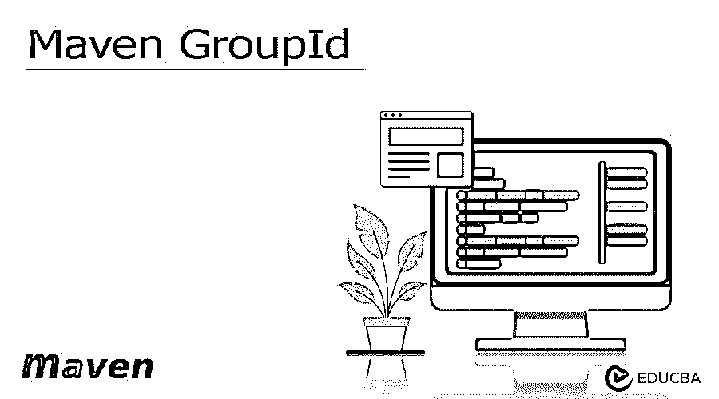


## Maven GroupId 简介

Maven groupid 只不过是项目组的 id。通常，组 id 在所有项目中是唯一的。组 id 被标识为我们的项目在所有项目中是唯一的，因此我们需要实施命名模式。在实施模式时，我们需要遵循包名的规则，所以我们可以说它是我们使用的域名。

### 什么是 Maven GroupId？

maven groupid 用于从所有其他项目中唯一地识别我们的项目。组 id 遵循 java 包名的规则，所以我们可以说它将使用保留的域名开始。Maven 没有强制执行这个规则，有多个遗留没有遵循这个约定，我们使用单个单词的组 id 来代替它。我们很难获得 maven 的收录和中心库所认可的单个单词组 ID。

<small>网页开发、编程语言、软件测试&其他</small>

当使用 maven 组 id 时，我们可以根据需要创建多个子组。确定组 ID 粒度的最佳方法是使用项目的结构。maven 项目配置是通过使用项目对象模型完成的，项目对象模型由文件名 pom.xml 表示。pom 将描述由项目管理的依赖性，并且它也用于构建软件的插件配置中。pom XML 文件还定义了多模块项目之间的关系。

### 关键要点

*   pom.xml 是 maven 的默认 xml，所有的 pom 都是从 default 或 parent 继承的。这个 pom 只是默认继承的默认 pom。
*   Maven groupid 使用默认的 pom 来执行在 maven groupid 中定义的相关目标。

### Maven GroupId 命名

在使用 maven groupid 时，关于类文件的重要事情是，我们不需要从中选择名称，它将从 java 文件的 1:1 映射中自动获取它们的名称。Maven 要求我们选择这两个名字，所以这对我们来说很简单。为了定义 maven 分组命名，我们需要遵循如下步骤。

*   在这一步，我们在 spring 初始化器中创建项目的模板。下图显示了 maven 分组命名项目的模板，如下所示。

组名–com . groupid 工件–maven _ groupid

名称–maven _ groupid 打包–jar

Java 版本–8

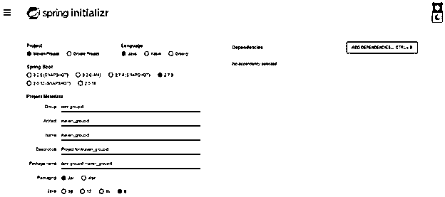


*   创建模板后，现在我们提取项目的文件，并在 strong 的工具套件中打开，如下所示。

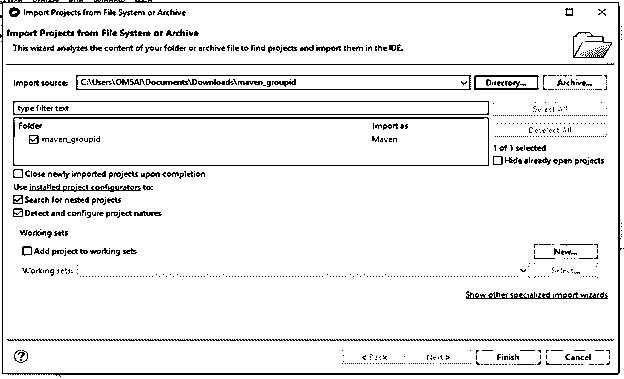


*   在这一步打开 maven groupid 项目时，我们检查 pom.xml 文件，如下所示。

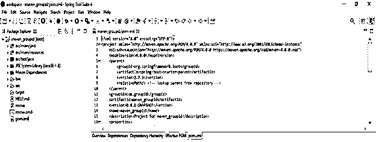


*   在下面的例子中，我们将命名约定定义如下。我们将名称定义为 maven_groupid，如下所示。

**代码:**

```
<parent>
<groupId>org.springframework.boot</groupId>
<artifactId>spring-boot-starter-parent</artifactId>
<version>2.7.3</version>
<relativePath/>
</parent>
<groupId>com.groupid</groupId>
<artifactId>maven_groupid</artifactId>
<version>0.0.1-SNAPSHOT</version>
<name>maven_groupid</name>
```

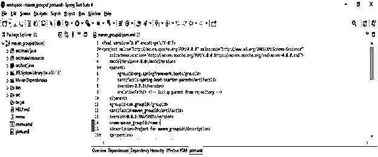


*   在下面的例子中，我们改变了 maven 的名字，同时，我们也改变了 groupid，如下所示。

**代码:**

```
<parent>
<groupId> org.springframework.boot </groupId>
<artifactId>spring-boot-starter-parent</artifactId>
<version>2.7.3</version>
<relativePath/> <!-- lookup parent from repository -->
</parent>
<groupId>com.maven</groupId>
<artifactId>maven_groupid</artifactId>
<version>0.0.1-SNAPSHOT</version>
<name>maven_group</name>
<description>Project for maven_groupid</description>
<properties>
```

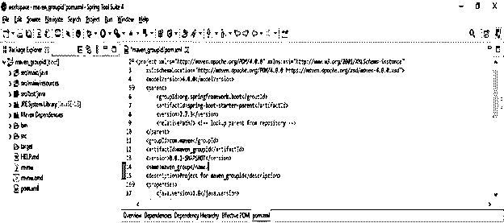


### Maven 限制 GroupId

我们可以通过实施源代码来定义项目的架构规则。Sonar 包含这种类型的能力，用于指定这些规则，并根据我们项目的质量仪表板显示违规情况。下面的例子显示了我们如何在 maven 中限制 groupid，如下所示。

**代码:**

```
<plugin>
<groupId>org.apache.maven.plugins</groupId>
<artifactId> maven-groupid </artifactId>
<version> 2.5 </version>
<configuration>
<targetJdk> 1.8 </targetJdk>
<rulesets>
<ruleset> settings.xml </ruleset>
</rulesets>
</configuration>
<dependencies>
<dependency>
<groupId> maven_group </groupId>
<artifactId> RestrictionRule </artifactId>
<version> 0.0.1 </version>
</dependency>
</dependencies>
</plugin>
```

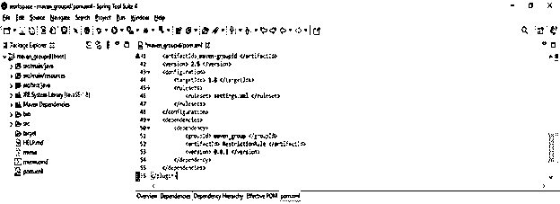


在下面的例子中，我们使用如下的单个 groupid 限制。我们将单个 groupid 定义如下。

**代码:**

```
<dependency>
<groupId> maven_group </groupId>
<artifactId> RestrictionRule </artifactId>
<version> 0.0.1 </version>
</dependency>
```

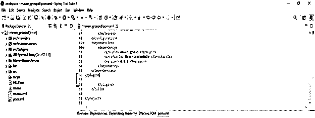


### Maven GroupId 和 ArtifactId

在下表中，我们将 artifactid 和组 id 定义如下。我们必须在 pom.xml 文件中定义相同的内容。

| **Sr 号** | **群组 Id** | **ArtifactId** |
| One | GroupId 正在唯一地标识该项目。 | ArtifactId 是没有版本的 jar 的名称。 |
| Two | GroupId 有各种版本。 | ArtifactId 没有任何版本。 |
| Three | 我们在 pom.xml 文件中定义 GroupId。 | 我们在 pom.xml 文件中定义 ArtifactId。 |
| Four | 在定义 GroupId 的时候，我们可以选择任何名称。 | 在定义 ArtifactId 时，我们可以选择任何名称。 |
| Five | 我们需要用小写字母定义 GroupId 的名称。 | 我们需要用小写字母定义 ArtifactId 的名称。 |
| Six | Maven 没有通过使用 GroupId 来实施规则。 | Maven 没有通过使用 ArtifactId 来实施规则。 |
| Seven | 我们已经在插件部分定义了 GroupId。 | 我们已经在插件部分定义了 ArtifactId。 |
| Eight | GroupId 只不过是项目的一个 Id。 | ArtifactId 只不过是项目的一个 Id。 |
| Nine | GroupId 只是 pom.xml 文件的一个元素。 | ArtifactId 只是 pom.xml 文件的一个元素。 |
| Ten | GroupId 指定项目组的 Id。 | ArtifactId 将指定项目的 if。 |

### Maven GroupId 示例

pom.xml 文件包含关于项目的信息。它还将包含插件和目标。下面的配置，我们需要在一个配置文件中指定。

*   项目相关性
*   插件
*   目标
*   构建配置文件
*   项目版本
*   邮寄名单
*   开发商

下面是 POM 的例子如下。

#### 示例#1

在下面的例子中，我们将组 id 定义为 maven-groupid。

**代码:**

```
<groupId>com.maven-groupid</groupId>
<artifactId>maven-groupid</artifactId>
<version>0.0.1-SNAPSHOT</version>
<name>maven-groupid</name>
<description>Project for maven_groupid</description>
<properties>
```

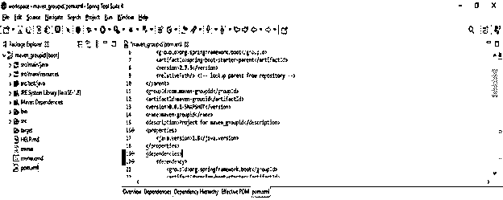


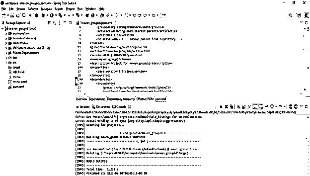


#### 实施例 2

在下面的例子中，我们使用默认的项目源文件夹作为输出目录，如下所示。

**代码:**

```
<groupId>com.maven</groupId>
<artifactId>maven_grpup</artifactId>
<version>1.0</version>
....
</reporting>
</project>
```

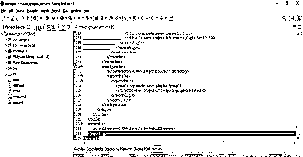


### 常见问题解答

下面是提到的常见问题:

#### Q1。maven GroupId 中的超级 POM 有什么用？

**回答:**super POM 正在帮助开发人员从 pom.xml 文件中指定最小配置细节，从该文件中配置被覆盖。

#### Q2。maven GroupId 有什么用？

**答:** GroupId 唯一标识所有项目。组 id 从反向域开始。Maven 没有强制执行这种类型的规则，有多个项目没有遵循惯例。

#### Q3。GroupId 中的 maven pom 有什么用？

**回答:**maven POM 只不过是与 maven 项目一起工作的对象模型。

### 结论

maven 项目配置是通过使用由文件名 pom.xml 表示的项目对象模型来完成的。在实施模式时，我们需要遵循包名的规则，因此我们可以说它是我们使用的域名。

### 推荐文章

这是一个 Maven GroupId 的指南。这里我们讨论介绍，以及如何定义 maven groupId 和例子。您也可以看看以下文章，了解更多信息–

1.  [Maven 故障保护插件](https://www.educba.com/maven-failsafe-plugin/)
2.  [硒美文依赖](https://www.educba.com/selenium-maven-dependency/)
3.  [Maven 本地存储库](https://www.educba.com/maven-local-repository/)
4.  [六月四号胃](https://www.educba.com/junit-4-maven/)