# maven Kafka-客户

> 原文：<https://www.educba.com/maven-kafka-clients/>


## Maven kafka 简介-客户

Maven Kafka——客户端用于在 maven 项目中创建生产者和消费者。在使用 maven Kafka 客户端时，我们需要在 pom.xml 文件中添加 Kafka 客户端依赖项，还需要创建 maven 项目以在 maven 中使用 Kafka 客户端。maven 的构建工具将包含 pom.xml 文件。pom.xml 文件是默认文件，包含所有项目的相关信息。

### 关键要点

*   Maven Kafka 客户端依赖用于通过使用 Kafka 生产者和消费者来创建 Kafka 应用程序。我们需要将 slf4j 与 maven Kafka 的依赖关系添加到 maven Kafka 应用程序中。
*   我们将 maven Kafka 依赖项定义到 pom.xml 文件中，该文件是应用程序配置文件。

### Maven kafka-clients 概述

在创建 Kafka 客户端时，我们需要将 Kafka 客户端的依赖项添加到 pom.xml 文件中。这个文件基本上包含了工件 id、组 id 和版本的信息。在添加或编辑 Kafka 客户端的该值时，用户需要定义 Kafka 客户端的依赖项。在定义 Kafka 客户端的依赖关系时，我们需要将它添加到依赖关系块中。

<small>网页开发、编程语言、软件测试&其他</small>

在添加红色的 Kafka 客户端依赖项时，我们可以说我们错过了启用自动导入选项。maven 的项目窗口将出现在项目屏幕的右侧。我们可以通过使用 spring 工具套件以及 eclipse IDE 来创建 Kafka 客户端项目。

### 如何创建 Maven kafka-clients 项目？

下面的步骤显示了我们如何创建 maven Kafka 客户端项目，如下所示。

为了创建项目，我们使用 spring 初始化器，并通过使用 spring 工具套件运行这个项目，如下所示:

1.在创建 maven Kafka 客户端项目时，我们首先使用 spring 初始化器创建项目的模板。下面我们使用 spring 初始化器创建 Kafka maven 项目的模板。在创建模板时，我们将组名的值定义为 com.example，工件名定义为 maven_kafka_client，名称定义为 maven_kafka_client，打包为 jar，语言定义为 java。

group Name–com . example
Artifact–maven _ Kafka _ client
Name–maven _ Kafka _ client
打包–jar
Java 版本–8
语言–Java

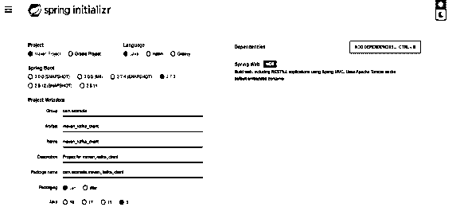


2.在将 maven Kafka 客户端项目的项目模板创建到 spring initializer 中时，我们现在需要下载并提取项目模板，并需要使用 spring 工具套件打开它，如下所示。

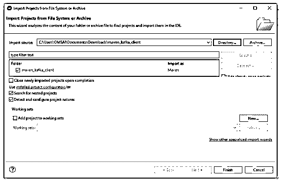


3.在下载并提取了 maven Kafka 客户端的项目模板之后，在这一步中，我们将检查 pom.xml 文件和项目的结构。项目结构如下。

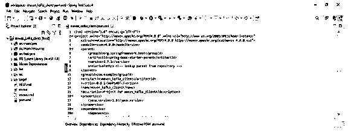


4.在上面的例子中，我们可以看到 pom.xml 文件是在创建项目模板时创建的。在下面的例子中，我们将 Kafka 客户端依赖项添加到 pom.xml 文件中，如下所示。

**代码:**

```
<dependency>
  <groupId> org.apache.kafka </groupId>
  <artifactId> kafka-clients </artifactId>
  <version> 3.0.0 </version>
</dependency>
```

**输出:**

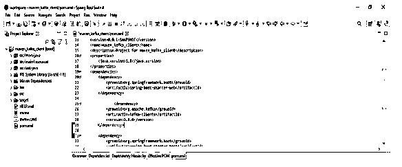


5.在添加了 maven Kafka 客户端依赖项之后，现在在这一步中，我们将添加 slf4j 依赖项，如下所示。这种依赖性用于日志记录。它正在启用运行到应用程序的日志。

**代码:**

```
<dependency>
  <groupId> org.slf4j </groupId>
  <artifactId> slf4j-api </artifactId>
  <version> 1.7.32 </version>
</dependency>
```

**输出:**

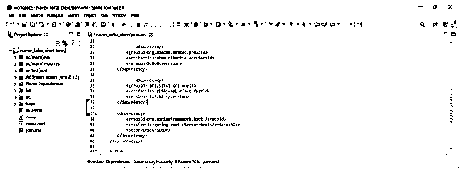


6.在添加了 Kafka 客户端的依赖项和 slf4j 依赖项之后，我们现在创建 maven Kafka 客户端的类，如下所示。我们创建的类名是 kafka_client，如下所示。

**代码:**

```
public class kafka_client {
………
  log.info ("Maven Kafka client");
  }
}
```

**输出:**

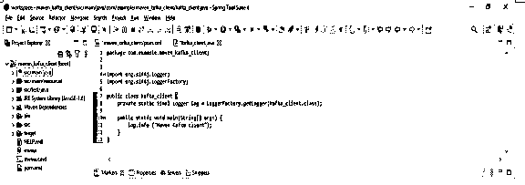


7.在创建了 maven Kafka 客户端的类之后，我们现在如下运行 Maven Kafka 客户端。

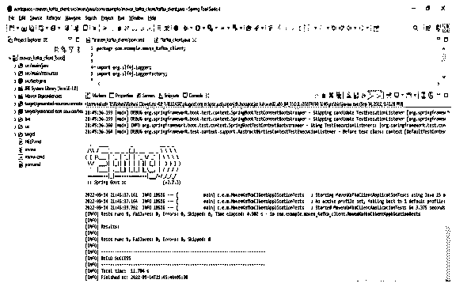


### maven Kafka-客户端的应用程序

为了创建 Kafka 客户端应用程序，我们使用 maven_kafka_client 的项目模板，如下所示。在下面的例子中，我们将应用程序名称的类创建为 maven_kafka，如下所示。

**代码:**

```
public class maven_kafka {
private static final Logger kafka = LoggerFactory.getLogger(kafka_client.class);
…
{
  kafka.info ("Kafka client");
  }
}
```

**输出:**

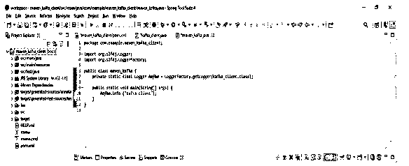


在下面的例子中添加了 maven Kafka client 类后，我们使用 spring 工具套件运行应用程序。在上面的例子中，我们使用了 logger 工厂方法和 logger 静态方法。在下面的例子中，我们可以看到我们已经启动了 maven Kafka 客户端的应用程序，如下所示。

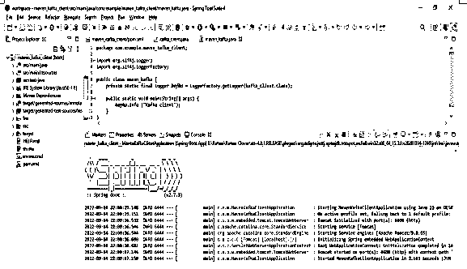


在下面的例子中，我们通过使用 maven 测试运行 maven Kafka 应用程序，如下所示。

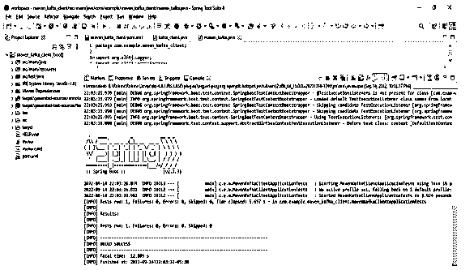


### Kafka 客户端依赖是必需的

在使用 maven Kafka 客户端时，我们需要 Kafka 客户端的依赖性。在不使用 Kafka 客户端的情况下，我们可以在我们的项目中使用相同的客户端。Kafka 客户端依赖性在开发 maven Kafka 客户端应用程序时非常重要。要使用 Kafka 客户端依赖项，我们需要将下面的代码添加到 pom.xml 文件中，如下所示。我们使用 pom.xml 文件来添加 Kafka 客户端依赖项。

**代码:**

```
<dependency>
  <groupId>org.apache.kafka</groupId>
  <artifactId>kafka-clients</artifactId>
  <version>3.0.0</version>
</dependency>
```

**输出:**

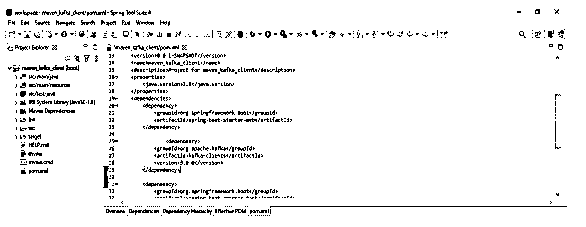


在上面的例子中，我们可以看到我们需要 maven Kafka 客户端的依赖。在下面的例子中，我们使用 maven Kafka 客户端运行应用程序。

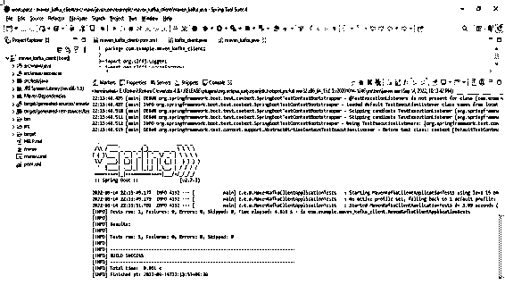


### 常见问题解答

下面是提到的常见问题:

#### Q1。在 maven 项目中添加 maven Kafka 客户端依赖项需要哪个文件？

**回答:**我们需要使用应用程序的 pom.xml 文件来添加 maven Kafka 客户端依赖。

#### Q2。maven Kafka 客户端依赖在 maven 项目中有什么用？

**答:** Maven Kafka 客户端依赖用于为 Maven Kafka 应用程序创建生产者和消费者。这种依赖性在开发应用程序时非常重要。

#### Q3。Kafka 客户端依赖项使用了哪个日志记录依赖项？

**答:**我们使用 slf4j 依赖和 maven Kafka 客户端依赖来记录项目日志。

### 结论

在创建 Kafka 客户端时，我们需要将 Kafka 客户端的依赖项添加到 pom.xml 文件中。此外，我们需要创建 maven 项目来使用 maven 中的 Kafka 客户端。

### 推荐文章

这是一本关于 Maven kafka-clients 的指南。在这里，我们讨论介绍，以及如何创建一个 maven kafka-clients 项目，应用程序和常见问题。您也可以看看以下文章，了解更多信息–

1.  [Maven 构建命令](https://www.educba.com/maven-build-command/)
2.  [Maven 战争插件](https://www.educba.com/maven-war-plugin/)
3.  [Maven 简介](https://www.educba.com/maven-profile/)
4.  [Maven 版本](https://www.educba.com/maven-versions/)