# Maven 快速入门原型

> 原文：<https://www.educba.com/maven-quickstart-archetype/>

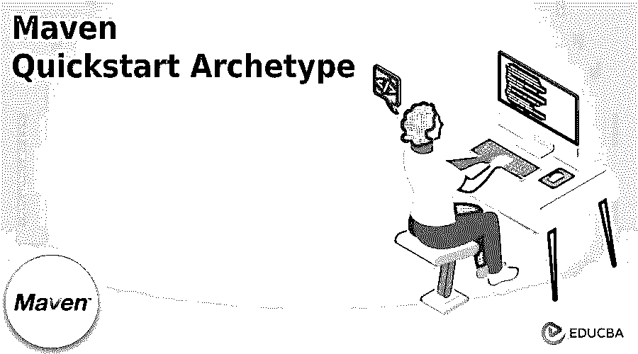


## Maven 快速入门原型介绍

Maven quickstart 原型用于生成 Maven 示例项目，通过使用该原型，我们可以创建一个新项目。maven quickstart 原型只是一个插件，它的工作是按照我们定义的模板创建项目的结构。我们使用 maven quickstart 原型来创建一个简单的 java 应用程序。为了使用 maven 快速入门原型创建项目，我们需要执行 mvn 命令。

### 关键要点

*   maven 原型只不过是一种项目抽象，它是从 maven 的定制项目实例化而来的。
*   它只是一个模板项目，我们正在从它创建另一个项目。maven 中原型的主要用途是我们可以标准化项目的开发。

### 什么是 Maven 快速入门原型？

假设我们需要同时使用命令行创建一个示例项目，我们使用的是 maven quickstart 原型。在创建项目时，我们需要用 mvn 命令传递原型生成参数，这将创建一个新的 maven 项目。maven 中有多种类型的原型可用于创建项目。为了开始一个新项目，我们需要从命令行使用 maven 原型插件。原型生成目标将选择默认的原型，这是按下回车键后建议的。Maven 原型插件将创建一个与 artifactid 匹配的简单目录名。

<small>网页开发、编程语言、软件测试&其他</small>

### 如何创造原型？

为了创建原型项目，我们首先需要创建一个安装了 mvn 的控制台。

以下步骤显示了我们如何创建原型，如下所示:

1.第一步，我们打开安装了 mvn 的控制台。在下面的例子中，我们已经配置了 maven 命令，所以我们不需要找到指定的 maven 路径。


2.现在打开命令 shell 之后，我们正在执行下面的命令来创建原型项目，如下所示。我们使用 mvn 命令和原型生成参数，如下所示。

**命令:**

```
mvn archetype:generate
```

**输出:**

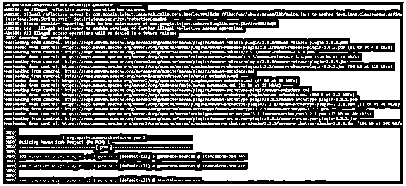


3.执行 mvn 原型命令后，在这一步中，我们选择默认应用过滤器。我们没有输入任何内容，因此它将选择为默认值。


4.在定义了 architect quick start 的默认选项后，在这一步中，我们将选择 architect quick start 的版本。在下面的例子中，我们可以看到它将显示第八个版本。当按下回车键时，将选择默认版本为 8。


5.在这一步定义了原型的版本之后，我们将进入项目的细节。我们在下面输入项目的细节。我们需要如下定义 groupid、artifactid、version 和 package 的值。

groupId–com . architect
版本–1.0-快照
artifact id–maven _ architect
包–maven _ architect


6.在此步骤中输入详细信息后，我们正在确认我们输入的所有详细信息，如下所示。

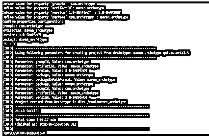


7.输入所有细节后，在进入项目后，我们可以看到 maven _ archetype 项目已创建，所有文件也已创建。


8.在检查了下面示例中的项目结构后，我们可以看到 pom.xml 文件也是在项目目录中生成的。

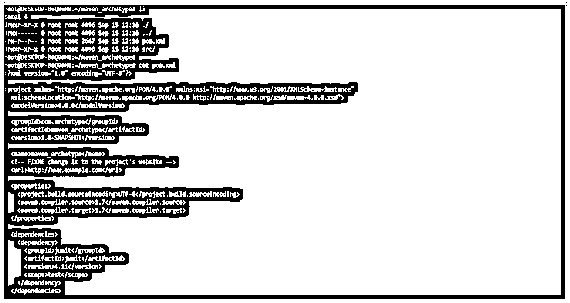


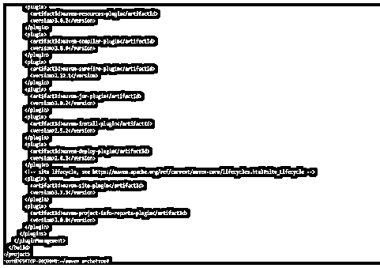


9.在检查了下面示例中的 pom.xml 文件后，我们可以看到 App.java 文件被创建到项目文件夹中，如下所示。

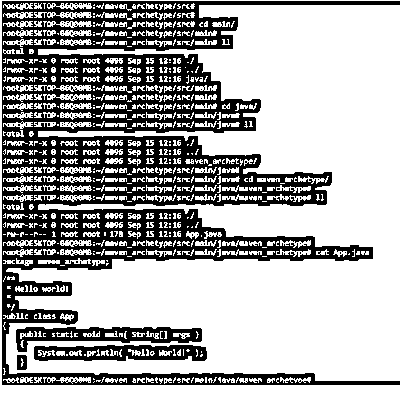


10.在检查了下面例子中的 App.java 文件后，我们可以看到 AppTest.java 文件被创建到项目文件夹中，如下所示。

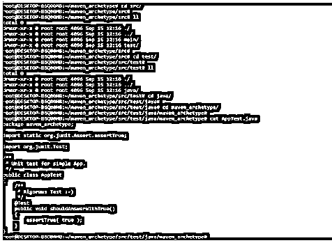


### 使用原型项目

maven 原型插件将允许用户通过使用原型和生成目标来创建 maven 项目。在下面的例子中，我们通过如下定义所有项目值来创建 maven 项目。下面的命令将从我们的原型生成 maven 项目，如下所示。

**命令:**

```
mvn archetype:generate –DarchetypeGroupId = com.archetype –DarchetypeArtifactId = archetype –DarchetypeVersion = 1.0-SNAPSHOT –DgroupId = com.archetype –DartifactId = archetype_sample –Dversion = 1.0-SNAPSHOT
```

**输出:**

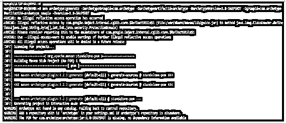


我们需要用 maven 原型插件传递原型参数来生成原型目标。我们也可以传递我们提供原型互动模式的原型项目。maven 原型项目已经生成，我们可以通过运行下面的命令来调用它。

**代码:**

```
mvn package liberty:run
```

**输出:**


在下面的例子中生成原型项目后，我们检查项目的 pom.xml 文件，如下所示。

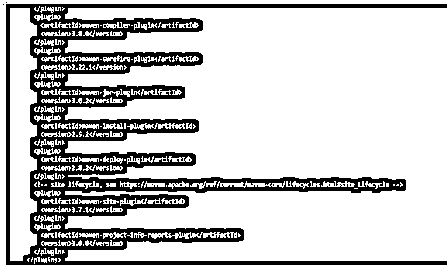


### Maven 快速入门不同原型

maven 中有多种类型的原型可用，下面将会提到。

*   **maven-architect-architect–**这个原型包含了包含一个样本项目的原型。
*   **maven-archetype-j2ee-simple–**该原型将包含 J2EE 的简化应用程序示例。
*   **maven-archetype-mojo–**这个原型将包含 maven 插件，它实际上是一个样本。
*   **maven-archetype-plugin-site–**这个原型将包含插件的 maven 站点样例。
*   **maven-archetype-plugin–**这个原型将包含 maven 原型项目中使用的 maven 插件样例。
*   **maven-archetype-portlet–**该原型将包含 JSR 268 的样例 portlet。
*   **maven-architect-quick start–**这个原型将包含使用 maven 开发的 maven 项目样例。
*   **maven-archetype-simple–**这个原型将包含使用 maven 开发的简单 maven 项目。
*   **maven-archetype-site-sample–**该原型将包含 maven 站点示例。
*   **maven-archetype-web app–**该原型将包含示例 maven webapps 项目。
*   **maven-archetype-site–**该原型将包含 maven 站点示例，该示例演示了 APT、FML 和 XDOC 等支持文档，这些文档已在我们的站点上演示过。

### Maven 快速入门原型示例

下面是提到的例子:

#### 示例#1

以下示例显示了 maven 快速入门原型，如下所示。通过使用 maven quickstart，我们使用一个简单的生成参数来创建项目。我们将在下面输入项目的详细信息，我们将如下定义 groupid、artifactid、version 和 package 的值。

mvn 原型:生成
groupId–com . maven
版本–1.0-快照
artifact id–原型
包–原型

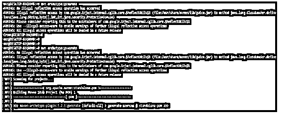


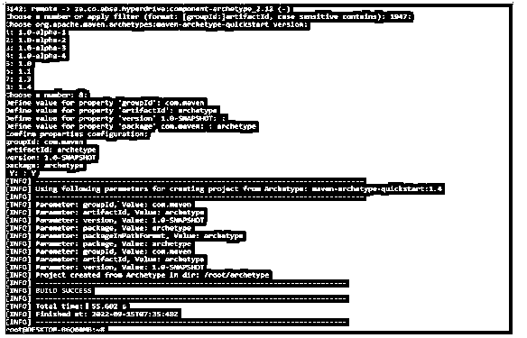


#### 实施例 2

在下面的例子中，我们将所有参数定义为执行 maven generate 命令的时间，如下所示。

**命令:**

```
mvn archetype:generate –DarchetypeGroupId = com.maven –DarchetypeArtifactId = maven –DarchetypeVersion = 1.0-SNAPSHOT –DgroupId = com.maven –DartifactId = maven_sample –Dversion = 1.0-SNAPSHOT
```

**输出:**


### 常见问题解答

下面是提到的常见问题:

#### Q1。maven 快速入门原型有什么用？

**回答:**基本上是用 maven quickstart 原型来创建 maven 项目。它将创建 maven 项目的所有结构。我们可以通过使用原型来开发一个示例应用程序。

#### Q2。使用 maven 原型创建项目时，我们需要使用哪个插件？

**回答:**我们在使用 maven archetype quickstart 开发应用的同时，需要使用原型插件。

#### Q3。在创建项目时，maven 原型描述符有什么用？

**回答:**maven 原型的描述符是原型项目的核心。它是位于项目目录中的 xml 文件名 architect-metadata . XML。

### 结论

原型生成一个目标，该目标选择按 enter 键后建议的默认原型。Maven 原型插件将创建一个与 artifactid 匹配的简单目录名。Maven quickstart 原型只是一个插件，它的工作是按照我们定义的模板创建项目的结构。

### 推荐文章

这是 Maven 快速入门原型指南。这里我们讨论一下入门，如何创造原型？和 maven 快速入门不同的原型和示例。您也可以看看以下文章，了解更多信息–

1.  [Maven 构建命令](https://www.educba.com/maven-build-command/)
2.  [Maven 战争插件](https://www.educba.com/maven-war-plugin/)
3.  [Maven 简介](https://www.educba.com/maven-profile/)
4.  [Maven 版本](https://www.educba.com/maven-versions/)