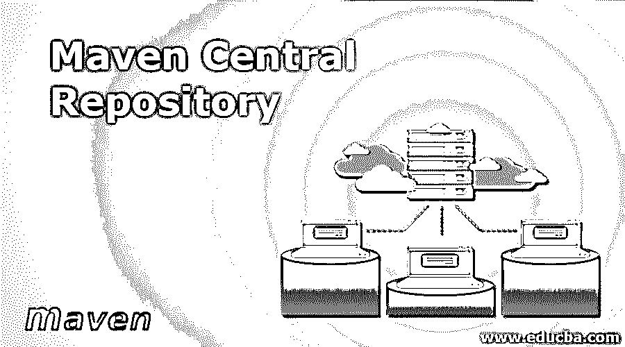
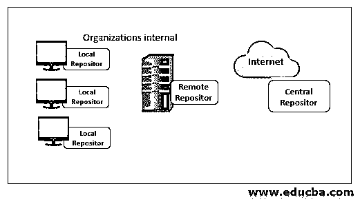
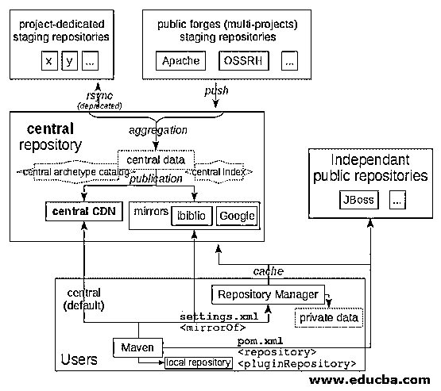

# Maven 中央存储库

> 原文：<https://www.educba.com/maven-central-repository/>

## Maven 中央存储库简介

Maven repository 是一个目录，其中存储了项目所需的所有依赖项，比如 jar、库文件、插件或其他工件。这些存储库帮助我们存储和维护有用的资源，以便在构建和部署工件时可以在我们的 maven 项目中使用它们。对于 maven 用户来说，任何类型的 maven 底层存储库的所有布局和结构都是完全隐藏的。在本主题中，我们将了解 MCP。

### 储存库的类型

maven 中基本上有三种类型的存储库，即本地存储库、远程存储库和中央存储库。

<small>网页开发、编程语言、软件测试&其他</small>

#### 1.本地 Maven 知识库

本地存储库是您的机器上使用 maven 的文件夹或目录，即包含您的项目所需的缓存 jar 和依赖项以及您在您的机器上构建但尚未发布的其他工件的本地机器。maven 用户可以执行的操作是，如果本地存储库中存在任何与内存或空间相关的问题，则清理本地存储库，或者完全删除该存储库上的数据，这将进一步导致重新下载项目所需的依赖项。可以通过以下方式在 settings.xml 文件中提及本地存储库

`<settings xmlns = "http://maven.apache.org/SETTINGS/1.0.0"
xmlns:xsi = "http://www.w3.org/2001/XMLSchema-instance"
xsi:schemaLocation = "http://maven.apache.org/SETTINGS/1.0.0
http://maven.apache.org/xsd/settings-1.0.0.xsd">
<localRepository>D:/sampleLocalRepo</localRepository>
</settings>`

#### 2.远程 Maven 知识库

远程存储库是位于远程的资源，包含具有 jar、库文件和插件的目录，以及其他可能有用的工件，并且可以通过使用诸如 https:// of file:// protocol 之类的协议来访问。这些远程存储库被进一步分成存储库，这些存储库保存在一个远程位置，在多个个人和开发人员之间共享，供公司或第三方私人使用，以维护和共享工件。您可以在 repositories 标记中的 settings.xml 文件中提到您的远程存储库，并且可以为多个远程存储库添加多个存储库标记，如果您希望以下列方式配置它们的话

`<repositories>
<repository>
<id>educba.library</id>
<url>http://educba.org/mavenremoterepo/samplelibrary</url>
</repository>
</repositories>`

#### 3.中央 Maven 知识库

maven 中的第二个远程存储库是中央存储库，可以用来下载 maven 项目中的依赖项，也可以用来在中央存储库中发布您想要的工件。中央 maven 资源库的链接是 https://repo.maven.apache.org/maven2/，而可用于搜索 maven 中央资源库中可用的 maven 依赖项的站点是——https://search.maven.org/.。这种类型的远程资源库也被称为中央资源库，对所有人开放，并且是开源的。这个库是由 maven 社区提供的。对于中央存储库，settings.xml 文件中不需要任何配置。

### 存储库的工作

每当启动第一个 maven 命令或构建项目时，maven 会自动将项目所需的依赖项(如 jar、库或插件)下载到本地存储库中，并创建一个本地存储库(如果不存在)。此后，无论何时构建项目，maven 都会引用下载并存储在本地存储库中的依赖项。这有助于减少与远程存储库进行数据交换所需的时间，节省时间和成本。

假设在构建项目时，maven 没有找到对本地存储库的依赖，而是在中央存储库中进行搜索。这个中央存储库是由 maven 社区提供的，不需要在 maven 中进行任何配置，但是要确保您有一个 internet 连接，可以通过 maven 自动搜索中央存储库中项目的依赖项。

现在，即使在本地和中央存储库中找不到这些存储库，maven 也会在远程存储库中搜索它们，如果提到并且可用的话。如果远程存储库不可用，并且没有找到依赖项，那么就会抛出一个错误，说明没有找到依赖项。如果远程存储库可用，则在那里搜索相关性，如果没有成功找到，则抛出一个错误，提示相关性不可用。在这两种情况下，如果您成功地找到了依赖项，那么它将被下载到本地存储库中以供进一步使用和参考。

可以看出，每台机器都有其自己的本地储存库，并且组织的同一网络中的多台机器可以共享远程储存库，而所有这些不同的组织和包括在每个组织中的机器或任何其他具有互联网连接的单独机器可以公开访问 maven 的中央储存库。

### Maven 中央存储库

maven 的中央存储库包含由 maven 社区提供给 maven 用户的所有 jar 文件、插件和库的集合。该存储库不需要进行任何配置，只需确保您的 IDE/机器连接到互联网，以便从中央存储库下载和使用依赖项。

很多时候，由于安全和带宽原因，组织可能不提供互联网接入。在这些情况下，我们可以在远程存储库上下载中央 maven 存储库资源的副本，供离线使用。这需要在远程存储库路径的 settings.xml 文件中提及。您甚至可能需要跨地理位置分布的其他官方中央存储库来用于搜索和获取依赖项，这在 maven 中称为镜像，可以通过在 settings.xml 文件中进行某些更改来使用。

下图显示了其他存储库和用户与 maven 中央存储库的组件和关系。可以看到中央存储库的内容交付网络(CDN)通过 settings.xml 文件连接到 maven 用户。

### 结论

maven 中使用了各种类型的存储库来实现高效便捷的依赖性管理。中央存储库就是其中之一，由 maven 社区提供，它存储了所有项目所需的所有依赖项，如 jar、插件和库。可以使用以下链接来搜索该存储库的依赖项——https://search.maven.org/和依赖项存在于该链接中——https://repo.maven.apache.org/maven2/.在您的 maven 项目中设置中央存储库不需要外部配置，只需确保互联网连接可用。

### 推荐文章

这是 Maven 中央存储库的指南。这里我们讨论 maven 中的三种类型的存储库，即本地、远程和中央存储库。您也可以看看以下文章，了解更多信息–

1.  [胃插件](https://www.educba.com/maven-plugins/)
2.  [Maven 生命周期](https://www.educba.com/maven-life-cycle/)
3.  [如何安装 Maven](https://www.educba.com/install-maven/)
4.  [Maven 命令](https://www.educba.com/maven-commands/)