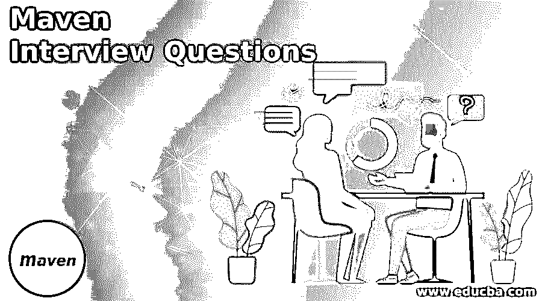

# Maven 面试问题

> 原文：<https://www.educba.com/maven-interview-questions/>

## Maven 面试问答

如果你正在寻找经验丰富或新生的 Maven 面试问题，你来对地方了。根据分析，maven 拥有大约 75%的市场份额。因此，在这篇关于专家面试问题的文章中，我们列出了十个常见的专家面试问题，帮助你通过面试&成为一名专家开发者。

以下是 maven 的面试问题，可以帮助你在 Maven 上进行面试。

<small>网页开发、编程语言、软件测试&其他</small>

### 第 1 部分——Maven 面试问题(基础)

第一部分涵盖了基本的 maven 面试问题。

#### 1.Maven 是什么，为什么用它？

**回答:**
在构建[软件系统](https://www.educba.com/system-software-tools/)的过程中，无论您使用哪种事件方法，您都希望执行后续的任务。

*   收集必需品
*   分析必需品
*   设计解决方案
*   开发(编码)解决方案
*   试液
*   部署解决方案
*   [维护解决方案](https://www.educba.com/good-work-life-balance/)

上述任务通常按上面列出的顺序执行。例如，在分析需求和设计解决方案之前，您不能开发解决方案。有些人可能会争辩说，使用测试驱动开发(书)，测试用例是在解决方案开发之前创建的。虽然这是真的，但是不管测试是什么时候开发的，在开发完成之后，测试仍然会被执行。

虽然所有的思考都应该由团队来完成，但是如果可以的话，重复的步骤可以由助理来完成。助手并不聪明，但是他知道软件系统开发流程和尝试装订项目的方法。例如，助手将生成 comes 支持的模板，传输所需的第三方库(也称为 JAR)及其依赖项，构建所有元素并构建可部署的 JAR、WAR 或 EAR 文件。这个助手叫做，玛文。这是 maven 与 hymenopteran(主页)或替代构建脚本等替代构建工具的区别。

换句话说，maven 是一个项目管理工具。Maven 为开发人员提供了一个完整的构建生命周期框架，开发团队可以使用它来改变项目的基础设施，因为 maven 使用默认的构建生命周期。

#### 2.Maven 管理了哪些方面？

**答:**
Maven 为开发者提供了管理以下内容的方法:

*   创建
*   证明文件
*   报告
*   属国
*   SCMs
*   放
*   分配
*   邮寄名单

#### 3.Pom 是什么？Pom 包含哪些信息？

**答案:**
POM 代表项目对象模型。这是 maven 中的一个基本工作单元。这是一个 XML 文件。它以 pom.xml 的形式永久驻留在项目的基本目录中。为了创建项目，它包含了许多与 maven
所使用的项目相关的配置细节和数据。pom 包含了以下一些配置信息

*   项目依赖关系。
*   插件。
*   [目标](https://www.educba.com/ultimate-career-goals/)。
*   建立档案。
*   项目版本。
*   开发商。
*   邮件列表。

#### 4.什么是 Maven 构建生命周期？说出 Maven 的 3 个构建生命周期？

**回答:**
构建生命周期是一个定义良好的阶段序列，它概括了目标执行的顺序。这里的阶段代表生命周期中的一个阶段。

三个构建生命周期是:

*   **清理:**清理由先前构建创建的工件。
*   **默认(或构建):**这个可以习惯构建器具。
*   **站点:**生成项目的站点文档。

#### 5.什么是 Maven 神器？

**答:**
工件是一个文件，它是一个内部的 JAR 文件，被部署到 [Maven 仓库](https://www.educba.com/install-maven/)。一个 Maven 构建会产生一个或多个工件，比如“源”JAR 和一个编译后的 JAR。

每个工件包含一个组 ID(通常是一个反向域名，比如 com.example.foo)、一个工件 ID(只是一个名称)和一个版本字符串。这 3 个一起明确地确定了伪像。项目的依赖项被指定为工件。

### 第 2 部分——Maven 面试问题(高级)

第一部分涵盖了高级 maven 面试问题。

#### 6.Maven 构建生命周期的阶段是什么？

**答案:**
敏捷测试的一些主要原则是:

以下是几个阶段

*   **验证:**项目是正确的，并且提供了所有必要的信息。
*   **编译:**项目的源代码。
*   **测试:**编译后的源代码采用适当的单元测试框架，这些测试不需要部署或打包代码。
*   **打包:**将编译好的代码像 JAR 一样，以其可分发的格式打包。
*   **Integration-test:** 如果有必要的话，在可能运行集成测试的地方处理和部署包。
*   **验证:**运行任何测试，以验证包装仍然有效并符合质量要求。
*   **Install:** 将包安装到本机存储库中，作为区域性替代项目的依赖项。
*   **Deploy:** 将最终的包复制到远程存储库中，以便与其他项目和开发人员共享。这是在集成或发布环境中完成的，

#### 7.什么是 Maven 知识库？

**答:**
[Maven 资源库是一个](https://www.educba.com/maven-repository/)位置，所有插件、库、jar、项目 jar 或任何其他特定项目相关信息都存储在这里，Maven 可以很容易地使用它。
它们的类型是 3 种类型的 maven 知识库:

*   本地知识库
*   中央存储库
*   远程存储库

#### 8.什么是 Maven 快照？

**回答:**
Maven 的快照[版本不是真实版本，不会发布。一个等效的版本可能会得到几个更新。通常，暴露依赖应该在整个开发过程中单独存在，并且任何自由版本(非快照)都不应该依赖于快照版本。](https://www.educba.com/install-maven/)

#### 10.构建工具应该有什么特性？

**答案:**
一个构建工具应该具备:

编译 Java 代码并构建 jar、war 和 ear 文件，以便部署和发布。

*   版本和依赖关系管理
*   运行查看并报告测试结果
*   用 Sonar 运行代码质量检查，检查风格，查找 bug 等。
*   环境财产替代
*   文件生成(WSDL、AspectJ、XSL 等。)
*   支持跨平台(UNIX Windows)和 ide(Eclipse、Netbeans、IntelliJ)
*   适当的文档和支持。

#### 11.列出 Maven 中的依赖范围？

**答案:**
maven 中使用的各种依赖范围有:

*   **Compile:** 这是默认的作用域，它表示项目的类路径中提供了什么依赖关系
*   **Provided:** 表示运行时依赖项由 JDK 或互联网服务器或容器提供
*   运行时:这表明编译不需要依赖关系，但是在整个执行过程中都需要
*   测试:它说提供依赖只是为了看看编译和执行阶段
*   系统:表示你必须给出系统路径
*   **Import:** 这意味着已知的或主格的 pom 应该用这个 [POM 部分中的依赖项来替换。](https://www.educba.com/maven-pom-file/)

### 推荐文章

这是一份专家面试问题清单的指南。在这里，我们涵盖了一些常见的面试问题及其详细的答案，以帮助候选人轻松应对面试。你也可以看看下面的文章来了解更多

1.  [控制系统面试问题](https://www.educba.com/control-system-interview-questions/)
2.  [EIGRP 面试问题](https://www.educba.com/eigrp-interview-questions/)
3.  [SQL 加入面试问题](https://www.educba.com/sql-joins-interview-questions/)
4.  [MS SQL 面试问题](https://www.educba.com/ms-sql-interview-questions/)