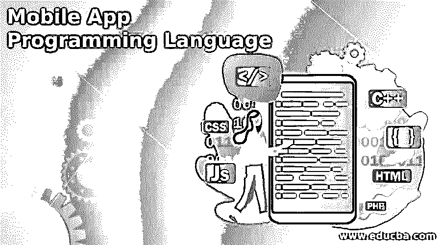

# 移动应用程序编程语言

> 原文：<https://www.educba.com/mobile-app-programming-language/>

## 移动应用程序编程语言介绍

选择移动应用程序编程语言是移动应用程序开发的第一步，也是最重要的一步，这在很大程度上取决于您将要使用的操作系统，因为不同的操作系统支持不同的移动应用程序编程语言。例如，C 和 Objective C 将用于 iOS 应用程序。HTML5 是两者的理想选择。你对语言的选择将决定你的应用是否成功。

这篇文章将引导你学习基本的移动应用程序编程语言，这将帮助你创建你自己的应用程序！

<small>网页开发、编程语言、软件测试&其他</small>

应用程序开发世界不仅对那些希望从中获利的人有利可图，对那些相信自己的想法是开创性的人也是如此。如果你希望进入应用程序开发的世界，你需要的只是一台电脑和对组成应用程序的移动应用程序编程语言的基本掌握。然而，选择一种语言经常会令人困惑，尤其是对于缺乏编程知识的人来说。

### 移动应用程序编程语言

移动开发者用于 app 开发的移动 app 编程语言有大量。无论你是移动应用程序编程语言的新手，还是对学习新技能感兴趣的专业人士，这八种语言都是开始学习的理想选择。

*   Java 语言(一种计算机语言，尤用于创建网站)
*   C++
*   目标-C
*   迅速发生的
*   HTML5
*   C#
*   红宝石
*   大蟒

在选择要使用的语言之前，遵循这 5 个步骤:陷阱。

*   学习跨平台 app 设计
*   评估开发应用程序的常见挑战。
*   确定你的目标受众
*   决定您计划使用的平台
*   在选择一种语言之前，好好研究并考虑所有选项。

#### 1.Java 语言(一种计算机语言，尤用于创建网站)

通常，Java、JavaScript 和 Enterprise Java Beans 会被混淆为相同的语言。然而，实际上，这三个是不同的软件开发系统，它们的名字中都有“Java”。JavaScript 是一种用于 Web 浏览器应用程序的脚本语言，有助于增强网页的属性，而另一方面，Java Beans 是一种可重用的软件组件，可以在构建工具中进行可视化操作。“但当我们谈论移动应用程序编程语言时，讨论的是 Java。

由太阳微系统公司开发的 Java 现在由甲骨文公司共同拥有。它是最常用的移动应用程序编程语言之一，因此大部分开发人员都精通 Java。

Java 是一种独立于平台的面向对象的程序开发语言。这使得它非常实用，因为人们可以在各种操作系统上使用它。但最重要的是，它与谷歌的 Android 移动操作系统配合使用。最适合 Android 为主平台的情况。它还用于需要开发跨不同平台共享的代码库的情况。但是对于 iOS 来说，Java 不能作为初始开发语言。

Java 是一种编译语言，它的优点是既可以在浏览器中运行，也可以在没有浏览器的设备上运行。由于这种灵活性，编码可以很容易地重用，软件更新也变得容易。这使它成为一个优秀的表演者。

**美国邮政局**

*   面向对象
*   独立于平台

**最适合:**

*   Android 操作系统

#### 2.C++

| 贝尔实验室的比雅尼·斯特劳斯特鲁普在 80 年代早期设计了 c++ 80，作为基于 C 语言的面向对象语言 |

C++是一种面向对象的移动应用程序编程语言，是世界上最古老、使用最广泛的语言之一。它用于设计几乎所有平台上的应用程序，如 Android iOS、Windows 和 Mac OS X 操作系统平台。

| 超过 1100 万专业开发人员熟练掌握 C++并经常使用它。 |

它是当今推动移动行业的主要语言。它是低级编程的理想选择，现在正被用于创建高性能的应用程序和游戏。Adobe 和 Mozilla 等主流网络应用也是由 C++引导的。它支持两种最流行的操作系统:Windows 和 Mac OS X。

C++编程技能很容易掌握，因为许多程序员都精通它。因此，C++的培训资源是广泛可用的。有趣的是，Java 和 C#借用了 C++的语法，

**美国邮政局**

*   面向对象
*   高性能服务器
*   中间件
*   客户端开发的绝佳选择

**最适合:**

*   Android 操作系统
*   苹果手机操作（iOS：iPhone OS 的缩写）
*   Windows 操作系统

#### 3.目标-C

iOS 应用主要是用 Objective-C 编程语言和 Xcode 这种开发环境编写的。是用原生 iOS 平台和苹果 OS X，即 iPhone 或 iPad 等 fr 设备编写软件的首选 app 开发语言。

Objective-C 是 C mobile app 编程语言的超集，因此借用了它的语法、基本类型和流控制语句。这适用于它的面向对象的语法很小，容易理解，并且它有很好的运行时间。它用于编码、设计应用程序的用户界面、运行新应用程序的试用版以及调试。

**美国邮政局**

*   面向对象

**最适合** [**手机的操作系统**](https://www.educba.com/applications-software-developer/ "Mobile Operating Systems to Build Applications") **如:**

*   苹果手机操作（iOS：iPhone OS 的缩写）
*   苹果的 OS X

#### 4.迅速发生的

用于编写苹果最新 and Cocoa 和 Cocoa Touch 代码的语言非常快捷。按照苹果公司的说法，Swift 应该与 Objective-C 配合使用。但在未来，苹果预计许多开发者会将 Swift 作为一种全面的移动应用编程语言。

Swift 优于 Objective-C 的一个优点是，它消除了出现各种安全问题的可能性。因此，当谈到为 iOS 编写应用程序时，Swift 是当前的选择。

正如苹果公司在 2015 年 WWDC 大会(全球开发者大会——苹果公司年度日历的一个亮点)上宣布的那样，Swift 将很快成为开源软件。这将不可避免地让越来越多的开发人员与 Swift 合作。此外，将 Swift 作为主要开发语言的项目数量也会因这一进步而增加。

**美国邮政局**

*   开源

**最适合** [**手机的操作系统**](https://en.wikipedia.org/wiki/Mobile_operating_system) **如:**

*   苹果手机操作（iOS：iPhone OS 的缩写）

#### 5.HTML5

我们都知道 HTML 或超文本标记语言，它最初是为了设计存储在 Web 上的 Web 应用程序而编写的，但旨在运行在移动浏览器上。

因此，HTML5 成为移动设备上基于网络或基于浏览器的应用的显而易见的选择。它是移动应用程序开发的首选，因为它有一些有用的工具，如离线 Web 存储、地理定位 API、画布绘制、CSS3 等等。添加不同的数据类型和简化其中的输入因素更容易。在 HTML 5 中，还可以根据需要调整屏幕尺寸。

对于那些已经熟悉 HTML 的人来说，学习 HTML 5 mobile framework 会容易得多，只需要很少的时间就能掌握，而且成本效益也很高。随着移动游戏市场的火爆，开发者正在寻找开发游戏应用的最佳方法，以最低的成本让尽可能多的用户使用。

**下行**

HTML5 还会带来下述挑战:

*   由于许可问题，开发者不得不面对压缩媒体的挑战
*   此外，基于 HTML5 的应用无法在谷歌 Play 商店或苹果 iTunes 等传统应用市场销售，因此很难通过传统方式将 HTML 5 应用货币化。
*   在接下来的时间里，可能需要对语言进行细微的调整，这将极大地影响浏览器管理 HTML5 的方式。
*   使用 PhoneGap 或 PhoneGap Build 可以克服访问原生 API 和创建 App Store 就绪的应用程序版本的挑战。
*   赋予 UI(用户界面)一种自然的感觉

**最适合** **的手机操作系统** **如:**

*   [Firefox OS](https://en.wikipedia.org/wiki/Firefox_OS)
*   旗鱼操作系统
*   [Tizen](https://en.wikipedia.org/wiki/Tizen)
*   [Ubuntu Touch](https://en.wikipedia.org/wiki/Ubuntu_Touch) 。

#### 6.C#

正如 Objective C 是 iOS 应用开发的“语言”，C#( C-Sharp)是 Windows 操作系统最受欢迎的移动应用编程语言，这并不意味着你不能使用 C#设计 Android 或 iOS 应用。这是通过使用跨平台工具实现的，比如 Unity 和 Xamarin。事实上，统计数据表明，23%的苹果开发者和 14%的谷歌 Android 开发者使用 C#，而只有 10%的人使用它来开发 Windows 应用程序。然而，它是最适合 Windows 的应用程序开发语言。

C#是一种面向对象的、可移植的跨语言，非常适合所有基于 Microsoft Windows 的语言。它允许代码扩展给开发者。特定于 Windows 平台的程序也可以进行编码，以便它们也可以使用其他移动应用程序编程语言的代码进行操作。它的概念类似于 Java 和 C++，但它只使用了那些有益的部分，而忽略了那些令人困惑并可能导致错误的特性，从而导致代码中的 bug。C#程序是托管代码，也就是说；它们是在一个受控的环境中编码和实现的，不会留下不规则或“错误”的空间，我们称之为“错误”。即使有命令，它也是一种简洁的语言，并支持有效的和可重用的组件。

**美国邮政局**

*   面向对象
*   轻便的

#### 7.Ruby- Ruby on Rails

Ruby 是一种开源的移动应用程序编程语言，也是 web 应用程序的主要提供者。用 Ruby 编写的软件，主要是在其 Ruby on Rails web 框架中，非常受欢迎，而且需求也在增长。开发人员更喜欢它，因为它是一种非常容易学习的动态语言。如果你了解 Ruby 或者是一个 Ruby 开发者，那么你在移动应用开发市场的需求量很大。

它最大的优点是强调简单和高效。它有一个复杂的语法，可以很容易地阅读和编写。根据 TIOBE 指数，Ruby 是全球十大编程语言之一。作为一种开源语言，它不仅免费，而且可以自由使用、复制、修改和分发。谈到改变或编辑，它让用户能够改变，删除或重组其部分。因此，它也被认为是一种非常灵活的语言。

编码可以不受任何限制。程序员确实需要配置文件来进行设置，因为 Rails 有一套现成的约定，这使得它非常省时。

为了用 Ruby 编写 iOS、Android 或 OS X 应用程序，程序员使用 RubyMotion，这是一种创新的工具，有助于快速开发上述操作系统的跨平台原生应用程序。

**美国邮政局**

*   面向对象
*   开源
*   通用编程语言

**最适合** **的手机操作系统** **如:**

*   webapps

#### 8.大蟒

Python 经常被贴上最简单的移动应用编程语言的标签。任何人都可以学习它，因为它的语法简单明了。还可以在任何地方运行应用程序编程 python run，因为它与许多应用程序类型兼容，包括 Web 开发、科学计算、教育等等。

无论是 web 应用程序开发数据分析，您都可以找到满足您各种需求的 Python 框架。在过去的几年中，它的受欢迎程度急剧增长，以至于它成为美国学校中教授的最受欢迎的移动应用程序编程语言，产生了大量的人才库，

用 Python 编写的一些著名应用程序的例子有 Pinterest 和 Instagram，以及 WordStream。

它使用简单、灵活、易读，支持开源开发。它是动态类型的，它的代码不那么冗长，小心地避免了不必要的细节。

### 结论

移动应用程序编程语言是一个不断发展的行业，新语言的构建和主流语言的不断升级导致了一个健康的竞争环境。

这完全是开发者的选择，来决定效率和功能性语言是他必须编写的应用程序或程序的理想语言。

### 推荐文章

这是一个全面的移动应用程序编程语言指南，它的介绍，其他编程语言，和结论。你也可以看看下面的课程来学习手机 App 编程语言

1.  [高级语言 vs 低级语言](https://www.educba.com/high-level-languages-vs-low-level-languages/)
2.  [C++编程语言](https://www.educba.com/c-programming-language-basics/)
3.  [iOS 移动应用测试](https://www.educba.com/course/ios-mobile-app-testing/)
4.  [移动自动化测试](https://www.educba.com/course/appium-mobile-automation-testing-training/)

